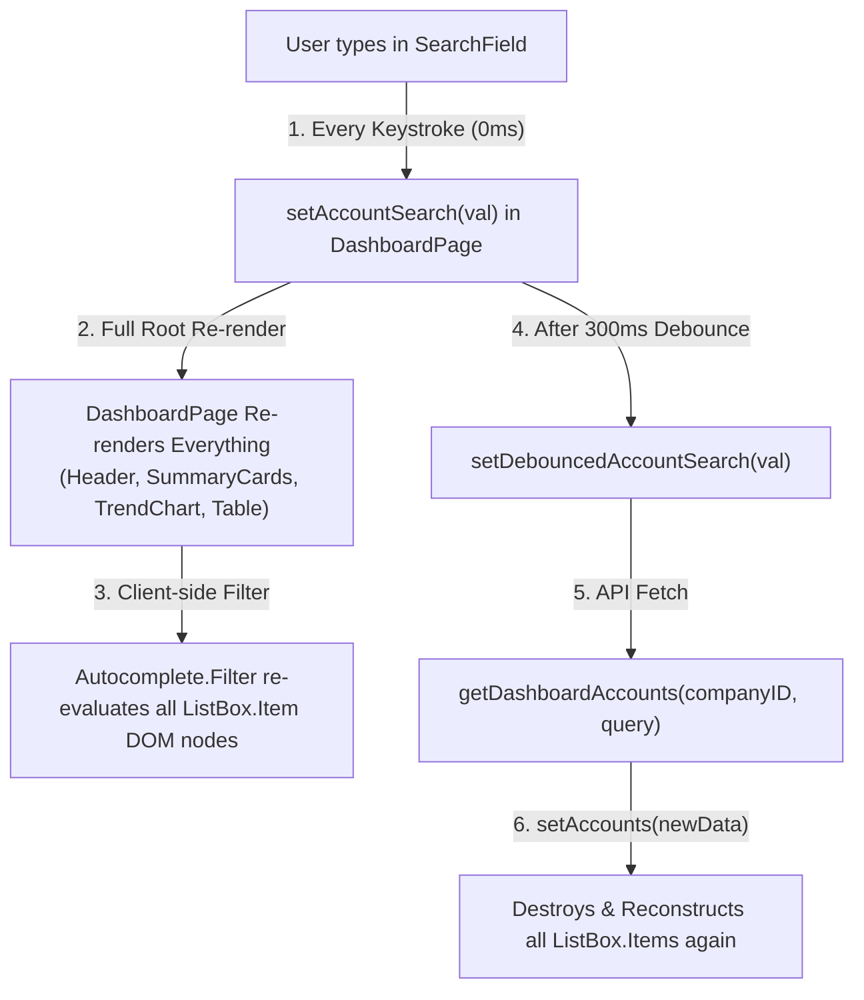

# useEffect(() => {

- **ID**: `antigravity-187db3509d444ec9ae54749800444c4553c07979ec2153adcc382cecc6ce119a`
- **Source Tool**: `antigravity`
- **Date**: `2026-09-21 09:36:49`
- **Tags**: `coding`, `assistant`, `antigravity`

---

## Turn 1: User

useEffect(() => {
    const timer = setTimeout(() => setDebouncedAccountSearch(accountSearch.trim()), 300);
    return () => clearTimeout(timer);
  }, [accountSearch]);

can you analyze this code , and can you investigate the risk of crashing due to out of memory? it happens after i repeteadly query the account search?

---

## Turn 2: Assistant

<details><summary>🔧 Tool Invocations (1)</summary>

- **run_command**: 

</details>


---

## Turn 3: Assistant

<details><summary>🔧 Tool Invocations (1)</summary>

- **run_command**: 

</details>


---

## Turn 4: Assistant

<details><summary>🔧 Tool Invocations (1)</summary>

- **run_command**: 

</details>


---

## Turn 5: Assistant

<details><summary>🔧 Tool Invocations (1)</summary>

- **view_file**: 

</details>


---

## Turn 6: Assistant

<details><summary>🔧 Tool Invocations (1)</summary>

- **view_file**: 

</details>


---

## Turn 7: Assistant

<details><summary>🔧 Tool Invocations (1)</summary>

- **view_file**: 

</details>


---

## Turn 8: Assistant

<details><summary>🔧 Tool Invocations (1)</summary>

- **view_file**: 

</details>


---

## Turn 9: Assistant

<details><summary>🔧 Tool Invocations (1)</summary>

- **view_file**: 

</details>


---

## Turn 10: Assistant

<details><summary>🔧 Tool Invocations (1)</summary>

- **view_file**: 

</details>


---

## Turn 11: Assistant

### 1. Analysis of the Code Snippet

```tsx
useEffect(() => {
  const timer = setTimeout(() => setDebouncedAccountSearch(accountSearch.trim()), 300);
  return () => clearTimeout(timer);
}, [accountSearch]);
```

* **Correctness:** In isolation, this snippet is the standard React debounce pattern.
* **Timer Leak Risk:** **None**. The cleanup function (`return () => clearTimeout(timer)`) properly cancels any pending timer whenever `accountSearch` updates before the 300ms window expires or when the component unmounts.
* **Direct OOM Risk:** The snippet itself **does not create a memory leak** through timer accumulation or memory retention in this effect.

---

### 2. Why Does Out of Memory (OOM) / Crashing Happen During Repeated Searches?

When repeated account searching causes browser tab freezes, massive heap spikes, or OOM crashes, the root cause lies in the **downstream rendering and state cascade triggered by `accountSearch`**:



#### A. Root-Level Re-render Cascade on Every Single Keystroke
* In [`src/containers/dashboard/index.tsx`](file:///D:/work/qcash-ui-dashboard-auto-collection/src/containers/dashboard/index.tsx#L47), `accountSearch` is stored at the root `DashboardPage` component.
* Every keystroke calls `setAccountSearch`, causing the entire `DashboardPage` (and all children: `SummaryCards`, `TrendChart`, `TransactionTable`) to re-render without memoization.
* Rapid typing creates hundreds of render passes and temporary closure allocations in seconds.

#### B. Conflict: Client-Side Filter + Server-Side Search
* In [`src/containers/dashboard/components/dashboard-header.tsx`](file:///D:/work/qcash-ui-dashboard-auto-collection/src/containers/dashboard/components/dashboard-header.tsx#L83-L103):
  * `Autocomplete.Filter` performs **client-side substring filtering** on every keystroke.
  * Concurrently, `debouncedAccountSearch` fetches **server-side filtered accounts** 300ms later.
* When the API returns, `accounts` state updates, destroying and rebuilding the entire collection of `ListBox.Item` elements.

#### C. Unvirtualized DOM & Accessibility Tree Churn (`ListBox.Item`)
* If an enterprise company has hundreds or thousands of bank accounts:
  * Each `ListBox.Item` instantiates React-Aria DOM nodes, focus handlers, ARIA observers, and event listeners.
  * Tearing down and recreating hundreds of DOM nodes on every keystroke and on every API response overwhelms the browser's Garbage Collector (GC), resulting in GC thrashing and heap exhaustion.

#### D. Heavy JSON Payload Allocations
* Every debounced query invokes [`getDashboardAccounts`](file:///D:/work/qcash-ui-dashboard-auto-collection/src/services/dashboard.ts#L77).
* Rapid queries allocate large arrays of account objects in V8 heap memory before older unreferenced arrays can be collected by the browser.

---

### 3. Recommended Mitigations

#### 1. Keep Keystroke State Local to the Search Component
Do not lift raw `accountSearch` (keystroke-level state) up to `DashboardPage`. Keep the input state inside `DashboardHeader` / `SearchField` and only pass the debounced string to the parent:

```tsx
// Inside DashboardHeader (local input state)
const [inputValue, setInputValue] = useState("");

useEffect(() => {
  const timer = setTimeout(() => onDebouncedSearch(inputValue.trim()), 300);
  return () => clearTimeout(timer);
}, [inputValue, onDebouncedSearch]);
```

#### 2. Disable Client-side Re-filtering if Backend Handles Filtering
Since the backend already returns filtered accounts via `getDashboardAccounts(companyID, debouncedAccountSearch)`, bypass redundant client-side filtering inside `Autocomplete.Filter`:

```tsx
// If the backend already filtered the data, pass through items directly
<Autocomplete.Filter filter={() => true}>
  ...
</Autocomplete.Filter>
```

#### 3. Limit or Virtualize Rendered Account Items
If an account list is large, cap the rendered options or slice the dropdown items to prevent thousands of DOM nodes from being created at once:

```tsx
const displayedAccounts = useMemo(() => accountOptions.slice(0, 100), [accountOptions]);
```

#### 4. Memoize Heavy Components
Wrap heavy components (`TrendChart`, `TransactionTable`, `SummaryCards`) in `React.memo` so that search input state changes in the header do not force re-rendering of charts and tables.

---

