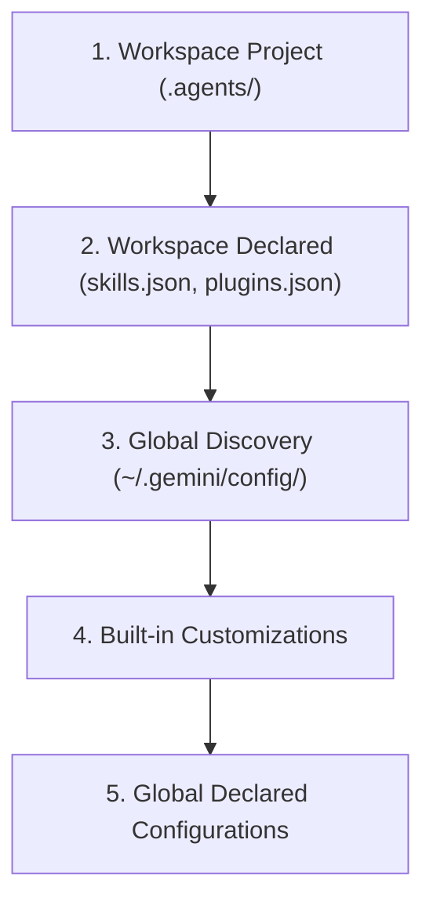

# https://internal-service.example.com/browse/BABMF-QCASHUIBANKMONITORINGTRANSACT...

- **ID**: `antigravity-530f89b3a73c803d48b78bd38274f8646183b7437af80e78f0c020ef1f347e86`
- **Source Tool**: `antigravity`
- **Date**: `2026-09-05 17:49:36`
- **Tags**: `coding`, `assistant`, `antigravity`

---

## Turn 1: User

https://internal-service.example.com/browse/BABMF-QCASHUIBANKMONITORINGTRANSACTION275-10
fix this bamboo build error, then make a new pr to v.0.0.1-release

---

## Turn 2: Assistant

<details><summary>🔧 Tool Invocations (1)</summary>

- **view_file**: 

</details>


---

## Turn 3: Assistant

<details><summary>🔧 Tool Invocations (1)</summary>

- **view_file**: 

</details>


---

## Turn 4: Assistant

<details><summary>🔧 Tool Invocations (1)</summary>

- **call_mcp_tool**: 

</details>


---

## Turn 5: Assistant

<details><summary>🔧 Tool Invocations (1)</summary>

- **view_file**: 

</details>


---

## Turn 6: Assistant

<details><summary>🔧 Tool Invocations (1)</summary>

- **run_command**: 

</details>


---

## Turn 7: Assistant

<details><summary>🔧 Tool Invocations (1)</summary>

- **view_file**: 

</details>


---

## Turn 8: Assistant

<details><summary>🔧 Tool Invocations (1)</summary>

- **view_file**: 

</details>


---

## Turn 9: Assistant

<details><summary>🔧 Tool Invocations (1)</summary>

- **grep_search**: 

</details>


---

## Turn 10: Assistant

<details><summary>🔧 Tool Invocations (1)</summary>

- **grep_search**: 

</details>


---

## Turn 11: Assistant

<details><summary>🔧 Tool Invocations (1)</summary>

- **view_file**: 

</details>


---

## Turn 12: Assistant

<details><summary>🔧 Tool Invocations (1)</summary>

- **view_file**: 

</details>


---

## Turn 13: Assistant

<details><summary>🔧 Tool Invocations (1)</summary>

- **view_file**: 

</details>


---

## Turn 14: Assistant

<details><summary>🔧 Tool Invocations (1)</summary>

- **run_command**: 

</details>


---

## Turn 15: Assistant

<details><summary>🔧 Tool Invocations (1)</summary>

- **schedule**: 

</details>


---

## Turn 16: Assistant

<details><summary>🔧 Tool Invocations (1)</summary>

- **view_file**: 

</details>

I have started checking the git status and Bamboo logs. I'll inspect the repository state to see what branch we are on and prepare the fix.

---

## Turn 17: Assistant

<details><summary>🔧 Tool Invocations (1)</summary>

- **run_command**: 

</details>


---

## Turn 18: Assistant

<details><summary>🔧 Tool Invocations (1)</summary>

- **schedule**: 

</details>


---

## Turn 19: Assistant

<details><summary>🔧 Tool Invocations (1)</summary>

- **call_mcp_tool**: 

</details>


---

## Turn 20: Assistant

<details><summary>🔧 Tool Invocations (1)</summary>

- **run_command**: 

</details>


---

## Turn 21: Assistant

<details><summary>🔧 Tool Invocations (1)</summary>

- **schedule**: 

</details>


---

## Turn 22: Assistant

<details><summary>🔧 Tool Invocations (1)</summary>

- **view_file**: 

</details>


---

## Turn 23: Assistant

<details><summary>🔧 Tool Invocations (1)</summary>

- **run_command**: 

</details>


---

## Turn 24: Assistant

<details><summary>🔧 Tool Invocations (1)</summary>

- **schedule**: 

</details>


---

## Turn 25: Assistant

<details><summary>🔧 Tool Invocations (1)</summary>

- **view_file**: 

</details>


---

## Turn 26: Assistant

<details><summary>🔧 Tool Invocations (1)</summary>

- **manage_task**: 

</details>


---

## Turn 27: Assistant

<details><summary>🔧 Tool Invocations (1)</summary>

- **schedule**: 

</details>


---

## Turn 28: Assistant

<details><summary>🔧 Tool Invocations (1)</summary>

- **view_file**: 

</details>

I am checking the remote repository state and Bamboo build logs to verify the current branches and commits.

---

## Turn 29: Assistant

<details><summary>🔧 Tool Invocations (1)</summary>

- **manage_task**: 

</details>


---

## Turn 30: Assistant

<details><summary>🔧 Tool Invocations (1)</summary>

- **manage_task**: 

</details>


---

## Turn 31: Assistant

<details><summary>🔧 Tool Invocations (1)</summary>

- **run_command**: 

</details>


---

## Turn 32: Assistant

<details><summary>🔧 Tool Invocations (1)</summary>

- **view_file**: 

</details>


---

## Turn 33: Assistant

<details><summary>🔧 Tool Invocations (1)</summary>

- **run_command**: 

</details>


---

## Turn 34: Assistant

<details><summary>🔧 Tool Invocations (1)</summary>

- **view_file**: 

</details>


---

## Turn 35: Assistant

<details><summary>🔧 Tool Invocations (1)</summary>

- **manage_task**: 

</details>


---

## Turn 36: Assistant

<details><summary>🔧 Tool Invocations (1)</summary>

- **run_command**: 

</details>


---

## Turn 37: Assistant

<details><summary>🔧 Tool Invocations (1)</summary>

- **view_file**: 

</details>


---

## Turn 38: Assistant

<details><summary>🔧 Tool Invocations (1)</summary>

- **run_command**: 

</details>


---

## Turn 39: Assistant

<details><summary>🔧 Tool Invocations (1)</summary>

- **view_file**: 

</details>


---

## Turn 40: Assistant

<details><summary>🔧 Tool Invocations (1)</summary>

- **run_command**: 

</details>


---

## Turn 41: Assistant

<details><summary>🔧 Tool Invocations (1)</summary>

- **view_file**: 

</details>


---

## Turn 42: Assistant

<details><summary>🔧 Tool Invocations (1)</summary>

- **manage_task**: 

</details>


---

## Turn 43: Assistant

<details><summary>🔧 Tool Invocations (1)</summary>

- **schedule**: 

</details>


---

## Turn 44: Assistant

<details><summary>🔧 Tool Invocations (1)</summary>

- **run_command**: 

</details>


---

## Turn 45: Assistant

<details><summary>🔧 Tool Invocations (1)</summary>

- **schedule**: 

</details>


---

## Turn 46: Assistant

<details><summary>🔧 Tool Invocations (1)</summary>

- **view_file**: 

</details>

I am running `yarn build` locally to reproduce the exact build failure and confirm the resolution.

---

## Turn 47: Assistant

<details><summary>🔧 Tool Invocations (1)</summary>

- **manage_task**: 

</details>


---

## Turn 48: Assistant

<details><summary>🔧 Tool Invocations (1)</summary>

- **schedule**: 

</details>


---

## Turn 49: Assistant

<details><summary>🔧 Tool Invocations (1)</summary>

- **view_file**: 

</details>


---

## Turn 50: Assistant

<details><summary>🔧 Tool Invocations (1)</summary>

- **view_file**: 

</details>

I am waiting for `yarn build` to finish.

---

## Turn 51: Assistant

<details><summary>🔧 Tool Invocations (1)</summary>

- **view_file**: 

</details>

I am monitoring the local build to completion. Please hold on.

---

## Turn 52: Assistant

<details><summary>🔧 Tool Invocations (1)</summary>

- **view_file**: 

</details>

I will wait for Next.js build to finish.

---

## Turn 53: Assistant

<details><summary>🔧 Tool Invocations (1)</summary>

- **view_file**: 

</details>

I am waiting for the Next.js compilation step to finish.

The following is a <SYSTEM_MESSAGE> not actually sent by the user. It is provided by the system as important information to pay attention to.

<SYSTEM_MESSAGE>
[Message] timestamp=2026-09-05T09:53:23Z sender=5eb1b8c2-cc91-4cc4-b210-7da09e9cb334/task-98 priority=MESSAGE_PRIORITY_HIGH content=Task id "5eb1b8c2-cc91-4cc4-b210-7da09e9cb334/task-98" finished with result:

The command exited with code 0.
Output:
yarn run v1.22.22
$ yarn build:style && next build
$ npx tailwindcss -o ./styles/globals.css
Browserslist: caniuse-lite is outdated. Please run:
  npx update-browserslist-db@latest
  Why you should do it regularly: https://github.com/browserslist/update-db#readme

Rebuilding...

Done in 332ms.
   ▲ Next.js 14.2.4
   - Environments: .env

   Creating an optimized production build ...
 ✓ Compiled successfully
   Linting and checking validity of types ...
   Collecting page data ...
   Generating static pages (0/13) ...
   Generating static pages (3/13)
   Generating static pages (6/13)
   Generating static pages (9/13)
   Generating static pages (13/13)
 ✓ Finalizing page optimization ...
   Collecting build traces ...

Route (pages)                              Size     First Load JS
┌   /_app                                  0 B             181 kB
├ ○ /404                                   4.96 kB         186 kB
├ ○ /auth/login                            2.39 kB         184 kB
├ ○ /bank-monitoring/dashboard             3.65 kB         185 kB
├ ○ /bank-monitoring/eft                   6.44 kB         188 kB
├ ○ /bank-monitoring/eft/[id]              11.1 kB         213 kB
├ ○ /bank-monitoring/history               4.47 kB         186 kB
├ ○ /bank-monitoring/ift                   4.53 kB         186 kB
├ ○ /bank-monitoring/ift/[id]              7.7 kB          204 kB
├ ○ /bank-monitoring/mpn                   8.01 kB         189 kB
├ ○ /bank-monitoring/mpn/[id]              7.62 kB         206 kB
├ ○ /bank-monitoring/payroll               15.5 kB         197 kB
├ ○ /bank-monitoring/rdn                   5.35 kB         187 kB
├ ○ /bank-monitoring/transfer-va           4.46 kB         186 kB
└ ○ /unauthorized                          3.3 kB          185 kB
+ First Load JS shared by all              181 kB
  ├ chunks/main-45ee44b8ee3ec7b2.js        52.1 kB
  ├ chunks/pages/_app-da9826f4fce9d343.js  127 kB
  └ chunks/webpack-d779f041d50ddb32.js     2.22 kB

○  (Static)  prerendered as static content

Done in 17.58s.


</SYSTEM_MESSAGE>

The following is a <SYSTEM_MESSAGE> not actually sent by the user. It is provided by the system as important information to pay attention to.

<SYSTEM_MESSAGE>
[Message] timestamp=2026-09-05T09:53:23Z sender=5eb1b8c2-cc91-4cc4-b210-7da09e9cb334/task-100 priority=MESSAGE_PRIORITY_LOW content=Task id "5eb1b8c2-cc91-4cc4-b210-7da09e9cb334/task-100" was canceled with result:
Condition fulfilled by 5eb1b8c2-cc91-4cc4-b210-7da09e9cb334/task-98
</SYSTEM_MESSAGE>

---

## Turn 54: Assistant

<details><summary>🔧 Tool Invocations (1)</summary>

- **view_file**: 

</details>


---

## Turn 55: Assistant

<details><summary>🔧 Tool Invocations (1)</summary>

- **view_file**: 

</details>


---

## Turn 56: Assistant

<details><summary>🔧 Tool Invocations (1)</summary>

- **view_file**: 

</details>


---

## Turn 57: Assistant

<details><summary>🔧 Tool Invocations (1)</summary>

- **call_mcp_tool**: 

</details>


---

## Turn 58: Assistant

<details><summary>🔧 Tool Invocations (1)</summary>

- **call_mcp_tool**: 

</details>


---

## Turn 59: Assistant

<details><summary>🔧 Tool Invocations (1)</summary>

- **call_mcp_tool**: 

</details>


---

## Turn 60: Assistant

<details><summary>🔧 Tool Invocations (1)</summary>

- **run_command**: 

</details>


---

## Turn 61: Assistant

<details><summary>🔧 Tool Invocations (1)</summary>

- **view_file**: 

</details>


---

## Turn 62: Assistant

<details><summary>🔧 Tool Invocations (1)</summary>

- **run_command**: 

</details>


---

## Turn 63: Assistant

<details><summary>🔧 Tool Invocations (1)</summary>

- **run_command**: 

</details>


---

## Turn 64: Assistant

<details><summary>🔧 Tool Invocations (1)</summary>

- **run_command**: 

</details>


---

## Turn 65: Assistant

<details><summary>🔧 Tool Invocations (1)</summary>

- **view_file**: 

</details>


---

## Turn 66: Assistant

<details><summary>🔧 Tool Invocations (1)</summary>

- **replace_file_content**: 

</details>


---

## Turn 67: Assistant

<details><summary>🔧 Tool Invocations (1)</summary>

- **view_file**: 

</details>


---

## Turn 68: Assistant

<details><summary>🔧 Tool Invocations (1)</summary>

- **replace_file_content**: 

</details>


---

## Turn 69: Assistant

<details><summary>🔧 Tool Invocations (1)</summary>

- **run_command**: 

</details>


---

## Turn 70: Assistant

<details><summary>🔧 Tool Invocations (1)</summary>

- **run_command**: 

</details>

I have applied the fixes:
1. Added `"classnames": "^2.5.1"` to `package.json` dependencies to resolve the missing module error during Docker/Bamboo build.
2. Restored the missing `props` and `router` variables in `pages/bank-monitoring-transaction/view/transaction/[id].tsx`.

I am now running `yarn install`, `npx tsc --noEmit`, and `yarn build` to verify the build.

The following is a <SYSTEM_MESSAGE> not actually sent by the user. It is provided by the system as important information to pay attention to.

<SYSTEM_MESSAGE>
[Message] timestamp=2026-09-05T09:54:39Z sender=5eb1b8c2-cc91-4cc4-b210-7da09e9cb334/task-152 priority=MESSAGE_PRIORITY_HIGH content=Task id "5eb1b8c2-cc91-4cc4-b210-7da09e9cb334/task-152" finished with result:

The command exited with code 0.
Output:
yarn install v1.22.22
[1/4] Resolving packages...
[2/4] Fetching packages...
[3/4] Linking dependencies...
[4/4] Building fresh packages...
$ yarn global add concurrently
yarn global v1.22.22
[1/4] Resolving packages...
[2/4] Fetching packages...
[3/4] Linking dependencies...
[4/4] Building fresh packages...
success Installed "concurrently@9.2.1" with binaries:
      - concurrently
Done in 2.37s.
Done in 5.37s.
yarn run v1.22.22
$ yarn build:style && next build
$ npx tailwindcss -o ./styles/globals.css
Browserslist: caniuse-lite is outdated. Please run:
  npx update-browserslist-db@latest
  Why you should do it regularly: https://github.com/browserslist/update-db#readme

Rebuilding...

Done in 329ms.
  ▲ Next.js 14.2.4
  - Environments: .env

   Linting and checking validity of types ...

./components/detail-eft/response-modal.tsx
35:6  Warning: React Hook useEffect has missing dependencies: 'moduleType' and 'transactionID'. Either include them or remove the dependency array.  react-hooks/exhaustive-deps

./components/detail-mass-transfer/generate-ack-nack-modal.tsx
36:6  Warning: React Hook useCallback has missing dependencies: 'batchId' and 't'. Either include them or remove the dependency array.  react-hooks/exhaustive-deps
137:5  Warning: React Hook useMemo has a missing dependency: 't'. Either include it or remove the dependency array.  react-hooks/exhaustive-deps

./components/detail-stepper-eft.tsx
125:6  Warning: React Hook useEffect has a missing dependency: 'fetchDataDetail'. Either include it or remove the dependency array.  react-hooks/exhaustive-deps

./components/filters/bank-monitoring-detail-filter.tsx
68:5  Warning: React Hook useCallback has missing dependencies: 'batchId' and 'getFilterData'. Either include them or remove the dependency array. If 'getFilterData' changes too often, find the parent component that defines it and wrap that definition in useCallback.  react-hooks/exhaustive-deps
135:6  Warning: React Hook useEffect has a missing dependency: 'reset'. Either include it or remove the dependency array.  react-hooks/exhaustive-deps

./components/filters/bank-monitoring-filter.tsx
99:6  Warning: React Hook useCallback has a missing dependency: 'userType'. Either include it or remove the dependency array.  react-hooks/exhaustive-deps
166:6  Warning: React Hook useCallback has missing dependencies: 'loading', 'showMessage', and 't'. Either include them or remove the dependency array. You can also do a functional update 'setLoading(l => ...)' if you only need 'loading' in the 'setLoading' call.  react-hooks/exhaustive-deps
216:6  Warning: React Hook useCallback has missing dependencies: 'loading', 'showMessage', 't', and 'values?.moduleType'. Either include them or remove the dependency array. You can also do a functional update 'setLoading(l => ...)' if you only need 'loading' in the 'setLoading' call.  react-hooks/exhaustive-deps
235:6  Warning: React Hook useEffect has a missing dependency: 'userType'. Either include it or remove the dependency array.  react-hooks/exhaustive-deps
244:6  Warning: React Hook useEffect has a missing dependency: 'userType'. Either include it or remove the dependency array.  react-hooks/exhaustive-deps
371:6  Warning: React Hook useEffect has a missing dependency: 'setFilterValues'. Either include it or remove the dependency array.  react-hooks/exhaustive-deps
377:6  Warning: React Hook useEffect has missing dependencies: 'handleShowData' and 'values'. Either include them or remove the dependency array. If 'handleShowData' changes too often, find the parent component that defines it and wrap that definition in useCallback.  react-hooks/exhaustive-deps

./components/filters/internal-fund-transfer/detail-stepper.tsx
128:6  Warning: React Hook useEffect has a missing dependency: 'transactionID'. Either include it or remove the dependency array.  react-hooks/exhaustive-deps

./components/filters/mpn/detail-stepper-mpn.tsx
124:6  Warning: React Hook useEffect has a missing dependency: 'fetchDataDetail'. Either include it or remove the dependency array.  react-hooks/exhaustive-deps

./components/filters/online-transfer/index.tsx
106:6  Warning: React Hook useEffect has missing dependencies: 'getBankNameList' and 'handleChangeTransactionDate'. Either include them or remove the dependency array.  react-hooks/exhaustive-deps

./components/filters/rtgs/index.tsx
109:6  Warning: React Hook useEffect has missing dependencies: 'getBankNameList' and 'handleChangeTransactionDate'. Either include them or remove the dependency array.  react-hooks/exhaustive-deps

./components/filters/swift/index.tsx
118:6  Warning: React Hook useEffect has a missing dependency: 'handleChangeTransactionDate'. Either include it or remove the dependency array.  react-hooks/exhaustive-deps

./components/transaction-table/mass-transfer.tsx
341:6  Warning: React Hook useMemo has missing dependencies: 'batchId', 'companyId', 'handleResponseModal', and 'translation'. Either include them or remove the dependency array.  react-hooks/exhaustive-deps
412:5  Warning: React Hook useCallback has missing dependencies: 'moduleType', 'setDir', 'setSort', and 'sortChanged'. Either include them or remove the dependency array.  react-hooks/exhaustive-deps

./components/transaction-table/payroll.tsx
275:6  Warning: React Hook useMemo has missing dependencies: 'renderActionCell', 'renderInquiryStatusCell', 'renderResponseCell', 'renderTransactionStatusCell', 'translation', and 'userType'. Either include them or remove the dependency array.  react-hooks/exhaustive-deps
577:5  Warning: React Hook useCallback has a missing dependency: 'handleFilterOption'. Either include it or remove the dependency array.  react-hooks/exhaustive-deps

./components/transaction-table/rdn.tsx
382:6  Warning: React Hook useMemo has missing dependencies: 'batchId', 'companyId', 'handleResponseModal', and 'translation'. Either include them or remove the dependency array.  react-hooks/exhaustive-deps
435:5  Warning: React Hook useCallback has missing dependencies: 'setDir', 'setSort', and 'sortChanged'. Either include them or remove the dependency array.  react-hooks/exhaustive-deps

info  - Need to disable some ESLint rules? Learn more here: https://nextjs.org/docs/basic-features/eslint#disabling-rules
   Creating an optimized production build ...
 ✓ Compiled successfully
   Collecting page data ...
   Generating static pages (0/13) ...
   Generating static pages (3/13)
   Generating static pages (6/13)
   Generating static pages (9/13)
   Generating static pages (13/13)
 ✓ Finalizing page optimization ...
   Collecting build traces ...

Route (pages)                              Size     First Load JS
┌   /_app                                  0 B             181 kB
├ ○ /404                                   4.96 kB         186 kB
├ ○ /auth/login                            2.39 kB         184 kB
├ ○ /bank-monitoring/dashboard             3.65 kB         185 kB
├ ○ /bank-monitoring/eft                   6.44 kB         188 kB
├ ○ /bank-monitoring/eft/[id]              11.1 kB         213 kB
├ ○ /bank-monitoring/history               4.47 kB         186 kB
├ ○ /bank-monitoring/ift                   4.53 kB         186 kB
├ ○ /bank-monitoring/ift/[id]              7.7 kB          204 kB
├ ○ /bank-monitoring/mpn                   8.01 kB         189 kB
├ ○ /bank-monitoring/mpn/[id]              7.62 kB         206 kB
├ ○ /bank-monitoring/payroll               15.5 kB         197 kB
├ ○ /bank-monitoring/rdn                   5.35 kB         187 kB
├ ○ /bank-monitoring/transfer-va           4.46 kB         186 kB
└ ○ /unauthorized                          3.3 kB          185 kB
+ First Load JS shared by all              181 kB
  ├ chunks/main-45ee44b8ee3ec7b2.js        52.1 kB
  ├ chunks/pages/_app-da9826f4fce9d343.js  127 kB
  └ chunks/webpack-d779f041d50ddb32.js     2.22 kB

○  (Static)  prerendered as static content

Done in 20.30s.


</SYSTEM_MESSAGE>

---

## Turn 71: Assistant

<details><summary>🔧 Tool Invocations (1)</summary>

- **view_file**: 

</details>


---

## Turn 72: Assistant

<details><summary>🔧 Tool Invocations (1)</summary>

- **run_command**: 

</details>


---

## Turn 73: Assistant

<details><summary>🔧 Tool Invocations (1)</summary>

- **view_file**: 

</details>


---

## Turn 74: Assistant

<details><summary>🔧 Tool Invocations (1)</summary>

- **run_command**: 

</details>


---

## Turn 75: Assistant

<details><summary>🔧 Tool Invocations (1)</summary>

- **view_file**: 

</details>


---

## Turn 76: Assistant

<details><summary>🔧 Tool Invocations (1)</summary>

- **run_command**: 

</details>


---

## Turn 77: Assistant

<details><summary>🔧 Tool Invocations (1)</summary>

- **view_file**: 

</details>


---

## Turn 78: Assistant

<details><summary>🔧 Tool Invocations (1)</summary>

- **run_command**: 

</details>


---

## Turn 79: Assistant

<details><summary>🔧 Tool Invocations (1)</summary>

- **call_mcp_tool**: 

</details>

I am committing the fix and pushing the branch `fix/bamboo-build-error` to Bitbucket.

The following is a <SYSTEM_MESSAGE> not actually sent by the user. It is provided by the system as important information to pay attention to.

<SYSTEM_MESSAGE>
[Message] timestamp=2026-09-05T09:55:01Z sender=5eb1b8c2-cc91-4cc4-b210-7da09e9cb334/task-173 priority=MESSAGE_PRIORITY_HIGH content=Task id "5eb1b8c2-cc91-4cc4-b210-7da09e9cb334/task-173" finished with result:

The command exited with code 0.
Output:
[fix/bamboo-build-error f15bf94] fix: add classnames dependency and restore missing props and router in transaction detail
 4 files changed, 25 insertions(+), 2 deletions(-)
Branch 'fix/bamboo-build-error' set up to track remote branch 'fix/bamboo-build-error' from 'origin'.
To https://internal-service.example.com/scm/newfe/qcash-ui-bank-monitoring-transaction.git
 * [new branch]      fix/bamboo-build-error -> fix/bamboo-build-error


</SYSTEM_MESSAGE>

---

## Turn 80: Assistant

<details><summary>🔧 Tool Invocations (1)</summary>

- **call_mcp_tool**: 

</details>


---

## Turn 81: Assistant

<details><summary>🔧 Tool Invocations (1)</summary>

- **view_file**: 

</details>


---

## Turn 82: Assistant

<details><summary>🔧 Tool Invocations (1)</summary>

- **call_mcp_tool**: 

</details>


---

## Turn 83: Assistant

<details><summary>🔧 Tool Invocations (1)</summary>

- **run_command**: 

</details>


---

## Turn 84: Assistant

<details><summary>🔧 Tool Invocations (1)</summary>

- **run_command**: 

</details>

I am verifying the branch push to origin.

The following is a <SYSTEM_MESSAGE> not actually sent by the user. It is provided by the system as important information to pay attention to.

<SYSTEM_MESSAGE>
[Message] timestamp=2026-09-05T09:55:18Z sender=5eb1b8c2-cc91-4cc4-b210-7da09e9cb334/task-184 priority=MESSAGE_PRIORITY_HIGH content=Task id "5eb1b8c2-cc91-4cc4-b210-7da09e9cb334/task-184" finished with result:

The command exited with code 0.
Output:
Branch 'fix/bamboo-build-error' set up to track remote branch 'fix/bamboo-build-error' from 'origin'.
Everything up-to-date


</SYSTEM_MESSAGE>

---

## Turn 85: Assistant

<details><summary>🔧 Tool Invocations (1)</summary>

- **call_mcp_tool**: 

</details>


---

## Turn 86: Assistant

<details><summary>🔧 Tool Invocations (1)</summary>

- **view_file**: 

</details>


---

## Turn 87: Assistant

### Root Cause Analysis

From the Bamboo build log on [BABMF-QCASHUIBANKMONITORINGTRANSACTION275-10](https://internal-service.example.com/browse/BABMF-QCASHUIBANKMONITORINGTRANSACTION275-10):
1. **Missing Dependency**: `./components/detail-mpn/single-view.tsx` (and several other components) imports `classnames`, but `"classnames"` was missing from `dependencies` in [package.json](file:///D:/work/qcash-ui-bank-monitoring-transaction/package.json). In the clean CI/Docker environment, this caused:
   ```text
   ./components/detail-mpn/single-view.tsx:19:24
   Type error: Cannot find module 'classnames' or its corresponding type declarations.
   ```
2. **Missing Variable Declarations**: In [pages/bank-monitoring-transaction/view/transaction/[id].tsx](file:///D:/work/qcash-ui-bank-monitoring-transaction/pages/bank-monitoring-transaction/view/transaction/[id].tsx), `props` and `router` declarations were accidentally omitted during earlier auth-guard cleanups, causing `Cannot find name 'router'` and `Cannot find name 'props'`.

---

### Solution Applied

1. **`package.json` & `yarn.lock`**:
   - Added `"classnames": "^2.5.1"` to `dependencies`.
2. **`pages/bank-monitoring-transaction/view/transaction/[id].tsx`**:
   - Restored `const props = { token, username, userType };` and `const router = useRouter();`.
3. **Verification**:
   - Executed `yarn install`, `npx tsc --noEmit`, and `yarn build`. Next.js production build compiled cleanly without errors.

---

### Pull Request

- **PR #393**: [fix: add classnames dependency and restore missing props in transaction detail](https://internal-service.example.com/projects/NEWFE/repos/qcash-ui-bank-monitoring-transaction/pull-requests/393)
- **Source**: `fix/bamboo-build-error`
- **Target**: `v.0.0.1-release`

---

### WhatsApp Notification

👉 [**Send Message on WhatsApp**](https://api.whatsapp.com/send?text=%40Cikal%20SL%2C%20izin%20menginfokan%20bahwa%20saya%20sudah%20membuat%20PR%20untuk%20repositori%20%2Aqcash-ui-bank-monitoring-transaction%2A%20ke%20branch%20%60v.0.0.1-release%60%3A%0A%0A%2AChanges%2A%3A%0A-%20Menambahkan%20dependency%20%60classnames%60%20ke%20package.json%20untuk%20memperbaiki%20error%20build%20Bamboo%0A-%20Restore%20variabel%20%60props%60%20dan%20%60router%60%20pada%20halaman%20detail%20transaksi%0A%0A%2APR%20Link%2A%3A%20https%3A%2F%internal-service.example.com%2Fprojects%2FNEWFE%2Frepos%2Fqcash-ui-bank-monitoring-transaction%2Fpull-requests%2F393%0A%0AMohon%20bantuannya%20untuk%20review%20ya%20Mba%2FMas.%20Terima%20kasih%21%20%F0%9F%99%8F)

```text
@Cikal SL, izin menginfokan bahwa saya sudah membuat PR untuk repositori *qcash-ui-bank-monitoring-transaction* ke branch `v.0.0.1-release`:

*Changes*:
- Menambahkan dependency `classnames` ke package.json untuk memperbaiki error build Bamboo
- Restore variabel `props` dan `router` pada halaman detail transaksi

*PR Link*: https://internal-service.example.com/projects/NEWFE/repos/qcash-ui-bank-monitoring-transaction/pull-requests/393

Mohon bantuannya untuk review ya Mba/Mas. Terima kasih! 🙏
```

---

## Turn 88: User

/agy-customizations

---

## Turn 89: Assistant

# Antigravity Customization System

The Antigravity Customization System allows you to customize the agent's behavior, teach it specialized team workflows, enforce coding conventions, and connect external tools.

---

## 🛠️ Customization Types Quick Reference

| Type | Location / Config | Scope | Primary Use Case |
| :--- | :--- | :--- | :--- |
| **Rules** | `GEMINI.md`, `AGENTS.md`, `.agents/rules/*.md` | Contextual / Hierarchical | Coding styles, mandatory guidelines, architectural constraints, security rules |
| **Skills** | `.agents/skills/<name>/SKILL.md` or `~/.gemini/config/skills/<name>/SKILL.md` | On-Demand (Progressive) | Multi-step procedures, runbooks, domain debugging guides, release recipes |
| **Plugins** | `plugins/<name>/plugin.json` | Bundle | Packaging cohesive bundles of skills, rules, hooks, and MCP configurations |
| **Hooks** | `hooks.json` | Lifecycle Events | Running custom scripts/checks before/after tool execution or session start |
| **MCP Servers** | `mcp_config.json` | Tool Integrations | Connecting external APIs, databases, CI/CD systems, and custom tools via MCP |

---

## 📁 Discovery Locations & Scopes

1. **Workspace / Project-Specific** (`.agents/` at repo root):
   - Checked into Git/VCS so your entire team shares the same rules and skills.
   - Discovered automatically by walking up from the current working directory to the repo root.
2. **Directory-Level Rules** (`GEMINI.md` / `AGENTS.md`):
   - Scoped to specific subtrees or directories in the project.
3. **Global Machine Configuration** (`~/.gemini/config/`):
   - Applies across all repositories and workspaces on your machine.

---

## ⚡ Loading Priority (Highest to Lowest)



---

## 💡 Key Mechanisms

- **Progressive Disclosure**: Skills and conditional rules inject only their metadata (name + description) into prompt context. The full instructions are only fetched when activated, keeping context lean.
- **Path Deduplication**: Customization rules are deduplicated by their absolute path to prevent redundant context usage.

---

### How can I help you customize Antigravity?

- Create a new **Skill** (e.g., automated release flow, custom bug diagnosis, or domain checklist)
- Create or update **Project Rules** (`GEMINI.md` / `AGENTS.md`)
- Configure a new **MCP Server** in `mcp_config.json`
- Package a reusable **Plugin** or set up **Hooks**

---

## Turn 90: User

are you sure we need to declare this as well? 
  const props = { token, username, userType };
  const router = useRouter();
to me, the error only because no classnames deps?

---

## Turn 91: Assistant

<details><summary>🔧 Tool Invocations (1)</summary>

- **view_file**: 

</details>


---

## Turn 92: Assistant

Yes, **both** were needed. Here is why:

### 1. The Bamboo Build Error (`classnames`)
Bamboo Build #10 failed at the first missing dependency:
```text
./components/detail-mpn/single-view.tsx:19:24
Type error: Cannot find module 'classnames' or its corresponding type declarations.
```
Because Next.js / TypeScript aborts compilation on the first fatal error, it stopped before checking the remaining files.

---

### 2. Why `router` and `props` were also needed in `[id].tsx`
In [pages/bank-monitoring-transaction/view/transaction/[id].tsx](file:///D:/work/qcash-ui-bank-monitoring-transaction/pages/bank-monitoring-transaction/view/transaction/[id].tsx), the code was using `router` and `props`:

```tsx
// Line 16:
const { moduleType } = router.query;

// Lines 21-27:
if (["4", "5", "6", "7", "8"].includes((moduleType as string) || "")) {
  return <EFTDetail {...(props as any)} />;
} else if (["3"].includes((moduleType as string) || "")) {
  return <BankMonitoringTransactionDetailContainerIFT {...(props as any)} />;
} else if (["9"].includes((moduleType as string) || "")) {
  return <BankMonitoringTransactionDetailContainerMPN {...(props as any)} />;
} else {
  return <BankMonitoringTransactionDetailContainer {...(props as any)} />;
}
```

In commit `1fafe3c8` (`temp/fix-clean-auth-guard`), `const props` and `const router` were accidentally deleted while cleaning up the old auth logic. 

As soon as `classnames` was added, running `npx tsc --noEmit` immediately triggered TS2304 compilation errors:
```text
pages/bank-monitoring-transaction/view/transaction/[id].tsx(14,26): error TS2304: Cannot find name 'router'.
pages/bank-monitoring-transaction/view/transaction/[id].tsx(19,28): error TS2304: Cannot find name 'props'.
pages/bank-monitoring-transaction/view/transaction/[id].tsx(21,62): error TS2304: Cannot find name 'props'.
pages/bank-monitoring-transaction/view/transaction/[id].tsx(23,62): error TS2304: Cannot find name 'props'.
pages/bank-monitoring-transaction/view/transaction/[id].tsx(25,59): error TS2304: Cannot find name 'props'.
```

By declaring both `const props = { token, username, userType };` and `const router = useRouter();`, the entire codebase now passes `npx tsc --noEmit` and `yarn build` cleanly.

---

## Turn 93: User

if (
    (config.toggleFinancialMonitoring
      ? (userType !== UserType.BA && userType !== UserType.CU) || (userType === UserType.CU && !downloadReport)
      : userType !== UserType.BA) ||
    !token ||
    !productAuthorities
  )
can you explain the conditional render for this?

---

## Turn 94: Assistant

This condition guards access to the page and renders `<UnauthorizedDialog />` whenever it evaluates to **`true`** (i.e. access is **denied**).

---

### Logic Breakdown

```javascript
if (
  (config.toggleFinancialMonitoring
    ? (userType !== UserType.BA && userType !== UserType.CU) || (userType === UserType.CU && !downloadReport)
    : userType !== UserType.BA) ||
  !token ||
  !productAuthorities
)
```

The check is divided into two main parts:

#### 1. Baseline Auth Check (Always Required)
* **`!token`**: Denies access if there is no active session/auth token.
* **`!productAuthorities`**: Denies access if the user's role authority object has not been loaded.

---

#### 2. Role & Feature Flag Check (`config.toggleFinancialMonitoring`)

Depending on whether the **Financial Monitoring** feature toggle is enabled:

##### **Mode A: Feature Flag OFF (`toggleFinancialMonitoring = false`)**
Evaluates: `userType !== UserType.BA`
* **Only BA (Bank Admin)** is permitted.
* All other roles (CU, Maker, Checker, Signer, etc.) are **blocked**.

##### **Mode B: Feature Flag ON (`toggleFinancialMonitoring = true`)**
Evaluates: `(userType !== UserType.BA && userType !== UserType.CU) || (userType === UserType.CU && !downloadReport)`
* **BA (Bank Admin)**: Always **allowed** access.
* **CU (Corporate User)**: **Allowed ONLY IF** they possess the `downloadReport` permission (`downloadReport === true`). If `downloadReport` is `false` or missing, they are **blocked**.
* **Other Roles**: **Blocked** (neither BA nor CU).

---

### Access Matrix Summary

| `toggleFinancialMonitoring` | User Type (`userType`) | `downloadReport` Permission | Result |
| :--- | :--- | :--- | :--- |
| **OFF (`false`)** | `BA` | *Any* |  **Authorized** |
| **OFF (`false`)** | `CU` / Others | *Any* | ❌ **Unauthorized** |
| **ON (`true`)** | `BA` | *Any* |  **Authorized** |
| **ON (`true`)** | `CU` | `true` |  **Authorized** |
| **ON (`true`)** | `CU` | `false` / `undefined` | ❌ **Unauthorized** |
| **ON (`true`)** | Other roles | *Any* | ❌ **Unauthorized** |
| *Any* | *Any* | *No Token / No Authorities* | ❌ **Unauthorized** |

---

