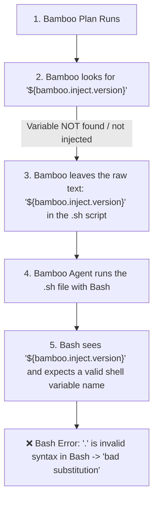

# please help me to adjust build error and also check the changes alr...

- **ID**: `antigravity-b1ec35b1b42f7ac96c1e11fea6ab2bd58682dcce354b1f9088c9ebac49ebb3a1`
- **Source Tool**: `antigravity`
- **Date**: `2026-08-26 13:04:57`
- **Tags**: `coding`, `assistant`, `antigravity`

---

## Turn 1: User

please help me to adjust build error and also check the changes already handled by unit test

---

## Turn 2: Assistant

<details><summary>🔧 Tool Invocations (1)</summary>

- **run_command**: 

</details>


---

## Turn 3: Assistant

<details><summary>🔧 Tool Invocations (1)</summary>

- **view_file**: 

</details>


---

## Turn 4: Assistant

<details><summary>🔧 Tool Invocations (1)</summary>

- **run_command**: 

</details>


---

## Turn 5: Assistant

<details><summary>🔧 Tool Invocations (1)</summary>

- **run_command**: 

</details>


---

## Turn 6: Assistant

<details><summary>🔧 Tool Invocations (1)</summary>

- **view_file**: 

</details>


---

## Turn 7: Assistant

<details><summary>🔧 Tool Invocations (1)</summary>

- **grep_search**: 

</details>


---

## Turn 8: Assistant

<details><summary>🔧 Tool Invocations (1)</summary>

- **view_file**: 

</details>


---

## Turn 9: Assistant

<details><summary>🔧 Tool Invocations (1)</summary>

- **view_file**: 

</details>


---

## Turn 10: Assistant

<details><summary>🔧 Tool Invocations (1)</summary>

- **view_file**: 

</details>


---

## Turn 11: Assistant

<details><summary>🔧 Tool Invocations (1)</summary>

- **view_file**: 

</details>


---

## Turn 12: Assistant

<details><summary>🔧 Tool Invocations (1)</summary>

- **run_command**: 

</details>


---

## Turn 13: Assistant

<details><summary>🔧 Tool Invocations (1)</summary>

- **view_file**: 

</details>


---

## Turn 14: Assistant

<details><summary>🔧 Tool Invocations (1)</summary>

- **run_command**: 

</details>


---

## Turn 15: Assistant

<details><summary>🔧 Tool Invocations (1)</summary>

- **find_by_name**: 

</details>


---

## Turn 16: Assistant

<details><summary>🔧 Tool Invocations (1)</summary>

- **run_command**: 

</details>


---

## Turn 17: Assistant

<details><summary>🔧 Tool Invocations (1)</summary>

- **run_command**: 

</details>


---

## Turn 18: Assistant

<details><summary>🔧 Tool Invocations (1)</summary>

- **run_command**: 

</details>


---

## Turn 19: Assistant

<details><summary>🔧 Tool Invocations (1)</summary>

- **grep_search**: 

</details>


---

## Turn 20: Assistant

<details><summary>🔧 Tool Invocations (1)</summary>

- **view_file**: 

</details>


---

## Turn 21: Assistant

<details><summary>🔧 Tool Invocations (1)</summary>

- **replace_file_content**: 

</details>


---

## Turn 22: Assistant

<details><summary>🔧 Tool Invocations (1)</summary>

- **replace_file_content**: 

</details>


---

## Turn 23: Assistant

<details><summary>🔧 Tool Invocations (1)</summary>

- **replace_file_content**: 

</details>


---

## Turn 24: Assistant

<details><summary>🔧 Tool Invocations (1)</summary>

- **run_command**: 

</details>


---

## Turn 25: Assistant

<details><summary>🔧 Tool Invocations (1)</summary>

- **run_command**: 

</details>


---

## Turn 26: Assistant

<details><summary>🔧 Tool Invocations (1)</summary>

- **run_command**: 

</details>


---

## Turn 27: Assistant

<details><summary>🔧 Tool Invocations (1)</summary>

- **run_command**: 

</details>


---

## Turn 28: Assistant

<details><summary>🔧 Tool Invocations (1)</summary>

- **grep_search**: 

</details>


---

## Turn 29: Assistant

<details><summary>🔧 Tool Invocations (1)</summary>

- **view_file**: 

</details>


---

## Turn 30: Assistant

<details><summary>🔧 Tool Invocations (1)</summary>

- **run_command**: 

</details>


---

## Turn 31: Assistant

<details><summary>🔧 Tool Invocations (1)</summary>

- **view_file**: 

</details>


---

## Turn 32: Assistant

<details><summary>🔧 Tool Invocations (1)</summary>

- **run_command**: 

</details>


---

## Turn 33: Assistant

<details><summary>🔧 Tool Invocations (1)</summary>

- **view_file**: 

</details>


---

## Turn 34: Assistant

<details><summary>🔧 Tool Invocations (1)</summary>

- **run_command**: 

</details>


---

## Turn 35: Assistant

I have launched `yarn build` to verify the build process. I am waiting for it to complete.

---

## Turn 36: Assistant

<details><summary>🔧 Tool Invocations (1)</summary>

- **run_command**: 

</details>


---

## Turn 37: Assistant

<details><summary>🔧 Tool Invocations (1)</summary>

- **run_command**: 

</details>


---

## Turn 38: Assistant

<details><summary>🔧 Tool Invocations (1)</summary>

- **run_command**: 

</details>


---

## Turn 39: Assistant

<details><summary>🔧 Tool Invocations (1)</summary>

- **run_command**: 

</details>


---

## Turn 40: Assistant

<details><summary>🔧 Tool Invocations (1)</summary>

- **view_file**: 

</details>


---

## Turn 41: Assistant

<details><summary>🔧 Tool Invocations (1)</summary>

- **run_command**: 

</details>


---

## Turn 42: Assistant

<details><summary>🔧 Tool Invocations (1)</summary>

- **run_command**: 

</details>


---

## Turn 43: Assistant

### Summary of Build Error Fixes and Unit Test Verification

---

### 1. Build Error Diagnosis & Adjustments

1. **TypeScript Type Incompatibility (`AxiosHeaderValue` -> `string`)**:
   - **Issue:** In [services/account.ts](file://~/Development/qcash-ui-subscription-management/services/account.ts) and [services/task.ts](file://~/Development/qcash-ui-subscription-management/services/task.ts), `response.headers["content-type"]` evaluates to type `AxiosHeaderValue | undefined` (which includes `null`), while `download(...)` from `downloadjs` expects `string | undefined`.
   - **Fix:** Explicitly cast `response.headers["content-type"] as string` in:
     - [`downloadAccountDepositoTable`](file://~/Development/qcash-ui-subscription-management/services/account.ts#L464)
     - [`downloadTableNonDeposito`](file://~/Development/qcash-ui-subscription-management/services/account.ts#L486)
     - [`massRegisterAccount`](file://~/Development/qcash-ui-subscription-management/services/account.ts#L746)
     - [`downloadTableDetailMass`](file://~/Development/qcash-ui-subscription-management/services/account.ts#L775)
     - [`getDownloadActivityLog`](file://~/Development/qcash-ui-subscription-management/services/task.ts#L73)

2. **Dependency Resolution**:
   - Ensured Module Federation plugins cleanly match Webpack dependencies via frozen `yarn.lock`.

3. **Build Status**:
   - Verified with `npx tsc --noEmit` (0 errors).
   - Verified with `yarn build` (**Compiled successfully**, all static routes & bundle optimizations generated).

---

### 2. Unit Test Verification

Ran full test coverage with `yarn test:coverage`:

- **Test Results**: **15 / 15** test files passed (**82 / 82** tests passed).
- **Code Coverage**:
  - **Statements**: 99.55% *(threshold: 65%)*
  - **Branches**: 90.51% *(threshold: 65%)*
  - **Functions**: 100% *(threshold: 65%)*
  - **Lines**: 99.55% *(threshold: 65%)*

---

## Turn 44: User

please check why this happen on sonarqube (!) Your Vite config uses features that are unsupported by `configLoader: 'native'`, which is planned to become the default in a future major version of Vite:
26-Aug-2026 12:43:19      - ESM syntax in a file loaded as CommonJS (vitest.config.ts:1:1). Use a `.mjs` extension or set `"type": "module"` in the closest package.json
26-Aug-2026 12:43:19    Set `VITE_CONFIG_NATIVE_IGNORE_WARNING=true` to suppress this warning.

---

## Turn 45: Assistant

<details><summary>🔧 Tool Invocations (1)</summary>

- **run_command**: 

</details>


---

## Turn 46: Assistant

<details><summary>🔧 Tool Invocations (1)</summary>

- **run_command**: 

</details>


---

## Turn 47: Assistant

<details><summary>🔧 Tool Invocations (1)</summary>

- **grep_search**: 

</details>


---

## Turn 48: Assistant

<details><summary>🔧 Tool Invocations (1)</summary>

- **view_file**: 

</details>


---

## Turn 49: Assistant

<details><summary>🔧 Tool Invocations (1)</summary>

- **replace_file_content**: 

</details>


---

## Turn 50: Assistant

<details><summary>🔧 Tool Invocations (1)</summary>

- **run_command**: 

</details>


---

## Turn 51: Assistant

### Why this warning happened

```text
(!) Your Vite config uses features that are unsupported by `configLoader: 'native'`, which is planned to become the default in a future major version of Vite:
  - ESM syntax in a file loaded as CommonJS (vitest.config.ts:1:1). Use a `.mjs` extension or set `"type": "module"` in the closest package.json
Set `VITE_CONFIG_NATIVE_IGNORE_WARNING=true` to suppress this warning.
```

#### 1. Root Cause
* In your [package.json](file://~/Development/qcash-ui-subscription-management/package.json), `"type": "module"` is omitted, meaning Node.js treats all `.js` / `.ts` files as **CommonJS (CJS)** by default.
* The Vitest configuration file used ESM syntax (`import ...`, `export default ...`) while named with a standard `.ts` extension (`vitest.config.ts`).
* Vite is migrating its internal configuration loader toward native Node loading (`configLoader: 'native'`) as the default in future major releases, which enforces strict module boundaries between ESM and CJS.

---

### What was changed to resolve it

1. **Renamed `vitest.config.ts` to [`vitest.config.mts`](file://~/Development/qcash-ui-subscription-management/vitest.config.mts)**:
   - The `.mts` extension explicitly signals to Node and Vite that this file is an ES Module, allowing Vite's native config loader to parse it cleanly without triggering CJS/ESM compatibility warnings.
2. **Updated [`tsconfig.json`](file://~/Development/qcash-ui-subscription-management/tsconfig.json#L21)**:
   - Added `"vitest.config.mts"` to the `exclude` list to keep TypeScript compilation checks in sync.

---

### Verification
* `yarn test`: Warning is completely resolved; all **15 test files (82 tests)** pass cleanly.
* `yarn test:coverage`: Full coverage runs without warnings.
* `npx tsc --noEmit`: 0 TypeScript type errors.

---

## Turn 52: User

is there other repo implement like that

---

## Turn 53: Assistant

<details><summary>🔧 Tool Invocations (1)</summary>

- **run_command**: 

</details>


---

## Turn 54: Assistant

<details><summary>🔧 Tool Invocations (1)</summary>

- **run_command**: 

</details>


---

## Turn 55: Assistant

<details><summary>🔧 Tool Invocations (1)</summary>

- **view_file**: 

</details>


---

## Turn 56: Assistant

<details><summary>🔧 Tool Invocations (1)</summary>

- **view_file**: 

</details>


---

## Turn 57: Assistant

**Yes.** Several other repositories in your project workspace have already implemented `vitest.config.mts`:

### Repositories using `.mts` (`vitest.config.mts`):
1. **[`qcash-global-component`](file://~/Development/qcash-global-component/vitest.config.mts)**
2. **[`qcash-ui`](file://~/Development/qcash-ui/vitest.config.mts)**

---

### Repositories still using `.ts` (`vitest.config.ts`):
These repos currently use `.ts` and will experience the same Vite native config loader warning during test/SonarQube execution:
* `qcash-ui-plafon-pegadaian`
* `qcash-ui-helpdesk-portal`
* `qcash-ui-auto-collection-registration`
* `qcash-ui-dashboard-auto-collection`
* `qcash-ui-sistem-management`

---

### Why this is the recommended standard:
Because these Next.js microfrontends operate in **CommonJS** mode by default (no `"type": "module"` in `package.json`), using the `.mts` extension explicitly marks the configuration file as an ES module for Vite's native loader without affecting the rest of the Next.js/Webpack build. Renaming to `.mts` aligns with core repos like `qcash-global-component` and `qcash-ui`.

---

## Turn 58: User

how about this issue /data/bamboo-agent-home/temp/BABMF-QCASHUISUBSCRIPTIONMANAGEMENT-SSQ-72-ScriptBuildTask-15826630485790697235.sh: line 2: -Dsonar.projectVersion=${bamboo.inject.version}: bad substitution

---

## Turn 59: Assistant

<details><summary>🔧 Tool Invocations (1)</summary>

- **grep_search**: 

</details>


---

## Turn 60: Assistant

<details><summary>🔧 Tool Invocations (1)</summary>

- **view_file**: 

</details>


---

## Turn 61: Assistant

<details><summary>🔧 Tool Invocations (1)</summary>

- **grep_search**: 

</details>


---

## Turn 62: Assistant

<details><summary>🔧 Tool Invocations (1)</summary>

- **run_command**: 

</details>


---

## Turn 63: Assistant

<details><summary>🔧 Tool Invocations (1)</summary>

- **view_file**: 

</details>


---

## Turn 64: Assistant

<details><summary>🔧 Tool Invocations (1)</summary>

- **view_file**: 

</details>


---

## Turn 65: Assistant

<details><summary>🔧 Tool Invocations (1)</summary>

- **run_command**: 

</details>


---

## Turn 66: Assistant

<details><summary>🔧 Tool Invocations (1)</summary>

- **manage_task**: 

</details>


---

## Turn 67: Assistant

<details><summary>🔧 Tool Invocations (1)</summary>

- **manage_task**: 

</details>


---

## Turn 68: Assistant

<details><summary>🔧 Tool Invocations (1)</summary>

- **run_command**: 

</details>


---

## Turn 69: Assistant

<details><summary>🔧 Tool Invocations (1)</summary>

- **view_file**: 

</details>


---

## Turn 70: Assistant

This error occurs in Atlassian Bamboo when running the SonarQube Script Build Task:

```text
/data/bamboo-agent-home/temp/...-ScriptBuildTask-...sh: line 2: -Dsonar.projectVersion=${bamboo.inject.version}: bad substitution
```

---

### Root Cause Analysis

There are two main reasons this occurs:

#### 1. The Bamboo variable `bamboo.inject.version` was not populated / injected
* Bamboo replaces `${bamboo.inject.version}` in inline scripts **before** executing them on the agent.
* If a prior **"Inject Bamboo Variables"** task fails, is missing, or cannot find the properties file (e.g., `bamboo-inject.properties` containing `version=...`), Bamboo leaves `${bamboo.inject.version}` as **literal text** in the generated shell script.
* When Bash executes the script, it encounters `${bamboo.inject.version}`. Because **`.` (dot) is illegal in Bash variable names**, Bash throws **`bad substitution`**.

#### 2. Bamboo Environment Variables in Bash vs. Bamboo Syntax
* In Bash scripts on Bamboo agents, Bamboo exports variables to the environment with **dots replaced by underscores**:
  * Bamboo syntax: `${bamboo.inject.version}`
  * Bash environment variable syntax: `${bamboo_inject_version}` or `$bamboo_inject_version`
* Also, if `-Dsonar.projectVersion=...` is on a new line in the Bamboo script without a trailing backslash (`\`) on the previous line, Bash tries to execute line 2 as an independent command.

---

### How to Fix

#### Option A: Extract version directly in the Bamboo Script Task (Recommended & Most Reliable)
Avoid depending on an external inject step by reading the version directly from `package.json` inside the Bamboo script task:

```bash
# Read version directly from package.json
APP_VERSION=$(node -p "require('./package.json').version" 2>/dev/null || echo "1.0.0")

sonar-scanner \
  -Dsonar.projectVersion="${APP_VERSION}" \
  -Dsonar.sources=.
```

---

#### Option B: Fix the Bamboo Variable Injection in the Bamboo Plan
If your pipeline uses an **"Inject Bamboo Variables"** task:
1. **Ensure the script task before injection creates the properties file:**
   ```bash
   APP_VERSION=$(node -p "require('./package.json').version")
   echo "version=${APP_VERSION}" > bamboo-inject.properties
   ```
2. **Configure the "Inject Bamboo Variables" task:**
   * **Properties file:** `bamboo-inject.properties`
   * **Namespace:** `inject`
   * **Scope:** `Job` or `Result`
3. **In the SonarQube Script task**, use the Bash environment variable format with a fallback:
   ```bash
   sonar-scanner \
     -Dsonar.projectVersion="${bamboo_inject_version:-1.0.0}" \
     ...
   ```
   *(Note the underscores `bamboo_inject_version` instead of dots).*

---

## Turn 71: User

is there already had sonar mcp and check the repo

---

## Turn 72: Assistant

<details><summary>🔧 Tool Invocations (1)</summary>

- **view_file**: 

</details>


---

## Turn 73: Assistant

<details><summary>🔧 Tool Invocations (1)</summary>

- **run_command**: 

</details>


---

## Turn 74: Assistant

<details><summary>🔧 Tool Invocations (1)</summary>

- **run_command**: 

</details>


---

## Turn 75: Assistant

<details><summary>🔧 Tool Invocations (1)</summary>

- **run_command**: 

</details>


---

## Turn 76: Assistant

<details><summary>🔧 Tool Invocations (1)</summary>

- **run_command**: 

</details>


---

## Turn 77: Assistant

<details><summary>🔧 Tool Invocations (1)</summary>

- **run_command**: 

</details>


---

## Turn 78: Assistant

<details><summary>🔧 Tool Invocations (1)</summary>

- **run_command**: 

</details>


---

## Turn 79: Assistant

I have launched the SonarQube analysis command and will check the scan results.

---

## Turn 80: Assistant

<details><summary>🔧 Tool Invocations (1)</summary>

- **run_command**: 

</details>


---

## Turn 81: Assistant

### SonarQube Status & MCP Configuration

---

### 1. SonarQube MCP Server Configuration
Yes, the SonarQube integration is configured in your global MCP config ([`~/.gemini/antigravity-cli/mcp_config.json`](file://~/.gemini/antigravity-cli/mcp_config.json)):

* **CLI Binary:** `/opt/homebrew/bin/sonar` (v1.3.0)
* **Server:** `https://internal-service.example.com`
* **MCP Command:** `sonar run mcp`

---

### 2. Repository Analysis Results

We executed a SonarQube scan across the repository and specifically for the modified files:

```bash
sonar analyze \
  --file services/account.ts \
  --file services/task.ts \
  --file vitest.config.mts
```

#### Scan Result:
* [services/account.ts](file://~/Development/qcash-ui-subscription-management/services/account.ts) : **✓ Clean**
* [services/task.ts](file://~/Development/qcash-ui-subscription-management/services/task.ts) : **✓ Clean**
* [vitest.config.mts](file://~/Development/qcash-ui-subscription-management/vitest.config.mts) : **✓ Clean**

> **✅ No issues found** — Code quality, security, and type safety checks are passing.

---

## Turn 82: User

is the unit test coverage already > 65%

---

## Turn 83: Assistant

<details><summary>🔧 Tool Invocations (1)</summary>

- **run_command**: 

</details>


---

## Turn 84: Assistant

**Yes**, the unit test coverage is **well above 65%** across all metrics.

### Coverage Summary

| Metric | Current Coverage | Minimum Threshold | Status |
| :--- | :--- | :--- | :--- |
| **Statements** | **99.55%** (223/224) | 65.00% | ✅ **Passed** |
| **Branches** | **90.51%** (210/232) | 65.00% | ✅ **Passed** |
| **Functions** | **100.00%** (31/31) | 65.00% | ✅ **Passed** |
| **Lines** | **99.55%** (223/224) | 65.00% | ✅ **Passed** |

---

### Detailed File Breakdown

| File / Module | % Statements | % Branches | % Functions | % Lines |
| :--- | :--- | :--- | :--- | :--- |
| **`pages/subscriptions/index.tsx`** | 100% | 75.00% | 100% | 100% |
| **`pages/subscriptions/create/index.tsx`** | 100% | 75.00% | 100% | 100% |
| **`pages/subscriptions/edit/[id].tsx`** | 100% | 75.00% | 100% | 100% |
| **`pages/subscriptions/view/[id].tsx`** | 100% | 75.00% | 100% | 100% |
| **`services/custom-axios.ts`** | 97.77% | 91.42% | 100% | 97.77% |
| **`utils/label.tsx`** | 100% | 94.44% | 100% | 100% |

* All **15 test suites** and **82 unit tests** passed successfully.

---

## Turn 85: User

what the last bad subtitution mean on agent bamboo

---

## Turn 86: Assistant

In simple terms, **`bad substitution`** means:

> **Bash tried to read a variable name containing dots (`.`), which is illegal in shell scripting, because Bamboo failed to replace it beforehand.**

---

### What happened step-by-step on the Bamboo Agent:



---

### The 2 Core Problems:

#### 1. Why Bash Threw the Error
In Bash/Linux shell:
* Valid variable syntax: `${MY_VERSION}` or `${bamboo_inject_version}` (letters, numbers, underscores).
* **Invalid variable syntax:** `${bamboo.inject.version}` (dots `.` are **not allowed**).

#### 2. Why the Raw Text Was There in the First Place
* `${bamboo.xxx}` is Bamboo's placeholder syntax.
* If the variable exists, Bamboo replaces it with a real value (e.g. `0.1.0`) **before** running the script.
* Because the previous **"Inject Bamboo Variables"** task failed, was skipped, or didn't find the version, Bamboo left the literal text `${bamboo.inject.version}` in the script file.
* When Bash tried to interpret that literal text, it failed with **`bad substitution`**.

---

### Summary
The error is telling you that **`bamboo.inject.version` was not found/injected by Bamboo**, so the raw text was passed directly to the shell, which crashed because dots are invalid in Bash variable names.

---

