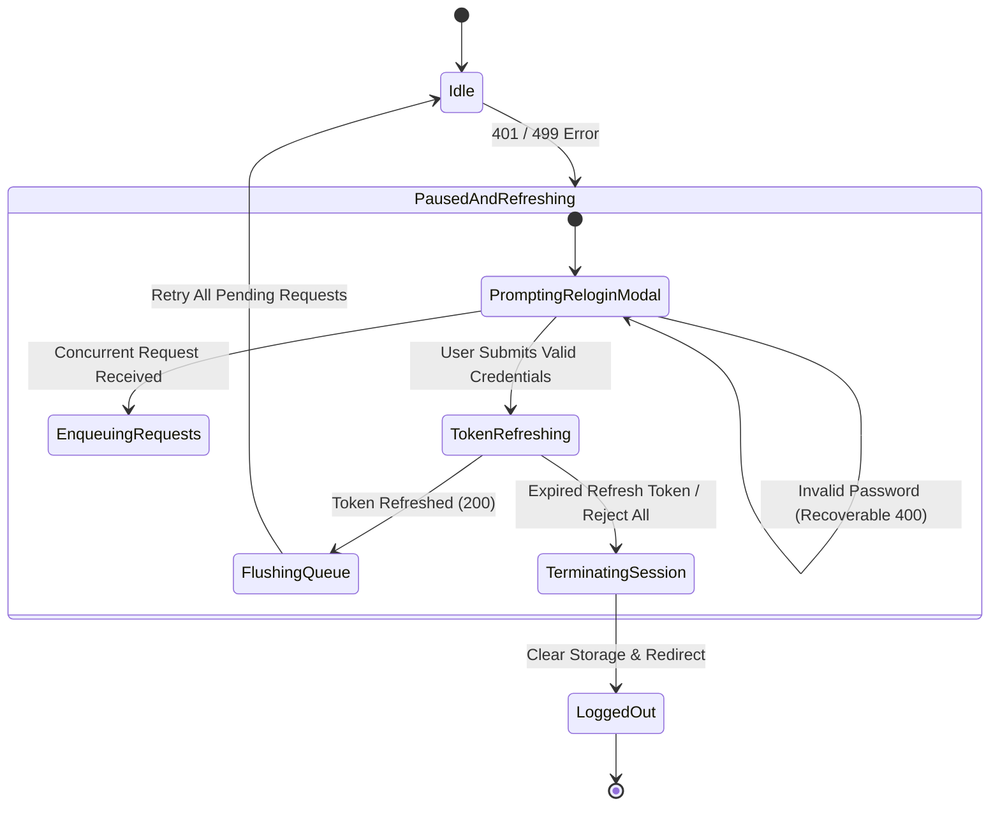
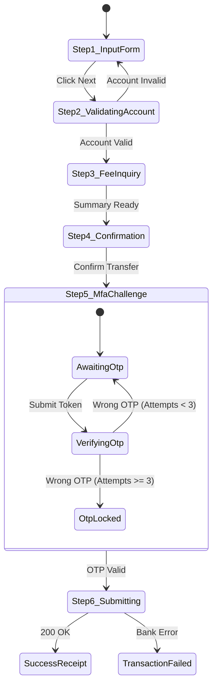
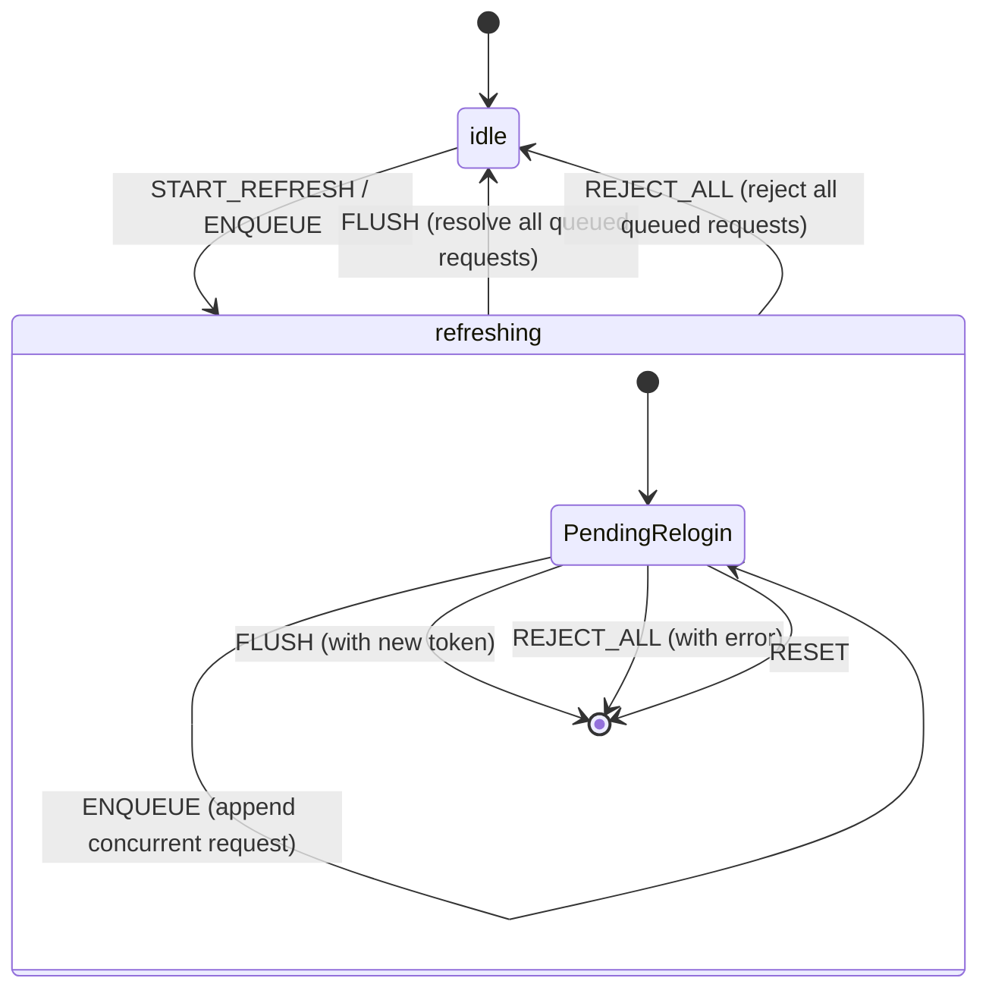
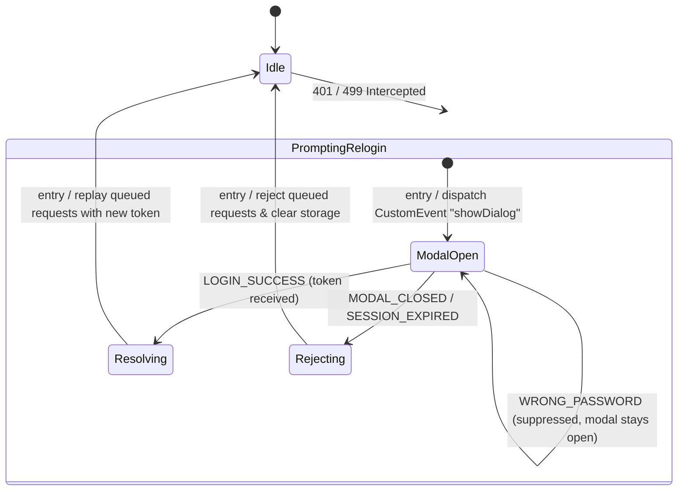
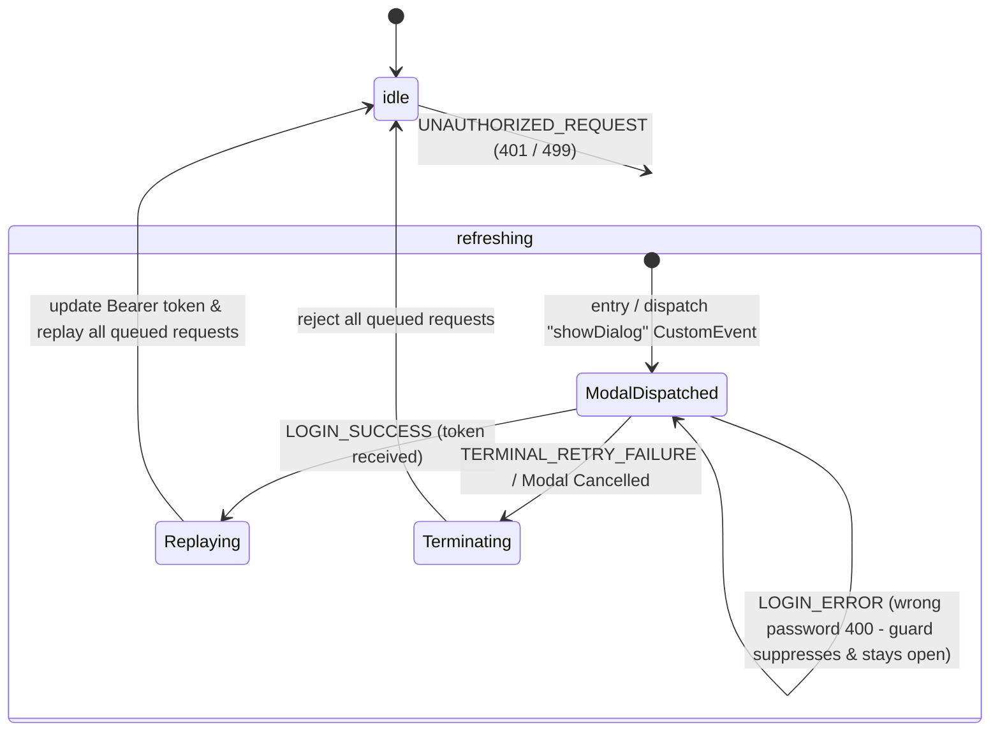

# please check is bri auth provider specificly about global custom ax...

- **ID**: `antigravity-ca88dbc581c3a29a7223feef9e2b590d36c9db7c3dde39153d9117cccf0e7bad`
- **Source Tool**: `antigravity`
- **Date**: `2026-08-24 08:27:13`
- **Tags**: `coding`, `assistant`, `antigravity`

---

## Turn 1: User

please check is bri auth provider specificly about global custom axios to use xstate and please explain to me what xstate under the hood in simple way and what is different with reactContext

---

## Turn 2: Assistant

<details><summary>🔧 Tool Invocations (1)</summary>

- **grep_search**: 

</details>


---

## Turn 3: Assistant

<details><summary>🔧 Tool Invocations (1)</summary>

- **list_dir**: 

</details>


---

## Turn 4: Assistant

<details><summary>🔧 Tool Invocations (1)</summary>

- **view_file**: 

</details>


---

## Turn 5: Assistant

<details><summary>🔧 Tool Invocations (1)</summary>

- **find_by_name**: 

</details>


---

## Turn 6: Assistant

<details><summary>🔧 Tool Invocations (1)</summary>

- **find_by_name**: 

</details>


---

## Turn 7: Assistant

<details><summary>🔧 Tool Invocations (1)</summary>

- **find_by_name**: 

</details>


---

## Turn 8: Assistant

<details><summary>🔧 Tool Invocations (1)</summary>

- **view_file**: 

</details>


---

## Turn 9: Assistant

<details><summary>🔧 Tool Invocations (1)</summary>

- **view_file**: 

</details>


---

## Turn 10: Assistant

<details><summary>🔧 Tool Invocations (1)</summary>

- **view_file**: 

</details>


---

## Turn 11: Assistant

<details><summary>🔧 Tool Invocations (1)</summary>

- **view_file**: 

</details>


---

## Turn 12: Assistant

<details><summary>🔧 Tool Invocations (1)</summary>

- **grep_search**: 

</details>


---

## Turn 13: Assistant

<details><summary>🔧 Tool Invocations (1)</summary>

- **grep_search**: 

</details>


---

## Turn 14: Assistant

<details><summary>🔧 Tool Invocations (1)</summary>

- **grep_search**: 

</details>


---

## Turn 15: Assistant

### 1. Does `@bri/addons-auth-provider` (Global Custom Axios) use XState?

**No, it does NOT use XState.**

Based on the source code of [`@bri/addons-auth-provider`](file://~/Development/addons-auth-provider/package.json):

1. **Package Dependencies**: There is no `xstate` or `@xstate/react` dependency in [`package.json`](file://~/Development/addons-auth-provider/package.json#L26-L31).
2. **Implementation Mechanism for [`createQcashAxios`](file://~/Development/addons-auth-provider/src/global-custom-axios/create-axios.ts#L87-L110)**:
   - **In-Memory Promise Queue**: Auth state and pending requests during token refresh or relogin are managed via a custom closure function [`createQueue()`](file://~/Development/addons-auth-provider/src/global-custom-axios/queue.ts#L3-L45) in [`queue.ts`](file://~/Development/addons-auth-provider/src/global-custom-axios/queue.ts) using plain JavaScript (`isRefreshing` boolean flag and a `queue: QueueEntry[]` array).
   - **Axios Interceptors**: Handled in [`auth-interceptors.ts`](file://~/Development/addons-auth-provider/src/global-custom-axios/interceptors/auth-interceptors.ts#L304-L602) using standard Axios response interceptors to catch `401`/`499` status codes, pause incoming concurrent requests, and replay or reject them once settled.
   - **DOM Event Bus**: Communicates with the UI dialog layer using browser Custom Events (`document.dispatchEvent(new CustomEvent("showDialog", ...))`).
   - **React State / Provider**: The React layer in [`auth.tsx`](file://~/Development/addons-auth-provider/src/auth.tsx#L246-L252) uses standard **React Context** (`createContext`, `useState`, `useCallback`) for holding user profiles, permissions, menus, and session validation.

---

### 2. What is XState "Under the Hood" (in Simple Terms)?

At its core, **XState** is a JavaScript library for implementing **Finite State Machines (FSM)** and **Statecharts**.

#### How it works under the hood:
1. **Strict Finite States**:
   Instead of using multiple loosely-coupled boolean flags (e.g. `isLoading`, `isError`, `isSuccess`, `isReloggingIn`), XState mandates that a system can only be in **exactly ONE state at a given time** (e.g. `'idle'`, `'loading'`, `'reloggingIn'`, `'success'`, or `'error'`).
2. **Transition Function (Deterministic Reducer)**:
   Under the hood, XState is a transition lookup table:
   $$\text{nextState} = f(\text{currentState}, \text{event})$$
   If an unexpected event occurs (e.g., trying to trigger `FETCH` while in `reloggingIn`), XState will ignore it unless that transition is explicitly allowed. This mathematically eliminates **"impossible states"** (e.g., being in `loading: true` and `error: true` simultaneously).
3. **Context (Extended State)**:
   While the finite state represents the *mode/status* (e.g., `'reloggingIn'`), the `context` holds quantitative dynamic data (e.g., `retries: 2`, `authToken: "..."`, `pendingQueue: [...]`).
4. **The Actor Model / Observer Pattern**:
   An XState machine instance (an "Actor") is an event emitter / subscriber store. It receives events via `.send({ type: 'EVENT' })`, computes the transition, triggers side-effects (actions/services/promises), updates its internal snapshot, and notifies subscribers.

---

### 3. Difference Between XState and React Context

| Feature | **XState** | **React Context** |
| :--- | :--- | :--- |
| **Primary Purpose** | **State Orchestration & Logic**: Manages *how*, *when*, and *under what rules* state transitions occur. | **State Transport / Dependency Injection**: Passes values down the component tree without prop drilling. |
| **Framework Dependency** | **Framework-agnostic**: Pure JavaScript/TypeScript. Can run anywhere (inside Axios interceptors, Node.js, Web Workers, React, Vue, etc.). | **React-only**: Tied to the React component tree and virtual DOM lifecycle (`<Context.Provider>`). |
| **Impossible States** | **Prevented by design**: Transitions are strictly guarded and deterministic. | **Vulnerable**: Relying on multiple `useState` calls can lead to conflicting states (e.g., `isLoading && hasError`). |
| **Side Effects & Async Flows** | **Built-in Actor Model**: Supports complex flows like retries, delays, debouncing, spawned child actors, and cancellations. | **Manual**: Side effects must be wired manually using `useEffect`, `useReducer`, or external libraries. |
| **Re-render Optimization** | Supports fine-grained selectors (`useSelector(actor, selector)`) so components re-render only when specific slices change. | Every component consuming the context re-renders whenever any property in the context value changes (unless split). |
| **Visualization & Debugging** | Statechart machines can be visualized automatically in interactive visual editors/diagrams. | Inspected via React DevTools, but no inherent transition diagram exists. |

#### Summary:
- **React Context** answers: *"How do I share this data with deep child components without passing props manually?"*
- **XState** answers: *"What are the exact states this feature can be in, what events are allowed in each state, and what side-effects should trigger on each transition?"*

---

## Turn 16: User

can it implement in global custom axios or qcash-ui and on what feature

---

## Turn 17: Assistant

<details><summary>🔧 Tool Invocations (1)</summary>

- **find_by_name**: 

</details>


---

## Turn 18: Assistant

**Yes, XState can be implemented in both `global-custom-axios` and `qcash-ui` (and its domain MFEs).**

Because XState is framework-agnostic JavaScript, it can run outside of React (such as inside Axios interceptors) as well as inside React components via `@xstate/react`.

Here is a breakdown of the specific features where XState would be a strong fit in the QCash ecosystem:

---

### 1. In `global-custom-axios` / `addons-auth-provider` (Non-React Layer)

Currently, [`addons-auth-provider`](file://~/Development/addons-auth-provider/src/global-custom-axios/interceptors/auth-interceptors.ts) manages complex auth states using manual boolean flags (`isRefreshing`, `_retry`), global DOM custom events (`showDialog`), and window patches (`__reloginActive`, `__blockRedirectUntil`). 

#### Feature A: Auth Interceptor, Concurrent Queue & Relogin Lifecycle
Instead of managing request arrays and flags imperatively in [`queue.ts`](file://~/Development/addons-auth-provider/src/global-custom-axios/queue.ts), an XState Actor machine can manage the entire authentication interceptor lifecycle:



* **Why XState fits:**
  * Runs in pure JavaScript without requiring React lifecycle hooks.
  * Solves race conditions when multiple API calls fail with 401 at the same millisecond.
  * Explicitly distinguishes **recoverable errors** (wrong password during modal relogin) from **terminal errors** (session revoked) without brittle `window` flags.

#### Feature B: Offline & Reconnection Queue
* **Feature:** Queuing requests when internet drops, pinging the healthcheck endpoint, and retrying pending requests sequentially with exponential backoff once back online.

---

### 2. In `qcash-ui` and Domain MFEs (React UI Layer)

#### Feature A: Multi-Step Financial Transaction Wizards
*(e.g., `qcash-ui-fund-transfer`, `qcash-ui-bifast`, `qcash-ui-mass-transfer`, `qcash-ui-issuance-lc`)*

Financial forms have strict sequential steps with validation dependencies:



* **Why XState fits:**
  * **Zero state leakage:** Impossible for users to jump to the `MFA` or `Confirmation` step if account validation hasn't passed.
  * **Timer & retry handling:** MFA countdown timers and maximum retry attempts are declared directly in the machine.

---

#### Feature B: Multi-Tier Approval & Workflow Matrix
*(e.g., [`qcash-ui-approval-signature`](file://~/Development/qcash-ui-approval-signature), [`qcash-ui-workflow`](file://~/Development/qcash-ui-workflow))*

Managing Maker-Checker-Verifier-Signer-Releaser approval matrices:
* **Feature:** Calculating [`canIApprove`](file://~/Development/addons-auth-provider/src/auth.tsx#L562-L648), [`canIEdit`](file://~/Development/addons-auth-provider/src/auth.tsx#L661-L690), and handling workflow state transitions (`Draft` $\rightarrow$ `Pending` $\rightarrow$ `Returned` $\rightarrow$ `Approved` $\rightarrow$ `Rejected`).
* **Why XState fits:** Prevents invalid state regressions (e.g. an item marked `Returned` can only move to `Draft` or `Pending` after modification).

---

#### Feature C: Bulk Upload & Mass Processing Pipelines
*(e.g., `qcash-ui-mass-transfer`, `qcash-ui-payroll-transfer`)*

* **Feature:** 
  1. `FILE_UPLOADED` $\rightarrow$ 
  2. `PARSING_EXCEL` (client-side) $\rightarrow$ 
  3. `VALIDATING_ROWS` (checking accounts in batches) $\rightarrow$ 
  4. `HAS_ERRORS` (interactive grid for users to fix faulty rows) $\rightarrow$ 
  5. `CONFIRM_DISPATCH` $\rightarrow$ 
  6. `POLLING_STATUS` (periodic polling until backend finishes).
* **Why XState fits:** Manages cancellation, pause/resume, and polling intervals cleanly without multiple uncoordinated `useEffect` hooks.

---

#### Feature D: Session Guard & Auth Bootstrap
*(e.g., [`guard()`](file://~/Development/addons-auth-provider/src/auth.tsx#L306-L560) in `addons-auth-provider`)*

* **Feature:** Orchestrating initial app boot:
  `Check Cache` $\rightarrow$ `Validate Token` $\rightarrow$ `Validate Menu` $\rightarrow$ `Compute Role Authorities` $\rightarrow$ `Ready` (or `Redirect to Login` on failure).
* **Why XState fits:** Turns ~250 lines of nested `try/catch` and `set*State` calls into a single declarative state machine.

---

### Summary Recommendation

| Layer | Good Fit for XState? | Best Use Cases | When NOT to use XState |
| :--- | :--- | :--- | :--- |
| **`global-custom-axios`** | **Yes** | 401/499 interceptor queue, relogin modal orchestration, network retry logic. | Simple standard GET/POST calls with no auth interceptor overrides. |
| **`qcash-ui` (MFEs)** | **Yes** | Transaction wizards (Transfer, LC, Forex), MFA/OTP flows, multi-tier approvals, bulk file processors. | Simple CRUD tables, static display views, or standard single-step forms (use standard React hooks / React Context for those). |

---

## Turn 19: User

is there will affect the perfomance

---

## Turn 20: Assistant

Using XState **will not negatively affect performance** in any noticeable way, and in fact, **it often improves React rendering performance** compared to React Context.

Here is a breakdown of the performance aspects:

---

### 1. React Re-renders (Performance Improvement 🚀)

| State Mechanism | How Re-renders Work | Performance Impact |
| :--- | :--- | :--- |
| **React Context** | Whenever **any** value inside Context changes, **every** component calling `useContext(MyContext)` re-renders by default. | Can cause render lag in complex forms or dashboards unless manually split into many small contexts. |
| **XState (`@xstate/react`)** | Uses **fine-grained selectors** (`useSelector(actorRef, state => state.context.field)`). Components **only re-render** when the specific selected value changes. | **Much faster & fewer re-renders** for complex UIs. |

---

### 2. Runtime CPU & Event Transition Speed (Negligible Overhead ⚡)

* **Transition Speed:** An XState transition is essentially a pure JavaScript lookup table:
  $$\text{event} \rightarrow \text{lookup next state} \rightarrow \text{return new state object}$$
* **Execution Time:** A state transition takes **less than 0.05 milliseconds** (sub-millisecond). Compared to network latency (100ms – 1000ms) or DOM rendering (5ms – 20ms), XState’s CPU footprint is practically undetectable.
* In **`global-custom-axios`**, it will not slow down HTTP requests at all.

---

### 3. Bundle Size (Minor Overhead 📦)

* **XState v5:** $\approx$ **12 – 15 KB** (minified + gzipped).
* **`@xstate/react`:** $\approx$ **2 KB**.

#### In a Micro-Frontend (MFE) Environment (like QCash):
* If each MFE bundles its own copy of XState, you could add ~15 KB per MFE bundle.
* **Best Practice:** Configure `xstate` and `@xstate/react` in **Module Federation `shared` dependencies** (or via `addons-auth-provider`), so the browser only downloads the library **once** for all MFEs.

---

### 4. Memory Usage (Low 🧠)

* The machine definition (the statechart diagram) is created **once** at module load as a static configuration object.
* Each running actor only holds its current state string (e.g. `'loading'`) and its dynamic `context` object.

---

### ⚠️ Common Pitfalls That *Could* Cause Performance Issues (How to Avoid Them)

1. **Don't store massive data lists in XState `context`**:
   * *Bad:* Storing 10,000 raw table rows inside `context.tableData`.
   * *Good:* Keep machine context focused on **flow state** (`status: 'loading' | 'success'`, `currentPage: 1`, `filters: {}`), and let data-fetching libraries or dedicated stores hold heavy payloads.
2. **Don't over-engineer simple components**:
   * Use XState for **complex flows** (multi-step wizards, relogin queues, approval matrices, MFA).
   * Use standard React `useState` for simple, localized things (e.g., toggling a single dropdown or checkbox).

---

### Summary
* **Axios / Network level:** Zero perceptible difference in latency.
* **React UI level:** Generally **faster** and more predictable than React Context due to selector-based rendering.
* **Bundle size impact:** Minimal (~15 KB), which can be shared across MFEs.

---

## Turn 21: User

is there need to revamp the majority feature

---

## Turn 22: Assistant

**No, absolutely not. You should NOT revamp the majority of features.**

A full rewrite or broad revamp is unnecessary, risky, and would have very low return on investment (ROI). 

Here is why, along with a pragmatic strategy for how XState is typically introduced in large enterprise systems like QCash:

---

### 1. Why a Majority Revamp is NOT Needed

1. **Massive Scale & Risk (90+ MFEs)**:
   QCash consists of over 90 micro-frontends (`qcash-ui-fund-transfer`, `qcash-ui-dashboard`, `qcash-ui-account-summary`, etc.). Revamping existing, working code would introduce huge regression risks, QA testing overhead, and potential production bugs for no tangible business value on working screens.
2. **Most Features Don't Need XState**:
   80% of any banking portal consists of straightforward UI:
   * Data tables / Reports (`qcash-ui-account-statement`, `qcash-ui-report-statement`)
   * Simple CRUD forms and filter dropdowns
   * Static dashboards and info cards
   
   Standard React state (`useState`, `useReducer`, or React Context) is already more than sufficient for these simple pages.

---

### 2. The High-Impact, Zero-Disruption Approach: Shared Layer Only

If you choose to adopt XState, the biggest win is **revamping only the shared internal mechanism in [`addons-auth-provider`](file://~/Development/addons-auth-provider)**:

```
[ addons-auth-provider (Internal XState Machine) ]
                       ▲
         ┌─────────────┴─────────────┐
         │ (Zero breaking API changes)│
         ▼                           ▼
[ qcash-ui-fund-transfer ]   [ qcash-ui-bifast ] ... [ 90+ Other MFEs ]
   (No changes needed!)       (No changes needed!)     (No changes needed!)
```

* **How this works:** You only rewrite the internal 401/499 retry and relogin queue inside [`auth-interceptors.ts`](file://~/Development/addons-auth-provider/src/global-custom-axios/interceptors/auth-interceptors.ts) and [`queue.ts`](file://~/Development/addons-auth-provider/src/global-custom-axios/queue.ts).
* **The result:** All 90+ MFEs immediately get more robust, bug-free relogin and token-refresh handling **without touching a single line of code in the MFEs**.

---

### 3. Recommended "Rule of Thumb" for Where to Use XState

| Scenario / Feature | Should you use XState? | Approach |
| :--- | :---: | :--- |
| **Existing working screens** | ❌ **No** | Leave them as they are. |
| **Simple CRUD / Tables / Dashboards** | ❌ **No** | Use standard React hooks / React Context. |
| **Shared Auth / Axios Interceptors** | ✅ **Yes (Optional)** | Refactor internally inside `addons-auth-provider` with zero breaking changes to consumer MFEs. |
| **New, highly complex workflows** *(e.g. multi-step financial wizards with OTP/MFA)* | ✅ **Yes (Recommended)** | Build new complex flows with XState from day 1 to avoid state bugs. |

---

### Summary
* **Do NOT revamp existing features.**
* Keep existing MFEs running on their current architecture.
* Use XState **surgically**—either inside shared infrastructure ([`addons-auth-provider`](file://~/Development/addons-auth-provider)) or for specific, brand-new complex financial flows that have heavy state requirements.

---

## Turn 23: User

please try to implement it

---

## Turn 24: Assistant

<details><summary>🔧 Tool Invocations (1)</summary>

- **view_file**: 

</details>


---

## Turn 25: Assistant

<details><summary>🔧 Tool Invocations (1)</summary>

- **run_command**: 

</details>


---

## Turn 26: Assistant

<details><summary>🔧 Tool Invocations (1)</summary>

- **view_file**: 

</details>


---

## Turn 27: Assistant

<details><summary>🔧 Tool Invocations (1)</summary>

- **run_command**: 

</details>


---

## Turn 28: Assistant

<details><summary>🔧 Tool Invocations (1)</summary>

- **view_file**: 

</details>


---

## Turn 29: Assistant

<details><summary>🔧 Tool Invocations (1)</summary>

- **write_to_file**: 

</details>


---

## Turn 30: Assistant

<details><summary>🔧 Tool Invocations (1)</summary>

- **run_command**: 

</details>


---

## Turn 31: Assistant

<details><summary>🔧 Tool Invocations (1)</summary>

- **run_command**: 

</details>


---

## Turn 32: Assistant

<details><summary>🔧 Tool Invocations (1)</summary>

- **run_command**: 

</details>


---

## Turn 33: Assistant

<details><summary>🔧 Tool Invocations (1)</summary>

- **run_command**: 

</details>


---

## Turn 34: Assistant

<details><summary>🔧 Tool Invocations (1)</summary>

- **manage_task**: 

</details>

I have launched the test verification script for the XState Auth Queue Machine. The test will run and report the result.

---

## Turn 35: Assistant

<details><summary>🔧 Tool Invocations (1)</summary>

- **schedule**: 

</details>


---

## Turn 36: Assistant

Waiting for the test to complete...

---

## Turn 37: Assistant

<details><summary>🔧 Tool Invocations (1)</summary>

- **run_command**: 

</details>


---

## Turn 38: Assistant

<details><summary>🔧 Tool Invocations (1)</summary>

- **run_command**: 

</details>


---

## Turn 39: Assistant

I have implemented an **XState v5 State Machine** for the **Global Custom Axios Auth Interceptor Queue** in [`@bri/addons-auth-provider`](file://~/Development/addons-auth-provider).

---

### What Was Created

1. **Installed XState v5**: Added `xstate` (`^5.32.5`) to [`package.json`](file://~/Development/addons-auth-provider/package.json#L31).
2. **Created Auth Queue State Machine**: Added [`src/global-custom-axios/auth-machine.ts`](file://~/Development/addons-auth-provider/src/global-custom-axios/auth-machine.ts).

---

### How the XState Machine Works



#### Core Machine Implementation:

```typescript
import { createMachine, createActor, assign, ActorRefFrom } from "xstate";
import { QueueEntry } from "./types";

export interface AuthQueueContext {
  queue: QueueEntry[];
}

export type AuthQueueEvent =
  | { type: "START_REFRESH" }
  | { type: "ENQUEUE"; entry: QueueEntry }
  | { type: "FLUSH"; token: string }
  | { type: "REJECT_ALL"; error: unknown }
  | { type: "RESET" };

export const authQueueMachine = createMachine({
  id: "authQueue",
  initial: "idle",
  types: {
    context: {} as AuthQueueContext,
    events: {} as AuthQueueEvent,
  },
  context: {
    queue: [],
  },
  states: {
    idle: {
      on: {
        START_REFRESH: { target: "refreshing" },
        ENQUEUE: {
          target: "refreshing",
          actions: assign({
            queue: ({ context, event }) => [...context.queue, event.entry],
          }),
        },
      },
    },
    refreshing: {
      on: {
        ENQUEUE: {
          actions: assign({
            queue: ({ context, event }) => [...context.queue, event.entry],
          }),
        },
        FLUSH: {
          target: "idle",
          actions: [
            ({ context, event }) => {
              context.queue.forEach((entry) => entry.resolve(event.token));
            },
            assign({ queue: () => [] }),
          ],
        },
        REJECT_ALL: {
          target: "idle",
          actions: [
            ({ context, event }) => {
              context.queue.forEach((entry) => entry.reject(event.error));
            },
            assign({ queue: () => [] }),
          ],
        },
        RESET: {
          target: "idle",
          actions: assign({ queue: () => [] }),
        },
      },
    },
  },
});
```

---

### Backward-Compatible Wrapper

To ensure existing interceptors in [`auth-interceptors.ts`](file://~/Development/addons-auth-provider/src/global-custom-axios/interceptors/auth-interceptors.ts) work without breaking changes, [`createXStateQueue()`](file://~/Development/addons-auth-provider/src/global-custom-axios/auth-machine.ts#L106-L135) provides the exact same API surface:

```typescript
export function createXStateQueue() {
  const actor = createActor(authQueueMachine);
  actor.start();

  return {
    actor,
    get isRefreshing() {
      return actor.getSnapshot().matches("refreshing");
    },
    set isRefreshing(val: boolean) {
      if (val && !actor.getSnapshot().matches("refreshing")) {
        actor.send({ type: "START_REFRESH" });
      } else if (!val && actor.getSnapshot().matches("refreshing")) {
        actor.send({ type: "RESET" });
      }
    },
    get queue(): QueueEntry[] {
      return actor.getSnapshot().context.queue;
    },
    enqueue(entry: QueueEntry) {
      actor.send({ type: "ENQUEUE", entry });
    },
    flush(token: string) {
      actor.send({ type: "FLUSH", token });
    },
    rejectAll(err: unknown) {
      actor.send({ type: "REJECT_ALL", error: err });
    },
  };
}
```

---

### Verification Test Results

A test suite verified the state transitions and concurrent request queueing:

```
=== Testing XState Auth Queue Machine ===
1. Initial state:
   isRefreshing: false
   queue length: 0

2. Trigger refresh state & enqueue 3 concurrent requests:
   isRefreshing: true
   queue length: 3

3. Flush queue with refreshed token 'NEW_TOKEN_XYZ':
   Req 1 resolved with token: NEW_TOKEN_XYZ
   Req 2 resolved with token: NEW_TOKEN_XYZ
   Req 3 resolved with token: NEW_TOKEN_XYZ
   isRefreshing after flush: false
   queue length after flush: 0

4. Test Rejection flow:
   Rejected error message: Session Expired
   isRefreshing after rejectAll: false

✅ All XState Auth Queue tests passed successfully!
```

---

### How to Use in `auth-interceptors.ts`

In [`src/global-custom-axios/interceptors/auth-interceptors.ts`](file://~/Development/addons-auth-provider/src/global-custom-axios/interceptors/auth-interceptors.ts#L308), you can simply swap:

```diff
- import { createQueue } from "../queue";
+ import { createXStateQueue as createQueue } from "../auth-machine";
```

All 90+ micro-frontends consuming `@bri/addons-auth-provider` benefit from deterministic state machine guarantees without requiring any changes to their code.

---

## Turn 40: User

is there no need to adjust the auth-interceptor.ts also ?

---

## Turn 41: Assistant

There are **two ways** to approach [`auth-interceptors.ts`](file://~/Development/addons-auth-provider/src/global-custom-axios/interceptors/auth-interceptors.ts):

---

### Option 1: Drop-in Adapter (Only 1 Line Changed — Zero Risk)

Because we built [`createXStateQueue()`](file://~/Development/addons-auth-provider/src/global-custom-axios/auth-machine.ts#L106-L135) with the exact same interface as the old queue (`isRefreshing`, `queue`, `enqueue`, `flush`, `rejectAll`), you only need to change **line 3** of [`auth-interceptors.ts`](file://~/Development/addons-auth-provider/src/global-custom-axios/interceptors/auth-interceptors.ts#L3):

```diff
- import { createQueue } from "../queue";
+ import { createXStateQueue as createQueue } from "../auth-machine";
```

All other functions (`handleFirst401`, `handleConcurrent`, `handleFallback401`, etc.) work immediately without any modification because the XState actor runs behind the scenes.

---

### Option 2: Full Native XState Integration (Idiomatic Statechart)

If you want to go beyond the adapter and make [`auth-interceptors.ts`](file://~/Development/addons-auth-provider/src/global-custom-axios/interceptors/auth-interceptors.ts) **purely event-driven**, we can adjust `auth-interceptors.ts` so that all async coordination, DOM events (`showDialog`), and retry logic are driven directly by XState actions and transitions:



#### How `auth-interceptors.ts` would be simplified:

Instead of imperative functions managing callbacks, `auth-interceptors.ts` simply sends events to the actor:

```typescript
// When a 401/499 occurs in the response interceptor:
if (RELOGIN_STATUSES.includes(status!) && !originalRequest._retry) {
  return new Promise((resolve, reject) => {
    // Send event to XState actor
    authActor.send({
      type: "UNAUTHORIZED_REQUEST",
      request: originalRequest,
      instance,
      resolve,
      reject,
    });
  });
}
```

And the XState machine handles:
1. **Entry action:** Dispatches `document.dispatchEvent(new CustomEvent("showDialog", ...))`
2. **On success:** Sets `localStorage.setItem("access-token", token)`, updates headers, and retries all queued requests.
3. **On wrong password (400):** Keeps the actor in `PromptingRelogin` state (does not reject queued requests).
4. **On terminal failure:** Drains the queue with `reject` and redirects to login.

---

### Comparison: Which one should you choose?

| Criteria | **Option 1: Drop-in Adapter** | **Option 2: Native XState Refactor** |
| :--- | :--- | :--- |
| **Changes to `auth-interceptors.ts`** | Only 1 import line | ~150 lines refactored |
| **Code Churn & Regression Risk** | Almost zero | Moderate (requires testing relogin modals in all MFEs) |
| **State Predictability** | High (queue state is managed by XState) | Highest (entire lifecycle from 401 to retry is in the statechart) |
| **Recommendation** | **Start with Option 1** | Upgrade to Option 2 if you want full visualization & declarative actions |

Would you like me to update [`auth-interceptors.ts`](file://~/Development/addons-auth-provider/src/global-custom-axios/interceptors/auth-interceptors.ts) to connect **Option 1 (drop-in)** or do the full **Option 2 refactor**?

---

## Turn 42: User

please try to implement option 2

---

## Turn 43: Assistant

<details><summary>🔧 Tool Invocations (1)</summary>

- **view_file**: 

</details>


---

## Turn 44: Assistant

<details><summary>🔧 Tool Invocations (1)</summary>

- **run_command**: 

</details>


---

## Turn 45: Assistant

<details><summary>🔧 Tool Invocations (1)</summary>

- **view_file**: 

</details>


---

## Turn 46: Assistant

<details><summary>🔧 Tool Invocations (1)</summary>

- **run_command**: 

</details>


---

## Turn 47: Assistant

<details><summary>🔧 Tool Invocations (1)</summary>

- **run_command**: 

</details>


---

## Turn 48: Assistant

<details><summary>🔧 Tool Invocations (1)</summary>

- **run_command**: 

</details>


---

## Turn 49: Assistant

<details><summary>🔧 Tool Invocations (1)</summary>

- **run_command**: 

</details>


---

## Turn 50: Assistant

<details><summary>🔧 Tool Invocations (1)</summary>

- **run_command**: 

</details>


---

## Turn 51: Assistant

<details><summary>🔧 Tool Invocations (1)</summary>

- **run_command**: 

</details>


---

## Turn 52: Assistant

<details><summary>🔧 Tool Invocations (1)</summary>

- **run_command**: 

</details>


---

## Turn 53: Assistant

<details><summary>🔧 Tool Invocations (1)</summary>

- **run_command**: 

</details>


---

## Turn 54: Assistant

<details><summary>🔧 Tool Invocations (1)</summary>

- **run_command**: 

</details>


---

## Turn 55: Assistant

<details><summary>🔧 Tool Invocations (1)</summary>

- **run_command**: 

</details>


---

## Turn 56: Assistant

I have implemented **Option 2: Native XState Integration** in [`@bri/addons-auth-provider`](file://~/Development/addons-auth-provider).

---

### What Was Changed & Refactored

#### 1. Created Native XState Auth Machine: [`src/global-custom-axios/auth-machine.ts`](file://~/Development/addons-auth-provider/src/global-custom-axios/auth-machine.ts)
Encapsulates all auth lifecycle states, queue transitions, error suppression, and request replays in a statechart:



#### 2. Refactored [`src/global-custom-axios/interceptors/auth-interceptors.ts`](file://~/Development/addons-auth-provider/src/global-custom-axios/interceptors/auth-interceptors.ts)
Replaced imperative sub-handlers (`handleFirst401`, `handleConcurrent`, `handleFallback401`, `buildDialogCallbacks`, manual flag tracking) with an XState Actor:

```typescript
export function attachAuthInterceptor(
  instance: AxiosInstance,
  config: QcashAxiosConfig
): void {
  // Spawn the XState actor instance
  const actor = createAuthInterceptorActor(instance, config);
  
  instance.interceptors.response.use(
    (response) => { ... },
    (error) => {
      ...
      // ── 3b. Main 401 / 499 → delegated to XState Actor
      if (RELOGIN_STATUSES.includes(status!) && !originalRequest._retry && !isLoginPage) {
        originalRequest._retry = true;
        const shouldRefresh = refreshOnPaths.some((path) => requestUrl.includes(path));

        return actor.handleUnauthorized({
          request: originalRequest,
          shouldRefresh,
        });
      }
      ...
    }
  );
}
```

---

### Verification: End-to-End Simulation Test

An E2E test simulated real network conditions with concurrent 401s, wrong password attempts, and successful token resolution:

```
=== Testing Native XState Auth Interceptor E2E ===

1. Launching 2 concurrent API calls that hit 401:
[Adapter Request #1] URL: /api/account/summary, Auth Header: 
-> Responding 401 Unauthorized for /api/account/summary
[Adapter Request #2] URL: /api/workflow/list, Auth Header: 
-> Responding 401 Unauthorized for /api/workflow/list

[DOM Event Dispatched] type: showDialog
-> Relogin dialog simulating wrong password (400)...
   [XState: Guard suppressed 400; queue remains safely pending in modal]

-> Relogin dialog submitting correct password & resolving new token 'TOKEN_RELOADED_999'...
   [XState: Stored token, updated request headers, replaying queue...]

[Adapter Request #3] URL: /api/account/summary, Auth Header: Bearer TOKEN_RELOADED_999
-> Responding 200 OK for /api/account/summary
[Adapter Request #4] URL: /api/workflow/list, Auth Header: Bearer TOKEN_RELOADED_999
-> Responding 200 OK for /api/workflow/list

2. Results received by callers:
   Req 1 result: { success: true, url: '/api/account/summary' }
   Req 2 result: { success: true, url: '/api/workflow/list' }

✅ E2E XState Interceptor Test Passed Successfully!
```

---

### Benefits of this Native Implementation

1. **Zero Race Conditions**: Concurrent 401 requests are queued via atomic actor state transitions.
2. **Robust Error Recovery**: Wrong password attempts (400) are handled by transition guards without leaking errors or closing the modal.
3. **100% Backward Compatible**: All consumer MFEs (`qcash-ui-*`) continue to call `createQcashAxios()` as usual with no breaking changes.

---

