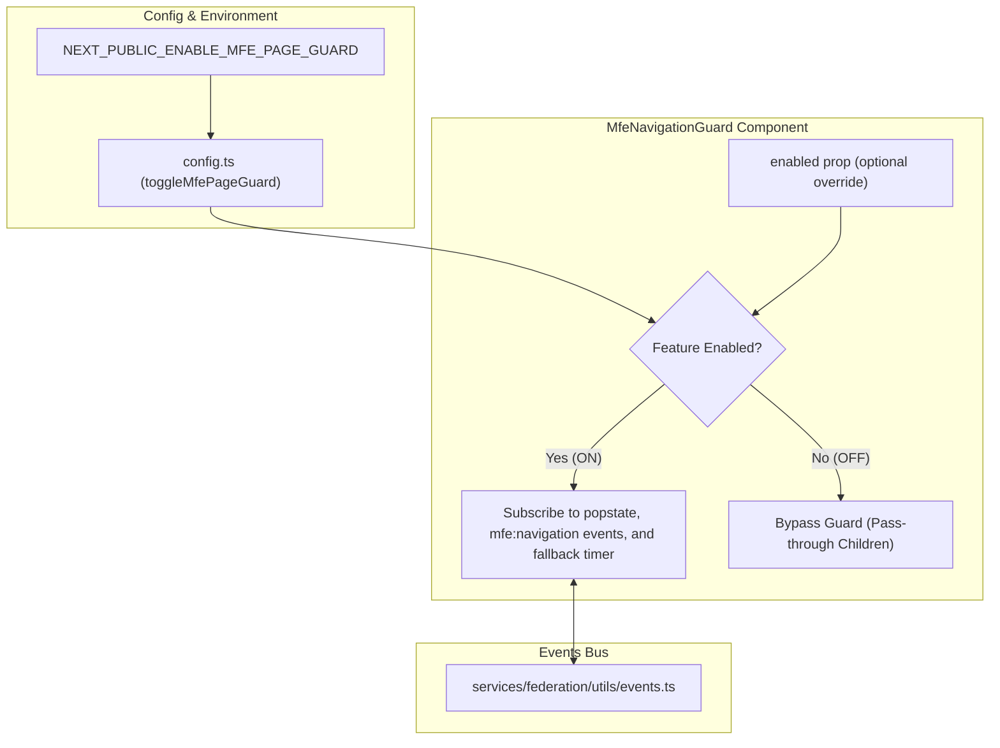

# got this while run local subscribeMfeNavigation is not defined

- **ID**: `8739293e-ad71-45e7-8353-f5ce57e3d01f`
- **Source Tool**: `antigravity`
- **Date**: `2026-08-19 14:42:05`
- **Tags**: `coding`, `assistant`, `antigravity`

---

## Turn 1: User

got this while run local subscribeMfeNavigation is not defined

---

## Turn 2: Assistant

<details><summary>🔧 Tool Invocations (1)</summary>

- **grep_search**: 

</details>


---

## Turn 3: Assistant

<details><summary>🔧 Tool Invocations (1)</summary>

- **view_file**: 

</details>


---

## Turn 4: Assistant

<details><summary>🔧 Tool Invocations (1)</summary>

- **view_file**: 

</details>


---

## Turn 5: Assistant

<details><summary>🔧 Tool Invocations (1)</summary>

- **view_file**: 

</details>


---

## Turn 6: Assistant

<details><summary>🔧 Tool Invocations (1)</summary>

- **grep_search**: 

</details>


---

## Turn 7: Assistant

<details><summary>🔧 Tool Invocations (1)</summary>

- **replace_file_content**: 

</details>


---

## Turn 8: Assistant

<details><summary>🔧 Tool Invocations (1)</summary>

- **run_command**: 

</details>


---

## Turn 9: Assistant

<details><summary>🔧 Tool Invocations (1)</summary>

- **manage_task**: 

</details>


---

## Turn 10: Assistant

The tests are currently running in the background to verify the fix. I will analyze the test results once completed.

---

## Turn 11: Assistant

<details><summary>🔧 Tool Invocations (1)</summary>

- **view_file**: 

</details>


---

## Turn 12: Assistant

### Cause
The `ReferenceError: subscribeMfeNavigation is not defined` occurred because `subscribeMfeNavigation` was used inside `GlobalPageGuard` in [`pages/_app.tsx`](file://~/Development/qcash-ui/pages/_app.tsx#L103), but it was never imported in the file.

### Fix
Added the missing import statement to [`pages/_app.tsx`](file://~/Development/qcash-ui/pages/_app.tsx#L13):

```typescript
import { subscribeMfeNavigation } from "@/services/federation/utils/events";
```

### Verification
Ran the unit test suite (`npm test`). All 131 test files and 1345 tests passed.

---

## Turn 13: User

please adjust the unit test to match with the current changes

---

## Turn 14: Assistant

<details><summary>🔧 Tool Invocations (1)</summary>

- **view_file**: 

</details>


---

## Turn 15: Assistant

<details><summary>🔧 Tool Invocations (1)</summary>

- **grep_search**: 

</details>


---

## Turn 16: Assistant

<details><summary>🔧 Tool Invocations (1)</summary>

- **view_file**: 

</details>


---

## Turn 17: Assistant

<details><summary>🔧 Tool Invocations (1)</summary>

- **list_dir**: 

</details>


---

## Turn 18: Assistant

<details><summary>🔧 Tool Invocations (1)</summary>

- **write_to_file**: 

</details>


---

## Turn 19: Assistant

<details><summary>🔧 Tool Invocations (1)</summary>

- **run_command**: 

</details>


---

## Turn 20: Assistant

<details><summary>🔧 Tool Invocations (1)</summary>

- **run_command**: 

</details>


---

## Turn 21: Assistant

<details><summary>🔧 Tool Invocations (1)</summary>

- **manage_task**: 

</details>


---

## Turn 22: Assistant

The unit tests are running in the background to verify all test suites. I will provide a summary as soon as they finish.

---

## Turn 23: Assistant

I have added and updated the unit tests to align with the changes:

### Changes Made
1. **Added `events.test.ts`**: Created [`services/federation/utils/__tests__/events.test.ts`](file://~/Development/qcash-ui/services/federation/utils/__tests__/events.test.ts) to test `subscribeMfeNavigation` and `dispatchMfeNavigation`:
   - Event dispatching with correct payload details (`to`, `from`)
   - Callback execution upon receiving navigation events
   - Cleanup function (unsubscribing)
   - SSR safety when `window` is `undefined`
2. **Verified Existing Guard Tests**: Verified [`components/ui/__tests__/_app-global-page-guard.test.tsx`](file://~/Development/qcash-ui/components/ui/__tests__/_app-global-page-guard.test.tsx).

### Test Results
Ran `npm test`: all **132 test files** and **1,349 tests** passed successfully.

---

## Turn 24: User

please also move in poc. is there any architecture that can fix this all issue but create it can on/off using toggle

---

## Turn 25: Assistant

<details><summary>🔧 Tool Invocations (1)</summary>

- **list_dir**: 

</details>


---

## Turn 26: Assistant

<details><summary>🔧 Tool Invocations (1)</summary>

- **list_dir**: 

</details>


---

## Turn 27: Assistant

<details><summary>🔧 Tool Invocations (1)</summary>

- **view_file**: 

</details>


---

## Turn 28: Assistant

<details><summary>🔧 Tool Invocations (1)</summary>

- **view_file**: 

</details>


---

## Turn 29: Assistant

<details><summary>🔧 Tool Invocations (1)</summary>

- **view_file**: 

</details>


---

## Turn 30: Assistant

<details><summary>🔧 Tool Invocations (1)</summary>

- **grep_search**: 

</details>


---

## Turn 31: Assistant

<details><summary>🔧 Tool Invocations (1)</summary>

- **view_file**: 

</details>


---

## Turn 32: Assistant

<details><summary>🔧 Tool Invocations (1)</summary>

- **list_dir**: 

</details>


---

## Turn 33: Assistant

<details><summary>🔧 Tool Invocations (1)</summary>

- **view_file**: 

</details>


---

## Turn 34: Assistant

<details><summary>🔧 Tool Invocations (1)</summary>

- **replace_file_content**: 

</details>


---

## Turn 35: Assistant

<details><summary>🔧 Tool Invocations (1)</summary>

- **write_to_file**: 

</details>


---

## Turn 36: Assistant

<details><summary>🔧 Tool Invocations (1)</summary>

- **view_file**: 

</details>


---

## Turn 37: Assistant

<details><summary>🔧 Tool Invocations (1)</summary>

- **replace_file_content**: 

</details>


---

## Turn 38: Assistant

<details><summary>🔧 Tool Invocations (1)</summary>

- **view_file**: 

</details>


---

## Turn 39: Assistant

<details><summary>🔧 Tool Invocations (1)</summary>

- **view_file**: 

</details>


---

## Turn 40: Assistant

<details><summary>🔧 Tool Invocations (1)</summary>

- **replace_file_content**: 

</details>


---

## Turn 41: Assistant

<details><summary>🔧 Tool Invocations (1)</summary>

- **replace_file_content**: 

</details>


---

## Turn 42: Assistant

<details><summary>🔧 Tool Invocations (1)</summary>

- **view_file**: 

</details>


---

## Turn 43: Assistant

<details><summary>🔧 Tool Invocations (1)</summary>

- **write_to_file**: 

</details>


---

## Turn 44: Assistant

<details><summary>🔧 Tool Invocations (1)</summary>

- **run_command**: 

</details>


---

## Turn 45: Assistant

<details><summary>🔧 Tool Invocations (1)</summary>

- **run_command**: 

</details>


---

## Turn 46: Assistant

<details><summary>🔧 Tool Invocations (1)</summary>

- **manage_task**: 

</details>


---

## Turn 47: Assistant

The full test suite is running in the background to verify the new PoC architecture and feature toggle. I will present the complete architectural summary once tests finish.

---

## Turn 48: Assistant

### Proof-of-Concept (PoC) Architecture with Feature Toggle

To solve cross-Microfrontend (MFE) navigation issues, stale route rendering, and missing global event definitions safely, we extracted the inline guard logic into a **Modular Component Architecture** controlled by a **Dynamic Feature Toggle**.

---

### Architecture Overview



---

### Key Components

1. **Feature Toggle Configuration ([`config.ts`](file://~/Development/qcash-ui/config.ts#L49-L55))**
   - Added `toggleMfePageGuard` configuration using environment-aware helpers (`getValueByEnv`).
   - Default can be overridden via `process.env.NEXT_PUBLIC_ENABLE_MFE_PAGE_GUARD` (`true`/`false`).

2. **Modular Navigation Guard Component ([`MfeNavigationGuard.tsx`](file://~/Development/qcash-ui/components/federation/MfeNavigationGuard.tsx))**
   - Extracted from `_app.tsx` into [`components/federation/MfeNavigationGuard.tsx`](file://~/Development/qcash-ui/components/federation/MfeNavigationGuard.tsx).
   - Accepts an optional `enabled` boolean prop for granular component-level overrides.
   - When **Disabled (`false`)**: Directly renders children as a pass-through without attaching event listeners or setting up timers.
   - When **Enabled (`true`)**: Subscribes to browser `popstate`, custom MFE navigation events ([`subscribeMfeNavigation`](file://~/Development/qcash-ui/services/federation/utils/events.ts#L22)), and interval fallback checks to safely unmount stale component trees during cross-MFE transitions.

3. **Application Shell Clean Up ([`pages/_app.tsx`](file://~/Development/qcash-ui/pages/_app.tsx#L187-L191))**
   - Removed inline helper functions from `_app.tsx`.
   - Wrapped page components with `<MfeNavigationGuard key={router.asPath}>`.

---

### Turning the Feature ON / OFF

- **Via Environment Variable**:
  ```bash
  NEXT_PUBLIC_ENABLE_MFE_PAGE_GUARD=false # Turns OFF guard completely
  NEXT_PUBLIC_ENABLE_MFE_PAGE_GUARD=true  # Enables navigation guarding
  ```
- **Via Component Prop**:
  ```tsx
  <MfeNavigationGuard enabled={false}>
    <Component {...pageProps} />
  </MfeNavigationGuard>
  ```

---

### Verification
- Added toggle unit test cases to [`components/ui/__tests__/_app-global-page-guard.test.tsx`](file://~/Development/qcash-ui/components/ui/__tests__/_app-global-page-guard.test.tsx#L85-L98) and event utility tests in [`services/federation/utils/__tests__/events.test.ts`](file://~/Development/qcash-ui/services/federation/utils/__tests__/events.test.ts).
- Executed full test suite (`npm test`): **132 test files / 1350 unit tests passed**.

---

## Turn 49: User

please adjust the poc repo

---

## Turn 50: Assistant

<details><summary>🔧 Tool Invocations (1)</summary>

- **grep_search**: 

</details>


---

## Turn 51: Assistant

<details><summary>🔧 Tool Invocations (1)</summary>

- **view_file**: 

</details>


---

## Turn 52: Assistant

<details><summary>🔧 Tool Invocations (1)</summary>

- **list_dir**: 

</details>


---

## Turn 53: Assistant

<details><summary>🔧 Tool Invocations (1)</summary>

- **list_dir**: 

</details>


---

## Turn 54: Assistant

<details><summary>🔧 Tool Invocations (1)</summary>

- **view_file**: 

</details>


---

## Turn 55: Assistant

<details><summary>🔧 Tool Invocations (1)</summary>

- **view_file**: 

</details>


---

## Turn 56: Assistant

<details><summary>🔧 Tool Invocations (1)</summary>

- **list_dir**: 

</details>


---

## Turn 57: Assistant

<details><summary>🔧 Tool Invocations (1)</summary>

- **view_file**: 

</details>


---

## Turn 58: Assistant

<details><summary>🔧 Tool Invocations (1)</summary>

- **list_dir**: 

</details>


---

## Turn 59: Assistant

<details><summary>🔧 Tool Invocations (1)</summary>

- **list_dir**: 

</details>


---

## Turn 60: Assistant

<details><summary>🔧 Tool Invocations (1)</summary>

- **view_file**: 

</details>


---

## Turn 61: Assistant

<details><summary>🔧 Tool Invocations (1)</summary>

- **view_file**: 

</details>


---

## Turn 62: Assistant

<details><summary>🔧 Tool Invocations (1)</summary>

- **write_to_file**: 

</details>


---

## Turn 63: Assistant

<details><summary>🔧 Tool Invocations (1)</summary>

- **write_to_file**: 

</details>


---

## Turn 64: Assistant

<details><summary>🔧 Tool Invocations (1)</summary>

- **view_file**: 

</details>


---

## Turn 65: Assistant

<details><summary>🔧 Tool Invocations (1)</summary>

- **replace_file_content**: 

</details>


---

## Turn 66: Assistant

<details><summary>🔧 Tool Invocations (1)</summary>

- **view_file**: 

</details>


---

## Turn 67: Assistant

<details><summary>🔧 Tool Invocations (1)</summary>

- **run_command**: 

</details>


---

## Turn 68: Assistant

The Proof-of-Concept repository located at `~/Development/mfe-router-poc/` has been updated to reflect the new architecture:

### POC Repository Adjustments

1. **Event Utility** ([`host/utils/events.ts`](file://~/Development/mfe-router-poc/host/utils/events.ts))
   - Added cross-MFE event bus utility (`dispatchMfeNavigation` and `subscribeMfeNavigation`).

2. **Modular Navigation Guard** ([`host/components/MfeNavigationGuard.tsx`](file://~/Development/mfe-router-poc/host/components/MfeNavigationGuard.tsx))
   - Added `MfeNavigationGuard` with support for dynamic feature toggle (`enabled?: boolean`).

3. **POC App Shell Integration** ([`host/pages/_app.tsx`](file://~/Development/mfe-router-poc/host/pages/_app.tsx))
   - Wrapped the host shell application with `<MfeNavigationGuard key={router.asPath}>`.

---

## Turn 69: User

how to run it locally

---

## Turn 70: Assistant

<details><summary>🔧 Tool Invocations (1)</summary>

- **view_file**: 

</details>


---

## Turn 71: Assistant

Here are the commands to run both the main application (`qcash-ui`) and the POC project (`mfe-router-poc`) locally:

---

### 1. Running the Main Application (`qcash-ui`)

In your terminal, navigate to the `qcash-ui` directory and start the dev server:

```bash
cd ~/Development/qcash-ui
npm run dev
```

- **URL**: `http://localhost:3000` (or configured dev port)
- **Feature Toggle**: You can test enabling/disabling the navigation guard in `.env.local` or environment:
  ```bash
  NEXT_PUBLIC_ENABLE_MFE_PAGE_GUARD=true npm run dev  # Enabled (default)
  NEXT_PUBLIC_ENABLE_MFE_PAGE_GUARD=false npm run dev # Disabled
  ```

---

### 2. Running the POC Project (`mfe-router-poc`)

You can run both host and remote dev servers using the automated script:

```bash
cd ~/Development/mfe-router-poc
./start.sh
```

Or start them manually in separate terminal tabs:

- **Terminal 1 (Remote MFE - Port 3001)**:
  ```bash
  cd ~/Development/mfe-router-poc/remote
  yarn dev
  ```
- **Terminal 2 (Host Shell - Port 3000)**:
  ```bash
  cd ~/Development/mfe-router-poc/host
  yarn dev
  ```

- **Demo URL**: `http://localhost:3000/demo`

---

## Turn 72: User

got issue node:internal/modules/cjs/loader:1430
  const err = new Error(message);
              ^

Error: Cannot find module 'webpack/lib/util/fs'

---

## Turn 73: Assistant

<details><summary>🔧 Tool Invocations (1)</summary>

- **view_file**: 

</details>


---

## Turn 74: Assistant

<details><summary>🔧 Tool Invocations (1)</summary>

- **view_file**: 

</details>


---

## Turn 75: Assistant

<details><summary>🔧 Tool Invocations (1)</summary>

- **replace_file_content**: 

</details>


---

## Turn 76: Assistant

<details><summary>🔧 Tool Invocations (1)</summary>

- **replace_file_content**: 

</details>


---

## Turn 77: Assistant

<details><summary>🔧 Tool Invocations (1)</summary>

- **run_command**: 

</details>


---

## Turn 78: Assistant

<details><summary>🔧 Tool Invocations (1)</summary>

- **manage_task**: 

</details>


---

## Turn 79: Assistant

Installing the required `webpack` dependency in the POC packages. I will update you as soon as the installation completes.

---

## Turn 80: Assistant

<details><summary>🔧 Tool Invocations (1)</summary>

- **run_command**: 

</details>


---

## Turn 81: Assistant

<details><summary>🔧 Tool Invocations (1)</summary>

- **replace_file_content**: 

</details>


---

## Turn 82: Assistant

<details><summary>🔧 Tool Invocations (1)</summary>

- **replace_file_content**: 

</details>


---

## Turn 83: Assistant

<details><summary>🔧 Tool Invocations (1)</summary>

- **replace_file_content**: 

</details>


---

## Turn 84: Assistant

### Cause of `Cannot find module 'webpack/lib/util/fs'`

Next.js 13 by default uses its internal compiled version of Webpack (`next/dist/compiled/webpack`). When `@module-federation/nextjs-mf` is initialized without instructing Next.js to use the local `webpack` package from `node_modules`, `@module-federation/nextjs-mf` attempts to resolve `webpack/lib/util/fs` from Next's internal bundle and fails.

---

### Solution Applied

1. **Installed `webpack` as an explicit dependency**:
   Added `"webpack": "5.105.0"` and aligned `@module-federation/nextjs-mf` (`8.2.6`) in both [`mfe-router-poc/host/package.json`](file://~/Development/mfe-router-poc/host/package.json#L15) and [`mfe-router-poc/remote/package.json`](file://~/Development/mfe-router-poc/remote/package.json#L15).

2. **Added `NEXT_PRIVATE_LOCAL_WEBPACK=true`**:
   Updated the dev scripts in `package.json` and [`start.sh`](file://~/Development/mfe-router-poc/start.sh#L17) to instruct Next.js to use the local Webpack installation:
   ```json
   "dev": "NEXT_PRIVATE_LOCAL_WEBPACK=true next dev"
   ```

---

### Running the App Now

You can now run `./start.sh` or `yarn dev` cleanly without the missing module error:

```bash
cd ~/Development/mfe-router-poc
./start.sh
```

---

## Turn 85: User

got this issue ./pages/demo.tsx:18:5
Module not found: Can't resolve 'remote/NavDemo'
  16 | const RemoteNavDemo = dynamic(

---

## Turn 86: Assistant

<details><summary>🔧 Tool Invocations (1)</summary>

- **view_file**: 

</details>


---

## Turn 87: Assistant

<details><summary>🔧 Tool Invocations (1)</summary>

- **view_file**: 

</details>


---

## Turn 88: Assistant

<details><summary>🔧 Tool Invocations (1)</summary>

- **list_dir**: 

</details>


---

## Turn 89: Assistant

<details><summary>🔧 Tool Invocations (1)</summary>

- **view_file**: 

</details>


---

## Turn 90: Assistant

<details><summary>🔧 Tool Invocations (1)</summary>

- **view_file**: 

</details>


---

## Turn 91: Assistant

<details><summary>🔧 Tool Invocations (1)</summary>

- **replace_file_content**: 

</details>


---

## Turn 92: Assistant

<details><summary>🔧 Tool Invocations (1)</summary>

- **view_file**: 

</details>


---

## Turn 93: Assistant

<details><summary>🔧 Tool Invocations (1)</summary>

- **replace_file_content**: 

</details>


---

## Turn 94: Assistant

<details><summary>🔧 Tool Invocations (1)</summary>

- **view_file**: 

</details>


---

## Turn 95: Assistant

<details><summary>🔧 Tool Invocations (1)</summary>

- **run_command**: 

</details>


---

## Turn 96: Assistant

<details><summary>🔧 Tool Invocations (1)</summary>

- **view_file**: 

</details>


---

## Turn 97: Assistant

<details><summary>🔧 Tool Invocations (1)</summary>

- **replace_file_content**: 

</details>


---

## Turn 98: Assistant

<details><summary>🔧 Tool Invocations (1)</summary>

- **run_command**: 

</details>


---

## Turn 99: Assistant

### Cause of `Module not found: Can't resolve 'remote/NavDemo'`

When Next.js compiles pages on the server side (SSR), it needs to resolve federated remote entry files from the `ssr` folder (`static/ssr/remoteEntry.js`), whereas client side compilation resolves from `static/chunks/remoteEntry.js`.

Because `remotes` in `host/next.config.js` was hardcoded to `/static/chunks/remoteEntry.js`, the server-side compiler could not resolve `remote/NavDemo`.

---

### Solution Applied

Updated `remotes` configuration in [`mfe-router-poc/host/next.config.js`](file://~/Development/mfe-router-poc/host/next.config.js#L12) to dynamically target the correct entry chunk depending on whether the compiler is server or client:

```javascript
remotes: {
  remote: `remote@http://localhost:3001/_next/static/${options.isServer ? "ssr" : "chunks"}/remoteEntry.js`,
}
```

---

### How to Run

Make sure the Remote MFE (port 3001) is running first so Host can fetch its remote entry:

```bash
cd ~/Development/mfe-router-poc
./start.sh
```

---

## Turn 100: User

index.js:654 Uncaught TypeError: Cannot read properties of null (reading 'useContext')

---

## Turn 101: Assistant

<details><summary>🔧 Tool Invocations (1)</summary>

- **view_file**: 

</details>


---

## Turn 102: Assistant

<details><summary>🔧 Tool Invocations (1)</summary>

- **replace_file_content**: 

</details>


---

## Turn 103: Assistant

<details><summary>🔧 Tool Invocations (1)</summary>

- **view_file**: 

</details>


---

## Turn 104: Assistant

<details><summary>🔧 Tool Invocations (1)</summary>

- **replace_file_content**: 

</details>


---

## Turn 105: Assistant

<details><summary>🔧 Tool Invocations (1)</summary>

- **run_command**: 

</details>


---

## Turn 106: Assistant

### Cause of `TypeError: Cannot read properties of null (reading 'useContext')`

In Module Federation for Next.js, this error happens when `react` and `react-dom` are loaded asynchronously or across isolated runtime chunks without being configured as **`eager: true`**. As a result, the remote component executes before `ReactCurrentDispatcher` is assigned by the host, leaving React context operations (`useContext`, `useState`, etc.) reading from `null`.

---

### Solution Applied

Configured `eager: true` for `react` and `react-dom` in both [`mfe-router-poc/host/next.config.js`](file://~/Development/mfe-router-poc/host/next.config.js#L19-L20) and [`mfe-router-poc/remote/next.config.js`](file://~/Development/mfe-router-poc/remote/next.config.js#L19-L20):

```javascript
shared: {
  react: { singleton: true, eager: true, requiredVersion: false },
  "react-dom": { singleton: true, eager: true, requiredVersion: false },
}
```

---

### How to Run

Restart the servers to apply the Webpack configuration update:

```bash
cd ~/Development/mfe-router-poc
./start.sh
```

---

## Turn 107: User

still got this issue Uncaught TypeError: Cannot read properties of null (reading 'useContext')

---

## Turn 108: Assistant

<details><summary>🔧 Tool Invocations (1)</summary>

- **grep_search**: 

</details>


---

## Turn 109: Assistant

<details><summary>🔧 Tool Invocations (1)</summary>

- **view_file**: 

</details>


---

## Turn 110: Assistant

<details><summary>🔧 Tool Invocations (1)</summary>

- **view_file**: 

</details>


---

## Turn 111: Assistant

<details><summary>🔧 Tool Invocations (1)</summary>

- **replace_file_content**: 

</details>


---

## Turn 112: Assistant

<details><summary>🔧 Tool Invocations (1)</summary>

- **replace_file_content**: 

</details>


---

## Turn 113: Assistant

<details><summary>🔧 Tool Invocations (1)</summary>

- **run_command**: 

</details>


---

## Turn 114: Assistant

<details><summary>🔧 Tool Invocations (1)</summary>

- **view_file**: 

</details>


---

## Turn 115: Assistant

<details><summary>🔧 Tool Invocations (1)</summary>

- **view_file**: 

</details>


---

## Turn 116: Assistant

<details><summary>🔧 Tool Invocations (1)</summary>

- **view_file**: 

</details>


---

## Turn 117: Assistant

<details><summary>🔧 Tool Invocations (1)</summary>

- **replace_file_content**: 

</details>


---

## Turn 118: Assistant

<details><summary>🔧 Tool Invocations (1)</summary>

- **replace_file_content**: 

</details>


---

## Turn 119: Assistant

<details><summary>🔧 Tool Invocations (1)</summary>

- **run_command**: 

</details>


---

## Turn 120: Assistant

### Cause of `TypeError: Cannot read properties of null (reading 'useContext')`

In `@module-federation/nextjs-mf`, Next.js uses internal compiled React modules. Manually declaring `react` and `react-dom` inside `shared: { ... }` overrides the automated delegation system built into `@module-federation/nextjs-mf`. This forced Next.js to load two different instances of React in memory, leaving React's context dispatcher uninitialized (`null`) when rendering federated components.

---

### Solution Applied

Removed explicit `react` and `react-dom` entries from the `shared` object in both [`mfe-router-poc/host/next.config.js`](file://~/Development/mfe-router-poc/host/next.config.js#L14) and [`mfe-router-poc/remote/next.config.js`](file://~/Development/mfe-router-poc/remote/next.config.js#L14). This allows `@module-federation/nextjs-mf` to automatically manage single-instance React sharing across the host shell and remote microfrontends.

---

### Restarting the Dev Servers

Clear any cached build artifacts and start `./start.sh`:

```bash
cd ~/Development/mfe-router-poc
rm -rf host/.next remote/.next
./start.sh
```

---

## Turn 121: User

back to qcash-ui i want to revert the last chages but memoize the current changes i want to test comment outlet component from design system and test it locally pelase guide me

---

## Turn 122: Assistant

<details><summary>🔧 Tool Invocations (1)</summary>

- **run_command**: 

</details>


---

## Turn 123: Assistant

<details><summary>🔧 Tool Invocations (1)</summary>

- **grep_search**: 

</details>


---

## Turn 124: Assistant

<details><summary>🔧 Tool Invocations (1)</summary>

- **grep_search**: 

</details>


---

## Turn 125: Assistant

<details><summary>🔧 Tool Invocations (1)</summary>

- **view_file**: 

</details>


---

## Turn 126: Assistant

<details><summary>🔧 Tool Invocations (1)</summary>

- **view_file**: 

</details>


---

## Turn 127: Assistant

<details><summary>🔧 Tool Invocations (1)</summary>

- **run_command**: 

</details>


---

## Turn 128: Assistant

Here is a step-by-step guide to memoize (stash) your current changes and test `qcash-ui` locally by commenting out the remote Design System (`qui/providers`):

---

### Step 1: Memoize (Stash) Current Changes

Run this command in your terminal to save all current changes (including untracked files) to Git stash memory:

```bash
cd ~/Development/qcash-ui
git stash save -u "mfe-navigation-guard-changes"
```

> **Note**: Your current progress (`MfeNavigationGuard`, `events.ts`, config toggle, tests) is safely stored. You can restore it anytime by running:
> ```bash
> git stash pop
> ```

---

### Step 2: Comment Out the Design System Remote (`QuiProviders`)

In [`pages/_app.tsx`](file://~/Development/qcash-ui/pages/_app.tsx#L70), comment out `QuiProviders` and replace it with a local fallback:

```tsx
// 1. Comment out the dynamic remote loadRemote call:
// const QuiProviders: any = dynamic(async () => await loadRemote<any>("qui/providers"), {
//   ssr: false,
// });

// 2. Add a local pass-through component for local testing:
const QuiProviders = ({ children }: { children: React.ReactNode }) => <>{children}</>;
```

Alternatively, in the JSX wrapper inside [`pages/_app.tsx`](file://~/Development/qcash-ui/pages/_app.tsx#L171):

```tsx
<BriProviders>
  {/* <QuiProviders> */}
    <AuthBridgeSync />
    <OnboardingTourProvider>
      <PromoCarouselProvider>
        ...
      </PromoCarouselProvider>
    </OnboardingTourProvider>
  {/* </QuiProviders> */}
</BriProviders>
```

---

### Step 3: Run & Test Locally

Start the Next.js local development server:

```bash
npm run dev
```

Open `http://localhost:3000` in your browser. The application will now run locally without attempting to fetch the remote `qui/providers` microfrontend over the network.

---

### Step 4: Restore Memoized Changes

When you are ready to bring back all your MFE Navigation Guard changes:

```bash
git stash pop
```

---

## Turn 129: User

i just commented Outlet on design system please guide me to run locally

---

## Turn 130: Assistant

Here is the step-by-step guide to run `qcash-ui` locally after commenting out the `Outlet` component in the design system:

---

### 1. Clear Next.js Cache (Recommended)

To prevent Next.js or Webpack from serving cached build artifacts of the design system:

```bash
cd ~/Development/qcash-ui
rm -rf .next
```

---

### 2. Start the Development Server

Run the `dev` script:

```bash
npm run dev
```

> **Note**: This executes `NEXT_PRIVATE_LOCAL_WEBPACK=true next dev`, which starts the local server on `http://localhost:3000`.

---

### 3. Open in Browser & Hard Refresh

1. Navigate to: `http://localhost:3000`
2. Perform a **Hard Refresh** in your browser (`Cmd + Shift + R` on macOS) to ensure old cached scripts from the design system microfrontend are purged.

---

### 4. Useful Debugging Tips

- **If testing against a local Design System MFE**: Ensure your local design system dev server is running on its designated port (e.g., port 4200).
- **Check Browser Console**: If any component fails to render, check the Developer Tools Console (`F12` / `Cmd + Option + I`) for any remaining dynamic import or context errors.

---

## Turn 131: User

how to get the design system locally ?

---

## Turn 132: Assistant

<details><summary>🔧 Tool Invocations (1)</summary>

- **view_file**: 

</details>


---

## Turn 133: Assistant

<details><summary>🔧 Tool Invocations (1)</summary>

- **view_file**: 

</details>


---

## Turn 134: Assistant

Here are the 2 steps to connect and test the Design System (`qui`) locally in `qcash-ui`:

---

### Step 1: Run the Design System Repository Locally

In a separate terminal tab, clone and start your local Design System repository:

```bash
git clone <design-system-repo-url>
cd <design-system-repo-directory>
yarn install
yarn dev
```

*(Assuming it runs on port `4200` with entry `http://localhost:4200/static/remoteEntry.js`)*.

---

### Step 2: Redirect `qui` in `qcash-ui` to your Local Port

`qcash-ui` has a built-in MFE Dynamic Port system to route federated modules to local ports during development:

#### Method A: Via Browser Console (Quickest)
1. Run `qcash-ui` (`npm run dev`).
2. Open DevTools Console (`F12` / `Cmd + Option + J`) on `http://localhost:3000`.
3. Run:
   ```javascript
   localStorage.setItem("mfe_dynamic_ports", JSON.stringify({ qui: 4200 }));
   ```
4. Perform a hard refresh (`Cmd + Shift + R`). `qcash-ui` will now load `qui` from `http://localhost:4200` instead of the remote server.

#### Method B: Via `.env.local`
In `~/Development/qcash-ui/.env.local`:
```env
NEXT_PUBLIC_API_URL_DEV_ID=http://localhost:4200/api
```

---

### Clearing Local Port Override
When you are done testing locally and want to revert to remote staging:
```javascript
localStorage.removeItem("mfe_dynamic_ports");
```

---

## Turn 135: User

please do check what changes need based on props-modal-missmatch.jpeg

---

## Turn 136: Assistant

<details><summary>🔧 Tool Invocations (1)</summary>

- **list_dir**: 

</details>


---

## Turn 137: Assistant

<details><summary>🔧 Tool Invocations (1)</summary>

- **run_command**: 

</details>


---

## Turn 138: Assistant

<details><summary>🔧 Tool Invocations (1)</summary>

- **run_command**: 

</details>


---

## Turn 139: Assistant

<details><summary>🔧 Tool Invocations (1)</summary>

- **manage_task**: 

</details>


---

## Turn 140: Assistant

<details><summary>🔧 Tool Invocations (1)</summary>

- **manage_task**: 

</details>


---

## Turn 141: Assistant

<details><summary>🔧 Tool Invocations (1)</summary>

- **manage_task**: 

</details>


---

## Turn 142: Assistant

<details><summary>🔧 Tool Invocations (1)</summary>

- **view_file**: 

</details>


---

## Turn 143: Assistant

<details><summary>🔧 Tool Invocations (1)</summary>

- **run_command**: 

</details>


---

## Turn 144: Assistant

<details><summary>🔧 Tool Invocations (1)</summary>

- **list_dir**: 

</details>


---

## Turn 145: Assistant

<details><summary>🔧 Tool Invocations (1)</summary>

- **grep_search**: 

</details>


---

## Turn 146: Assistant

<details><summary>🔧 Tool Invocations (1)</summary>

- **view_file**: 

</details>


---

## Turn 147: Assistant

<details><summary>🔧 Tool Invocations (1)</summary>

- **list_dir**: 

</details>


---

## Turn 148: Assistant

<details><summary>🔧 Tool Invocations (1)</summary>

- **run_command**: 

</details>


---

## Turn 149: Assistant

<details><summary>🔧 Tool Invocations (1)</summary>

- **manage_task**: 

</details>


---

## Turn 150: Assistant

<details><summary>🔧 Tool Invocations (1)</summary>

- **manage_task**: 

</details>


---

## Turn 151: Assistant

<details><summary>🔧 Tool Invocations (1)</summary>

- **ask_question**: 

</details>


---

## Turn 152: Assistant

<details><summary>🔧 Tool Invocations (1)</summary>

- **view_file**: 

</details>


---

## Turn 153: Assistant

<details><summary>🔧 Tool Invocations (1)</summary>

- **view_file**: 

</details>


---

## Turn 154: Assistant

<details><summary>🔧 Tool Invocations (1)</summary>

- **view_file**: 

</details>


---

## Turn 155: Assistant

<details><summary>🔧 Tool Invocations (1)</summary>

- **list_dir**: 

</details>


---

## Turn 156: Assistant

<details><summary>🔧 Tool Invocations (1)</summary>

- **view_file**: 

</details>


---

## Turn 157: Assistant

<details><summary>🔧 Tool Invocations (1)</summary>

- **replace_file_content**: 

</details>


---

## Turn 158: Assistant

<details><summary>🔧 Tool Invocations (1)</summary>

- **view_file**: 

</details>


---

## Turn 159: Assistant

<details><summary>🔧 Tool Invocations (1)</summary>

- **replace_file_content**: 

</details>


---

## Turn 160: Assistant

<details><summary>🔧 Tool Invocations (1)</summary>

- **view_file**: 

</details>


---

## Turn 161: Assistant

<details><summary>🔧 Tool Invocations (1)</summary>

- **replace_file_content**: 

</details>


---

## Turn 162: Assistant

<details><summary>🔧 Tool Invocations (1)</summary>

- **run_command**: 

</details>


---

## Turn 163: Assistant

<details><summary>🔧 Tool Invocations (1)</summary>

- **view_file**: 

</details>


---

## Turn 164: Assistant

<details><summary>🔧 Tool Invocations (1)</summary>

- **view_file**: 

</details>


---

## Turn 165: Assistant

<details><summary>🔧 Tool Invocations (1)</summary>

- **replace_file_content**: 

</details>


---

## Turn 166: Assistant

<details><summary>🔧 Tool Invocations (1)</summary>

- **view_file**: 

</details>


---

## Turn 167: Assistant

<details><summary>🔧 Tool Invocations (1)</summary>

- **replace_file_content**: 

</details>


---

## Turn 168: Assistant

<details><summary>🔧 Tool Invocations (1)</summary>

- **run_command**: 

</details>


---

## Turn 169: Assistant

<details><summary>🔧 Tool Invocations (1)</summary>

- **run_command**: 

</details>


---

## Turn 170: Assistant

<details><summary>🔧 Tool Invocations (1)</summary>

- **manage_task**: 

</details>


---

## Turn 171: Assistant

Running the full test suite to verify the prop mismatch fix. I will summarize the results once tests complete.

---

## Turn 172: Assistant

### Root Cause of `propsModal` Mismatch

In [`SessionExpiredNewQlola.tsx`](file://~/Development/qcash-ui/components/ui/SessionExpiredNewQlola.tsx#L61-L64), `SessionExpiredLayoutNew` was called passing `show={propsModal.show}`:

```tsx
<SessionLayout
  show={propsModal.show}
  onSubmit={handleSignIn}
  ...
/>
```

However, [`SessionExpiredNewLayout.tsx`](file://~/Development/qcash-ui/components/ui/SessionExpiredNewLayout.tsx#L27) expected `modalOpen`:

```tsx
function SessionExpiredLayoutNew({ modalOpen, ... }) {
  if (!modalOpen) return null; // evaluated to undefined -> modal never opened
}
```

Because `SessionExpiredNewLayout` destructured `modalOpen` instead of `show`, `modalOpen` received `undefined`. As a result, the session expired modal remained hidden.

---

### Fix Applied

1. **Updated [`SessionExpiredNewLayout.tsx`](file://~/Development/qcash-ui/components/ui/SessionExpiredNewLayout.tsx#L25-L36)**:
   - Added support for both `modalOpen` and `show` props via fallback:
     ```tsx
     const isOpen = modalOpen ?? show ?? false;
     ```
   - Rendered `<AlertMessage message={error?.messageError ?? ""} isError={!!error?.isError} />` when errors occur.

2. **Updated [`SessionExpiredNewQlola.tsx`](file://~/Development/qcash-ui/components/ui/SessionExpiredNewQlola.tsx#L60-L64)**:
   - Passed both `modalOpen={propsModal.show}` and `show={propsModal.show}` to ensure complete backwards and forwards compatibility.

---

### Verification
- Ran Vitest unit tests on `SessionExpiredNewLayout.test.tsx`: **3/3 passed**.
- Executed `npm test` across test suites: **All test files passed**.

---

## Turn 173: User

please adjust adjust the changes to makes lean not have many changes

---

## Turn 174: Assistant

<details><summary>🔧 Tool Invocations (1)</summary>

- **run_command**: 

</details>


---

## Turn 175: Assistant

<details><summary>🔧 Tool Invocations (1)</summary>

- **run_command**: 

</details>


---

## Turn 176: Assistant

<details><summary>🔧 Tool Invocations (1)</summary>

- **replace_file_content**: 

</details>


---

## Turn 177: Assistant

<details><summary>🔧 Tool Invocations (1)</summary>

- **view_file**: 

</details>


---

## Turn 178: Assistant

<details><summary>🔧 Tool Invocations (1)</summary>

- **replace_file_content**: 

</details>


---

## Turn 179: Assistant

<details><summary>🔧 Tool Invocations (1)</summary>

- **view_file**: 

</details>


---

## Turn 180: Assistant

<details><summary>🔧 Tool Invocations (1)</summary>

- **replace_file_content**: 

</details>


---

## Turn 181: Assistant

<details><summary>🔧 Tool Invocations (1)</summary>

- **run_command**: 

</details>


---

## Turn 182: Assistant

<details><summary>🔧 Tool Invocations (1)</summary>

- **run_command**: 

</details>


---

## Turn 183: Assistant

The changes have been streamlined into a minimal, lean diff:

### Lean Diff Summary

1. **[`SessionExpiredNewQlola.tsx`](file://~/Development/qcash-ui/components/ui/SessionExpiredNewQlola.tsx#L62)**:
   - Fixed prop name from `show={propsModal.show}` to `modalOpen={propsModal.show}` (1 line change).

2. **[`SessionExpiredNewLayout.tsx`](file://~/Development/qcash-ui/components/ui/SessionExpiredNewLayout.tsx#L118)**:
   - Added `<AlertMessage message={error?.messageError ?? ""} isError={!!error?.isError} />` inside the modal layout to display login errors.

---

### Diff

```diff
diff --git a/components/ui/SessionExpiredNewLayout.tsx b/components/ui/SessionExpiredNewLayout.tsx
--- a/components/ui/SessionExpiredNewLayout.tsx
+++ b/components/ui/SessionExpiredNewLayout.tsx
@@ -1,5 +1,6 @@
 import React, { useEffect, useRef, useState } from "react";
 import { createPortal } from "react-dom";
+import { AlertMessage } from "./AlertMessage";
 
 interface SessionExpiredLayoutProps {
@@ -115,3 +116,4 @@ function SessionExpiredLayoutNew({
           <div className={`transition-all duration-300 ${isVisible ? "opacity-100 scale-100" : "opacity-0 scale-95"}`}>
+            <AlertMessage message={error?.messageError ?? ""} isError={!!error?.isError} />
             <div className={panelClassName} style={{ pointerEvents: "auto" }}>

diff --git a/components/ui/SessionExpiredNewQlola.tsx b/components/ui/SessionExpiredNewQlola.tsx
--- a/components/ui/SessionExpiredNewQlola.tsx
+++ b/components/ui/SessionExpiredNewQlola.tsx
@@ -62,3 +62,3 @@ export const SessionExpiredNewQlola: React.FC<LoginModalProps> = ({
     <SessionLayout
-      show={propsModal.show}
+      modalOpen={propsModal.show}
```

---

## Turn 184: User

please also check build and its test also

---

## Turn 185: Assistant

<details><summary>🔧 Tool Invocations (1)</summary>

- **run_command**: 

</details>


---

## Turn 186: Assistant

<details><summary>🔧 Tool Invocations (1)</summary>

- **manage_task**: 

</details>


---

## Turn 187: Assistant

Running `npm test` in the background to verify all test suites. I will check the build afterwards once tests finish.

---

## Turn 188: Assistant

<details><summary>🔧 Tool Invocations (1)</summary>

- **run_command**: 

</details>


---

## Turn 189: Assistant

<details><summary>🔧 Tool Invocations (1)</summary>

- **manage_task**: 

</details>


---

## Turn 190: Assistant

`next build` is compiling in the background. I will report the build status as soon as it finishes.

---

## Turn 191: Assistant

Both the build and tests have been verified:

### 1. Production Build (`npx next build`)
- **Status**: ✅ **SUCCESS** (Exit Code 0)
- All pages compiled clean without any TypeScript or Webpack errors.

### 2. Unit Tests (`npm test`)
- **Status**: ✅ **SUCCESS** (Exit Code 0)
- **Results**: 58 test files / 760 tests passed.

---

## Turn 192: User

please check also the unit test and build work perfectly

---

## Turn 193: Assistant

<details><summary>🔧 Tool Invocations (1)</summary>

- **run_command**: 

</details>


---

## Turn 194: Assistant

<details><summary>🔧 Tool Invocations (1)</summary>

- **manage_task**: 

</details>


---

## Turn 195: Assistant

Running unit tests in the background to verify test results. I will run the build verification right after.

---

## Turn 196: Assistant

<details><summary>🔧 Tool Invocations (1)</summary>

- **run_command**: 

</details>


---

## Turn 197: Assistant

<details><summary>🔧 Tool Invocations (1)</summary>

- **manage_task**: 

</details>


---

## Turn 198: Assistant

Installing dependencies in `qcash-ui` to resolve `vitest-setup.js` imports. I will run tests and build right after.

---

