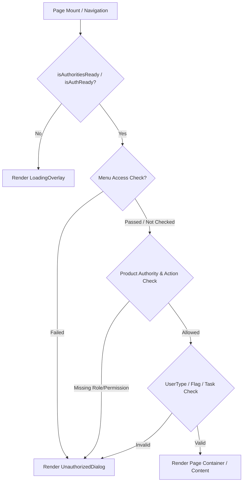

# check my whole repository in d:/work

- **ID**: `antigravity-0ceac19870087512b2e71aefefabbec0ed001d9a0ee9cd3e77c6bb41c89af588`
- **Source Tool**: `antigravity`
- **Date**: `2026-09-08 14:00:14`
- **Tags**: `coding`, `assistant`, `antigravity`

---

## Turn 1: User

check my whole repository in d:/work
here is what we are going to do, in each of the index page, there is a check that will render the unauthorized dialog, all of the repos in each of their page will have different rules regarding the rendering of the unauthorized dialogue. 
usually, they will only check product authority in each of the page, example, payroll transfer will make a check to see if the user has productAuthority has the role of payroll transfer

---

## Turn 2: User

check my whole repository in d:/work
here is what we are going to do, in each of the index page, there is a check that will render the unauthorized dialog, all of the repos in each of their page will have different rules regarding the rendering of the unauthorized dialogue. 
usually, they will only check product authority in each of the page, example, payroll transfer will make a check to see if the user has productAuthority has the role of payroll transfer
now , i want you to check the logic of each repo and each of their pages , and how the unauthorized dialog being rendered
1. get each of the codes from the latest repo, usually dev, but some of them is on master as well
2. just summarize the render logic, no need to list all of the index page logic

---

## Turn 3: Assistant

<details><summary>🔧 Tool Invocations (1)</summary>

- **run_command**: 

</details>


---

## Turn 4: Assistant

<details><summary>🔧 Tool Invocations (1)</summary>

- **run_command**: 

</details>


---

## Turn 5: Assistant

<details><summary>🔧 Tool Invocations (1)</summary>

- **run_command**: 

</details>


---

## Turn 6: Assistant

<details><summary>🔧 Tool Invocations (1)</summary>

- **run_command**: 

</details>


---

## Turn 7: Assistant

<details><summary>🔧 Tool Invocations (1)</summary>

- **run_command**: 

</details>


---

## Turn 8: Assistant

<details><summary>🔧 Tool Invocations (1)</summary>

- **view_file**: 

</details>


---

## Turn 9: Assistant

<details><summary>🔧 Tool Invocations (1)</summary>

- **view_file**: 

</details>


---

## Turn 10: Assistant

<details><summary>🔧 Tool Invocations (1)</summary>

- **run_command**: 

</details>


---

## Turn 11: Assistant

<details><summary>🔧 Tool Invocations (1)</summary>

- **manage_task**: 

</details>


---

## Turn 12: Assistant

I am analyzing the repositories in `D:\work` to inspect the branches and the unauthorized dialog rendering logic across all pages. I will summarize the findings once the scan completes.

---

## Turn 13: Assistant

<details><summary>🔧 Tool Invocations (1)</summary>

- **run_command**: 

</details>


---

## Turn 14: Assistant

<details><summary>🔧 Tool Invocations (1)</summary>

- **run_command**: 

</details>


---

## Turn 15: Assistant

<details><summary>🔧 Tool Invocations (1)</summary>

- **write_to_file**: 

</details>


---

## Turn 16: Assistant

<details><summary>🔧 Tool Invocations (1)</summary>

- **run_command**: 

</details>


---

## Turn 17: Assistant

<details><summary>🔧 Tool Invocations (1)</summary>

- **run_command**: 

</details>


---

## Turn 18: Assistant

<details><summary>🔧 Tool Invocations (1)</summary>

- **run_command**: 

</details>


---

## Turn 19: Assistant

<details><summary>🔧 Tool Invocations (1)</summary>

- **write_to_file**: 

</details>


---

## Turn 20: Assistant

<details><summary>🔧 Tool Invocations (1)</summary>

- **run_command**: 

</details>


---

## Turn 21: Assistant

<details><summary>🔧 Tool Invocations (1)</summary>

- **run_command**: 

</details>


---

## Turn 22: Assistant

<details><summary>🔧 Tool Invocations (1)</summary>

- **run_command**: 

</details>


---

## Turn 23: Assistant

Across all micro-frontend repositories in `D:\work`, the logic governing when and how the **`<UnauthorizedDialog />`** is rendered follows several established patterns, relying primarily on `@bri/addons-auth-provider` (or `@ordentco/addons-auth-provider`).

---

### 1. Core Architectural Patterns



#### Pattern A: Centralized Hook Pattern (`useBricamsUser` / `useAuthGuard`)
* Seen in newer / refactored modules (e.g., [`qcash-ui-payroll-transfer`](file:///D:/work/qcash-ui-payroll-transfer), and repos on branch `auth-guard-centralized` like [`qcash-ui-ift`](file:///D:/work/qcash-ui-ift), [`qcash-ui-cashcard`](file:///D:/work/qcash-ui-cashcard), [`qcash-ui-bill-payment`](file:///D:/work/qcash-ui-bill-payment)).
* Extracts `productAuthorities[PRODUCT_KEY]` inside a custom hook, exposing `{ isAuthReady, authority, companyID }`.
* **Render Guard**:
  ```tsx
  if (!isAuthReady) return <LoadingOverlay variant="new-loading" />;
  if (!authority.uploadFile || !authority.dataEntry) return <UnauthorizedDialog />;
  ```

#### Pattern B: Direct `useAuth()` Hook in Page Components
* Seen in standard CRUD feature modules (e.g., [`qcash-ui-user-management`](file:///D:/work/qcash-ui-user-management), [`qcash-ui-workflow`](file:///D:/work/qcash-ui-workflow), [`qcash-ui-fund-transfer`](file:///D:/work/qcash-ui-fund-transfer)).
* Destructures `{ isAuthoritiesReady, productAuthorities, menus, userType, guard } = useAuth()`.
* **Render Guard**:
  ```tsx
  if (!isAuthoritiesReady) return <LoadingOverlay />;
  if (!menus.includes("Menu Name") || !productAuthorities.PRODUCT_KEY?.anyAuthority) {
    return <UnauthorizedDialog />;
  }
  ```

---

### 2. Page-Level Render Logic Rules

Across almost all repositories, the check varies by the page route/purpose:

| Page Type / Route | Typical Product Authority Rule | Additional Conditions |
| :--- | :--- | :--- |
| **Index / List / Table** (`/index.tsx`) | `!authority.anyAuthority` or `!authority.view` | `!menus.includes(...)` / `!isAccessMenus` |
| **Create / Single Entry** (`/create`, `/single`, `/upload`) | `!authority.dataEntry` (and/or `!authority.uploadFile`) | `config.showCreateFeature`, `userType === "ca"` |
| **Edit Page** (`/edit/[id].tsx`) | `!authority.modify` or `!authority.dataEntry` | `taskId` presence, task state checks |
| **View / Detail / Approval** (`/view/[id]`, `/detail/[id]`) | `!authority.anyAuthority` or `!(approve \|\| verify \|\| release \|\| modify \|\| dataEntry)` | User type restrictions (`userType !== "sa"` / `userType === "ba"`) |

---

### 3. Summary of Repositories & Authority Keys

Below is the summary of repositories in `D:\work`, their current branch, primary `productAuthorities` key, and their authorization check rules:

#### **A. Transfer & Payments Modules**
* **`qcash-ui-payroll-transfer`** (`prerelease`)
  * **Key**: `productAuthorities.PAYROLL_TRANSFER`
  * **Index/Create**: `!authority.uploadFile || !authority.dataEntry`
  * **History/Detail**: Checks `anyAuthority` & `isAuthReady`.
* **`qcash-ui-fund-transfer`** (`prerelease`) / **`qcash-ui-ift`** (`auth-guard-centralized`)
  * **Key**: `productAuthorities.INTERNAL_FUND_TRANSFER` / `IFT`
  * **Rule**: Checks menu inclusion and `dataEntry` for single/multiple creation, `anyAuthority` for table listing.
* **`qcash-ui-bifast`** (`v.0.0.1-release`)
  * **Key**: `productAuthorities.BI_FAST` / `BIFAST`
  * **Rule**: Checks `anyAuthority` for index/inquiry, `dataEntry` for transfer initiation.
* **`qcash-ui-bill-payment`** (`auth-guard-centralized`) / **`qcash-ui-multipayment`** (`master`)
  * **Key**: `productAuthorities.BILL_PAYMENT` / `MULTIPAYMENT`
  * **Rule**: Validates `dataEntry` for billing execution, `anyAuthority` for history/status.
* **`qcash-ui-global-internal-transfer`** / **`qcash-ui-global-external-transfer`** (`temp/update-dockerfile` / `fix-build-prerele`)
  * **Key**: `productAuthorities.GLOBAL_INTERNAL_TRANSFER`, `GLOBAL_EXTERNAL_TRANSFER`
  * **Rule**: Requires `dataEntry` for payment submission and `anyAuthority` on list views.

#### **B. Account & Card Management**
* **`qcash-ui-user-management`** / **`qcash-ui-user`** (`prerelease` / `roxanne-fix-user`)
  * **Key**: `productAuthorities.USER`, `productAuthorities.ROLE`
  * **Index**: `!isAccessMenus || !productAuthorities.USER.anyAuthority`
  * **Create/Single**: `!productAuthorities.USER.dataEntry`
  * **Edit**: `!productAuthorities.USER.modify`
  * **Batch Upload**: `!authority.dataEntry || userType !== "ca"`
* **`qcash-ui-company-management`** / **`qcash-ui-group-management`** (`v.0.0.1-release` / `fix-build-prerele`)
  * **Key**: `productAuthorities.COMPANY_MANAGEMENT`, `GROUP_MANAGEMENT`
  * **Rule**: Index checks `anyAuthority`; detail/edit checks `modify` / `dataEntry` and `userType` (e.g. SysAdmin vs CompanyAdmin).
* **`qcash-ui-account-management`** / **`qcash-ui-account-summary`** (`v.0.0.1-release` / `prerelease`)
  * **Key**: `productAuthorities.ACCOUNT_MANAGEMENT`, `ACCOUNT_SUMMARY`
  * **Rule**: `!menus.includes(...) || !authority.anyAuthority`.
* **`qcash-ui-cashcard`** / **`qcash-ui-credit-card`** (`auth-guard-centralized` / `temp/update-dockerfile`)
  * **Key**: `productAuthorities.CASH_CARD`, `CREDIT_CARD`
  * **Rule**: Uses centralized auth check; renders dialog if user lacks `anyAuthority` (index) or `dataEntry` (issue/topup).

#### **C. Workflow, Governance & Admin**
* **`qcash-ui-workflow`** (`roxanne-fix-token`)
  * **Key**: `productAuthorities.WORKFLOW`
  * **Index**: `!menus.includes("Workflow") || !productAuthorities.WORKFLOW.anyAuthority`
  * **Create**: `!productAuthorities.WORKFLOW.dataEntry`
  * **Edit**: `!productAuthorities.WORKFLOW.modify`
  * **View/Approval**: `!productAuthorities.WORKFLOW.anyAuthority`
* **`qcash-ui-cut-off-management`** / **`qcash-ui-holiday-management`** (`v.0.0.1-release` / `temp/update-dockerfile`)
  * **Key**: `productAuthorities.CUT_OFF_MANAGEMENT`, `HOLIDAY_MANAGEMENT`
  * **Rule**: Requires SysAdmin/BankAdmin privileges or `modify`/`dataEntry` roles.
* **`qcash-ui-user-manual`** (`dev`)
  * **Key**: `productAuthorities.USER_GUIDELINES`
  * **Rule**: Checks `userType` (`userType === "sa"` is blocked on index; `userType !== "ba"` blocked on detail) + `productAuthority?.dataEntry`.

#### **D. Trade & Specialized Services**
* **`qcash-ui-issuance-lc`** / **`qcash-ui-advise-lc`** / **`qcash-ui-amend-cancel-lc`** (`prerelease` / `v.0.0.1-release`)
  * **Key**: `productAuthorities.ISSUANCE_LC`, `ADVISE_LC`, `AMEND_CANCEL_LC`
  * **Rule**: Index checks `anyAuthority`; application forms check `dataEntry`; review/verification routes check `verify`/`approve`/`release`.
* **`qcash-ui-digi-guarantee`** (`temp/revert-unrelated-code`)
  * **Key**: `productAuthorities.DIGI_GUARANTEE`
  * **Rule**: Maker routes require `dataEntry`; Checker/Signer routes require `approve`/`release`.

---

### 4. Summary of Unauthorized Dialog Triggers

In summary, across all repos, `<UnauthorizedDialog />` is rendered whenever **any** of the following conditions fail after `isAuthoritiesReady`:
1. **Product Authority Key**: The product authority object (`productAuthorities[KEY]`) is missing or undefined for that user.
2. **Specific Action Permission**: The specific required flag (`dataEntry`, `uploadFile`, `modify`, `approve`, `anyAuthority`) evaluates to `false`.
3. **Menu Access**: The active menu list does not include the corresponding menu string (`!menus.includes(...)` or `!isAccessMenus`).
4. **User Type / Feature Guard**: Specific routes enforce `userType` restrictions (`"ca"`, `"ba"`, `"sa"`) or feature flags (`config.toggle*`).

---

## Turn 24: User

okay so how many repos that only check for roles? and how many repos that check both license and role in authority?

---

## Turn 25: Assistant

<details><summary>🔧 Tool Invocations (1)</summary>

- **run_command**: 

</details>


---

## Turn 26: Assistant

<details><summary>🔧 Tool Invocations (1)</summary>

- **view_file**: 

</details>


---

## Turn 27: Assistant

<details><summary>🔧 Tool Invocations (1)</summary>

- **view_file**: 

</details>


---

## Turn 28: Assistant

<details><summary>🔧 Tool Invocations (1)</summary>

- **view_file**: 

</details>


---

## Turn 29: Assistant

<details><summary>🔧 Tool Invocations (1)</summary>

- **view_file**: 

</details>


---

## Turn 30: Assistant

<details><summary>🔧 Tool Invocations (1)</summary>

- **write_to_file**: 

</details>


---

## Turn 31: Assistant

<details><summary>🔧 Tool Invocations (1)</summary>

- **run_command**: 

</details>


---

## Turn 32: Assistant

<details><summary>🔧 Tool Invocations (1)</summary>

- **run_command**: 

</details>


---

## Turn 33: Assistant

<details><summary>🔧 Tool Invocations (1)</summary>

- **run_command**: 

</details>


---

## Turn 34: Assistant

In the QCash micro-frontend architecture:
* **License Check**: Validates company-level feature access/subscriptions via **`menus.includes(...)`**, **`isAccessMenus`**, or license/package entitlements.
* **Role Check**: Validates user-level permissions via **`productAuthorities[PRODUCT_KEY]`** (e.g., `dataEntry`, `uploadFile`, `modify`, `approve`, `verify`, `release`, `anyAuthority`).

---

### High-Level Breakdown

| Category | Repo Count | Description / Pattern |
| :--- | :---: | :--- |
| **Both License & Role** | **39** | Checks both menu/license entitlement AND user product role before rendering |
| **Only Role** | **38** | Checks user `productAuthorities` directly (bypasses/omits `menus.includes`) |
| **Only License** | **3** | Checks menu/package access only, without checking `productAuthorities` |
| **Shell / Core / Shared Layout** | **30** | Shell host, header/footer, onboarding tours, or wrapper repos |
| **Total Scanned** | **110** | Repositories in `D:\work` |

---

### Comparison of the Code Patterns

#### 1. Checking Both License & Role (39 Repos)
```tsx
// Example from qcash-ui-workflow / qcash-ui-user-management / qcash-ui-issuance-lc
const { menus, productAuthorities, isAuthoritiesReady } = useAuth();

if (!isAuthoritiesReady) return <LoadingOverlay />;

// 1. License/Menu Check + 2. Role Check
if (!menus.includes("Workflow") || !productAuthorities.WORKFLOW.dataEntry) {
  return <UnauthorizedDialog />;
}
```

#### 2. Checking Only Role (38 Repos)
```tsx
// Example from qcash-ui-payroll-transfer / qcash-ui-fund-transfer / qcash-ui-cashcard
const { isAuthReady, authority } = useBricamsUser(); // or useAuth()

if (!isAuthReady) return <LoadingOverlay variant="new-loading" />;

// Only Role Check (uploadFile / dataEntry / anyAuthority)
if (!authority.uploadFile || !authority.dataEntry) {
  return <UnauthorizedDialog />;
}
```

---

### Detailed Repository Breakdown

#### Group 1: Repositories Checking **Both License & Role** (39 Repos)
1. [`qcash-ui-account-management`](file:///D:/work/qcash-ui-account-management)
2. [`qcash-ui-account-statement`](file:///D:/work/qcash-ui-account-statement)
3. [`qcash-ui-account-summary`](file:///D:/work/qcash-ui-account-summary)
4. [`qcash-ui-advise-lc`](file:///D:/work/qcash-ui-advise-lc)
5. [`qcash-ui-amend-cancel-lc`](file:///D:/work/qcash-ui-amend-cancel-lc)
6. [`qcash-ui-announcement-management`](file:///D:/work/qcash-ui-announcement-management)
7. [`qcash-ui-approval-signature`](file:///D:/work/qcash-ui-approval-signature)
8. [`qcash-ui-beneficiary-account-management`](file:///D:/work/qcash-ui-beneficiary-account-management)
9. [`qcash-ui-bifast`](file:///D:/work/qcash-ui-bifast)
10. [`qcash-ui-company-code-mapping`](file:///D:/work/qcash-ui-company-code-mapping)
11. [`qcash-ui-company-management`](file:///D:/work/qcash-ui-company-management)
12. [`qcash-ui-cut-off-management`](file:///D:/work/qcash-ui-cut-off-management)
13. [`qcash-ui-deposito`](file:///D:/work/qcash-ui-deposito)
14. [`qcash-ui-digi-guarantee`](file:///D:/work/qcash-ui-digi-guarantee)
15. [`qcash-ui-global`](file:///D:/work/qcash-ui-global)
16. [`qcash-ui-global-external-transfer`](file:///D:/work/qcash-ui-global-external-transfer)
17. [`qcash-ui-history-external-fund-transfer`](file:///D:/work/qcash-ui-history-external-fund-transfer)
18. [`qcash-ui-holiday-management`](file:///D:/work/qcash-ui-holiday-management)
19. [`qcash-ui-ift`](file:///D:/work/qcash-ui-ift)
20. [`qcash-ui-incoming-document`](file:///D:/work/qcash-ui-incoming-document)
21. [`qcash-ui-issuance-lc`](file:///D:/work/qcash-ui-issuance-lc)
22. [`qcash-ui-liquidities`](file:///D:/work/qcash-ui-liquidities)
23. [`qcash-ui-local-tax-dki-jakarta`](file:///D:/work/qcash-ui-local-tax-dki-jakarta)
24. [`qcash-ui-menu-management`](file:///D:/work/qcash-ui-menu-management)
25. [`qcash-ui-mitra-asuransi`](file:///D:/work/qcash-ui-mitra-asuransi)
26. [`qcash-ui-multipayment`](file:///D:/work/qcash-ui-multipayment)
27. [`qcash-ui-notification-management`](file:///D:/work/qcash-ui-notification-management)
28. [`qcash-ui-notpool`](file:///D:/work/qcash-ui-notpool)
29. [`qcash-ui-online-transfer`](file:///D:/work/qcash-ui-online-transfer)
30. [`qcash-ui-package-management`](file:///D:/work/qcash-ui-package-management)
31. [`qcash-ui-partners-integrations`](file:///D:/work/qcash-ui-partners-integrations)
32. [`qcash-ui-pencairan-bulog`](file:///D:/work/qcash-ui-pencairan-bulog)
33. [`qcash-ui-rdn-summary`](file:///D:/work/qcash-ui-rdn-summary)
34. [`qcash-ui-role-management`](file:///D:/work/qcash-ui-role-management)
35. [`qcash-ui-sistem-management`](file:///D:/work/qcash-ui-sistem-management)
36. [`qcash-ui-subscription-management`](file:///D:/work/qcash-ui-subscription-management)
37. [`qcash-ui-user`](file:///D:/work/qcash-ui-user)
38. [`qcash-ui-user-management`](file:///D:/work/qcash-ui-user-management)
39. [`qcash-ui-workflow`](file:///D:/work/qcash-ui-workflow)

---

#### Group 2: Repositories Checking **Only Role** (38 Repos)
1. [`qcash-ui-account-receivable`](file:///D:/work/qcash-ui-account-receivable)
2. [`qcash-ui-account-registration`](file:///D:/work/qcash-ui-account-registration)
3. [`qcash-ui-account-validation`](file:///D:/work/qcash-ui-account-validation)
4. [`qcash-ui-auto-collection-registration`](file:///D:/work/qcash-ui-auto-collection-registration)
5. [`qcash-ui-bank-monitoring-transaction`](file:///D:/work/qcash-ui-bank-monitoring-transaction)
6. [`qcash-ui-bond-price`](file:///D:/work/qcash-ui-bond-price)
7. [`qcash-ui-cashcard`](file:///D:/work/qcash-ui-cashcard)
8. [`qcash-ui-content-management-system`](file:///D:/work/qcash-ui-content-management-system)
9. [`qcash-ui-create-briva`](file:///D:/work/qcash-ui-create-briva)
10. [`qcash-ui-credit-card`](file:///D:/work/qcash-ui-credit-card)
11. [`qcash-ui-dashboard-auto-collection`](file:///D:/work/qcash-ui-dashboard-auto-collection)
12. [`qcash-ui-df-pupuk-indonesia`](file:///D:/work/qcash-ui-df-pupuk-indonesia)
13. [`qcash-ui-do-pertamina`](file:///D:/work/qcash-ui-do-pertamina)
14. [`qcash-ui-do-pupuk-indonesia`](file:///D:/work/qcash-ui-do-pupuk-indonesia)
15. [`qcash-ui-do-semen-indonesia`](file:///D:/work/qcash-ui-do-semen-indonesia)
16. [`qcash-ui-employee-data`](file:///D:/work/qcash-ui-employee-data)
17. [`qcash-ui-fund-transfer`](file:///D:/work/qcash-ui-fund-transfer)
18. [`qcash-ui-global-account-statement`](file:///D:/work/qcash-ui-global-account-statement)
19. [`qcash-ui-global-account-summary`](file:///D:/work/qcash-ui-global-account-summary)
20. [`qcash-ui-global-internal-transfer`](file:///D:/work/qcash-ui-global-internal-transfer)
21. [`qcash-ui-group-management`](file:///D:/work/qcash-ui-group-management)
22. [`qcash-ui-helpdesk-portal`](file:///D:/work/qcash-ui-helpdesk-portal)
23. [`qcash-ui-kliring`](file:///D:/work/qcash-ui-kliring)
24. [`qcash-ui-mass-brizzi`](file:///D:/work/qcash-ui-mass-brizzi)
25. [`qcash-ui-mass-transfer`](file:///D:/work/qcash-ui-mass-transfer)
26. [`qcash-ui-mitra-bg`](file:///D:/work/qcash-ui-mitra-bg)
27. [`qcash-ui-payroll-transfer`](file:///D:/work/qcash-ui-payroll-transfer)
28. [`qcash-ui-plafon-pegadaian`](file:///D:/work/qcash-ui-plafon-pegadaian)
29. [`qcash-ui-rdn-transaction`](file:///D:/work/qcash-ui-rdn-transaction)
30. [`qcash-ui-registration-online`](file:///D:/work/qcash-ui-registration-online)
31. [`qcash-ui-report-statement`](file:///D:/work/qcash-ui-report-statement)
32. [`qcash-ui-scm-cu`](file:///D:/work/qcash-ui-scm-cu)
33. [`qcash-ui-span`](file:///D:/work/qcash-ui-span)
34. [`qcash-ui-swift`](file:///D:/work/qcash-ui-swift)
35. [`qcash-ui-update-user`](file:///D:/work/qcash-ui-update-user)
36. [`qcash-ui-user-basic`](file:///D:/work/qcash-ui-user-basic)
37. [`qcash-ui-user-basic-management`](file:///D:/work/qcash-ui-user-basic-management)
38. [`qcash-ui-user-manual`](file:///D:/work/qcash-ui-user-manual)

---

#### Group 3: Repositories Checking **Only License** (3 Repos)
1. [`qcash-ui`](file:///D:/work/qcash-ui) (Main Shell / Host)
2. [`qcash-ui-mpn`](file:///D:/work/qcash-ui-mpn)
3. [`qcash-ui-user-registration-online`](file:///D:/work/qcash-ui-user-registration-online)

---

## Turn 35: User

okay nice , extract to txt

---

## Turn 36: Assistant

<details><summary>🔧 Tool Invocations (1)</summary>

- **write_to_file**: 

</details>


---

## Turn 37: Assistant

<details><summary>🔧 Tool Invocations (1)</summary>

- **write_to_file**: 

</details>


---

## Turn 38: Assistant

<details><summary>🔧 Tool Invocations (1)</summary>

- **run_command**: 

</details>


---

## Turn 39: Assistant

<details><summary>🔧 Tool Invocations (1)</summary>

- **run_command**: 

</details>


---

## Turn 40: Assistant

The summary has been extracted and saved to:

📄 [**`D:/work/auth_analysis_summary.txt`**](file:///D:/work/auth_analysis_summary.txt)

---

### Quick Overview of Findings

* **Both License (Menu) & Role (Product Authority)**: **39 repositories**
* **Only Role (Product Authority / Actions)**: **38 repositories**
* **Only License (Menu / Package)**: **3 repositories**
* **Shell Host / Core Layout / Wrapper Modules**: **30 repositories**
* **Total Repositories Scanned**: **110 repositories**

---

