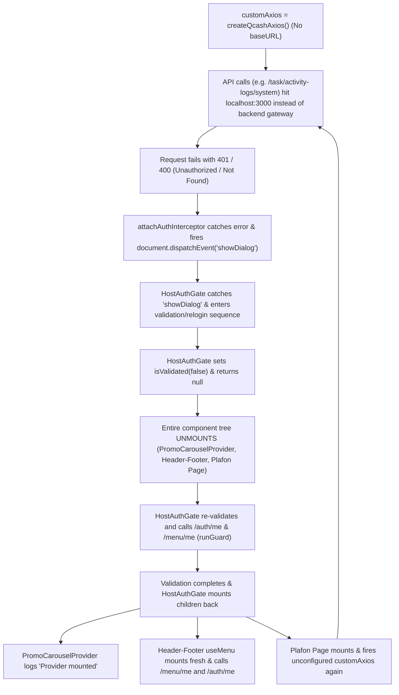

# tracing infinite loop on plafon pegadaian render

- **ID**: `antigravity-dd822cf5bb353ee472e3bcf8866afe8c30ed40bab770957bbf4c2cfd3893c582`
- **Source Tool**: `antigravity`
- **Date**: `2026-09-01 13:46:42`
- **Tags**: `coding`, `assistant`, `antigravity`

---

## Turn 1: User

tracing infinite loop on plafon pegadaian render
this is a debugging session that encompass 2 or more repos
1. plafon pegadaian
2. qcash ui
3. maybe header footer 

okay so this is what happened
we migrate ordent to bri provider, removing guard call, adding singleton and upping version bri on some of the repos, including plafon pegadaian
what happen
1. on any other repo that perform migration, the render is working normally
2. but on plafon, there is an almost infinite calling of me api endpoint, this could be because the plafon pegadaian render logic itself
[Image 1] [Image 2] 
can you trace why this me endpoints specifically happen to plafon pegadaian? 
1. you can check vault llm for further context regarding this migration, we have many knowledge concernig it on on the gemini agy sessions

---

## Turn 2: Assistant

<details><summary>🔧 Tool Invocations (1)</summary>

- **run_command**: 

</details>


---

## Turn 3: Assistant

<details><summary>🔧 Tool Invocations (1)</summary>

- **list_dir**: 

</details>


---

## Turn 4: Assistant

<details><summary>🔧 Tool Invocations (1)</summary>

- **run_command**: 

</details>


---

## Turn 5: Assistant

<details><summary>🔧 Tool Invocations (1)</summary>

- **run_command**: 

</details>


---

## Turn 6: Assistant

<details><summary>🔧 Tool Invocations (1)</summary>

- **run_command**: 

</details>


---

## Turn 7: Assistant

<details><summary>🔧 Tool Invocations (1)</summary>

- **manage_task**: 

</details>


---

## Turn 8: Assistant

<details><summary>🔧 Tool Invocations (1)</summary>

- **run_command**: 

</details>


---

## Turn 9: Assistant

<details><summary>🔧 Tool Invocations (1)</summary>

- **manage_task**: 

</details>


---

## Turn 10: Assistant

<details><summary>🔧 Tool Invocations (1)</summary>

- **run_command**: 

</details>


---

## Turn 11: Assistant

<details><summary>🔧 Tool Invocations (1)</summary>

- **view_file**: 

</details>


---

## Turn 12: Assistant

<details><summary>🔧 Tool Invocations (1)</summary>

- **view_file**: 

</details>


---

## Turn 13: Assistant

<details><summary>🔧 Tool Invocations (1)</summary>

- **view_file**: 

</details>


---

## Turn 14: Assistant

<details><summary>🔧 Tool Invocations (1)</summary>

- **run_command**: 

</details>


---

## Turn 15: Assistant

<details><summary>🔧 Tool Invocations (1)</summary>

- **view_file**: 

</details>


---

## Turn 16: Assistant

<details><summary>🔧 Tool Invocations (1)</summary>

- **run_command**: 

</details>


---

## Turn 17: Assistant

<details><summary>🔧 Tool Invocations (1)</summary>

- **run_command**: 

</details>


---

## Turn 18: Assistant

<details><summary>🔧 Tool Invocations (1)</summary>

- **view_file**: 

</details>


---

## Turn 19: Assistant

<details><summary>🔧 Tool Invocations (1)</summary>

- **view_file**: 

</details>


---

## Turn 20: Assistant

<details><summary>🔧 Tool Invocations (1)</summary>

- **view_file**: 

</details>


---

## Turn 21: Assistant

<details><summary>🔧 Tool Invocations (1)</summary>

- **grep_search**: 

</details>


---

## Turn 22: Assistant

<details><summary>🔧 Tool Invocations (1)</summary>

- **grep_search**: 

</details>


---

## Turn 23: Assistant

<details><summary>🔧 Tool Invocations (1)</summary>

- **view_file**: 

</details>


---

## Turn 24: Assistant

<details><summary>🔧 Tool Invocations (1)</summary>

- **find_by_name**: 

</details>


---

## Turn 25: Assistant

<details><summary>🔧 Tool Invocations (1)</summary>

- **view_file**: 

</details>


---

## Turn 26: Assistant

<details><summary>🔧 Tool Invocations (1)</summary>

- **list_dir**: 

</details>


---

## Turn 27: Assistant

<details><summary>🔧 Tool Invocations (1)</summary>

- **view_file**: 

</details>


---

## Turn 28: Assistant

<details><summary>🔧 Tool Invocations (1)</summary>

- **grep_search**: 

</details>


---

## Turn 29: Assistant

<details><summary>🔧 Tool Invocations (1)</summary>

- **view_file**: 

</details>


---

## Turn 30: Assistant

<details><summary>🔧 Tool Invocations (1)</summary>

- **run_command**: 

</details>


---

## Turn 31: Assistant

<details><summary>🔧 Tool Invocations (1)</summary>

- **view_file**: 

</details>


---

## Turn 32: Assistant

<details><summary>🔧 Tool Invocations (1)</summary>

- **manage_task**: 

</details>


---

## Turn 33: Assistant

<details><summary>🔧 Tool Invocations (1)</summary>

- **run_command**: 

</details>


---

## Turn 34: Assistant

<details><summary>🔧 Tool Invocations (1)</summary>

- **manage_task**: 

</details>


---

## Turn 35: Assistant

<details><summary>🔧 Tool Invocations (1)</summary>

- **run_command**: 

</details>


---

## Turn 36: Assistant

<details><summary>🔧 Tool Invocations (1)</summary>

- **manage_task**: 

</details>


---

## Turn 37: Assistant

<details><summary>🔧 Tool Invocations (1)</summary>

- **grep_search**: 

</details>


---

## Turn 38: Assistant

<details><summary>🔧 Tool Invocations (1)</summary>

- **grep_search**: 

</details>


---

## Turn 39: Assistant

<details><summary>🔧 Tool Invocations (1)</summary>

- **view_file**: 

</details>


---

## Turn 40: Assistant

<details><summary>🔧 Tool Invocations (1)</summary>

- **grep_search**: 

</details>


---

## Turn 41: Assistant

<details><summary>🔧 Tool Invocations (1)</summary>

- **view_file**: 

</details>


---

## Turn 42: Assistant

<details><summary>🔧 Tool Invocations (1)</summary>

- **view_file**: 

</details>


---

## Turn 43: Assistant

<details><summary>🔧 Tool Invocations (1)</summary>

- **grep_search**: 

</details>


---

## Turn 44: Assistant

<details><summary>🔧 Tool Invocations (1)</summary>

- **grep_search**: 

</details>


---

## Turn 45: Assistant

<details><summary>🔧 Tool Invocations (1)</summary>

- **view_file**: 

</details>


---

## Turn 46: Assistant

<details><summary>🔧 Tool Invocations (1)</summary>

- **view_file**: 

</details>


---

## Turn 47: Assistant

<details><summary>🔧 Tool Invocations (1)</summary>

- **view_file**: 

</details>


---

## Turn 48: Assistant

<details><summary>🔧 Tool Invocations (1)</summary>

- **view_file**: 

</details>


---

## Turn 49: Assistant

<details><summary>🔧 Tool Invocations (1)</summary>

- **run_command**: 

</details>


---

## Turn 50: Assistant

<details><summary>🔧 Tool Invocations (1)</summary>

- **manage_task**: 

</details>


---

## Turn 51: Assistant

<details><summary>🔧 Tool Invocations (1)</summary>

- **view_file**: 

</details>


---

## Turn 52: Assistant

<details><summary>🔧 Tool Invocations (1)</summary>

- **find_by_name**: 

</details>


---

## Turn 53: Assistant

<details><summary>🔧 Tool Invocations (1)</summary>

- **view_file**: 

</details>


---

## Turn 54: Assistant

<details><summary>🔧 Tool Invocations (1)</summary>

- **view_file**: 

</details>


---

## Turn 55: Assistant

<details><summary>🔧 Tool Invocations (1)</summary>

- **run_command**: 

</details>


---

## Turn 56: Assistant

<details><summary>🔧 Tool Invocations (1)</summary>

- **manage_task**: 

</details>


---

## Turn 57: Assistant

<details><summary>🔧 Tool Invocations (1)</summary>

- **manage_task**: 

</details>


---

## Turn 58: Assistant

<details><summary>🔧 Tool Invocations (1)</summary>

- **run_command**: 

</details>


---

## Turn 59: Assistant

<details><summary>🔧 Tool Invocations (1)</summary>

- **manage_task**: 

</details>


---

## Turn 60: Assistant

<details><summary>🔧 Tool Invocations (1)</summary>

- **run_command**: 

</details>


---

## Turn 61: Assistant

<details><summary>🔧 Tool Invocations (1)</summary>

- **manage_task**: 

</details>


---

## Turn 62: Assistant

<details><summary>🔧 Tool Invocations (1)</summary>

- **grep_search**: 

</details>


---

## Turn 63: Assistant

<details><summary>🔧 Tool Invocations (1)</summary>

- **find_by_name**: 

</details>


---

## Turn 64: Assistant

<details><summary>🔧 Tool Invocations (1)</summary>

- **run_command**: 

</details>


---

## Turn 65: Assistant

<details><summary>🔧 Tool Invocations (1)</summary>

- **manage_task**: 

</details>


---

## Turn 66: Assistant

<details><summary>🔧 Tool Invocations (1)</summary>

- **manage_task**: 

</details>


---

## Turn 67: Assistant

<details><summary>🔧 Tool Invocations (1)</summary>

- **run_command**: 

</details>


---

## Turn 68: Assistant

<details><summary>🔧 Tool Invocations (1)</summary>

- **manage_task**: 

</details>


---

## Turn 69: Assistant

<details><summary>🔧 Tool Invocations (1)</summary>

- **run_command**: 

</details>


---

## Turn 70: Assistant

<details><summary>🔧 Tool Invocations (1)</summary>

- **manage_task**: 

</details>


---

## Turn 71: Assistant

<details><summary>🔧 Tool Invocations (1)</summary>

- **view_file**: 

</details>


---

## Turn 72: Assistant

<details><summary>🔧 Tool Invocations (1)</summary>

- **view_file**: 

</details>


---

## Turn 73: Assistant

<details><summary>🔧 Tool Invocations (1)</summary>

- **run_command**: 

</details>


---

## Turn 74: Assistant

<details><summary>🔧 Tool Invocations (1)</summary>

- **run_command**: 

</details>


---

## Turn 75: Assistant

<details><summary>🔧 Tool Invocations (1)</summary>

- **manage_task**: 

</details>


---

## Turn 76: Assistant

<details><summary>🔧 Tool Invocations (1)</summary>

- **view_file**: 

</details>


---

## Turn 77: Assistant

<details><summary>🔧 Tool Invocations (1)</summary>

- **view_file**: 

</details>


---

## Turn 78: Assistant

<details><summary>🔧 Tool Invocations (1)</summary>

- **view_file**: 

</details>


---

## Turn 79: Assistant

<details><summary>🔧 Tool Invocations (1)</summary>

- **view_file**: 

</details>


---

## Turn 80: Assistant

<details><summary>🔧 Tool Invocations (1)</summary>

- **view_file**: 

</details>


---

## Turn 81: Assistant

<details><summary>🔧 Tool Invocations (1)</summary>

- **view_file**: 

</details>


---

## Turn 82: Assistant

<details><summary>🔧 Tool Invocations (1)</summary>

- **view_file**: 

</details>


---

## Turn 83: Assistant

<details><summary>🔧 Tool Invocations (1)</summary>

- **grep_search**: 

</details>


---

## Turn 84: Assistant

<details><summary>🔧 Tool Invocations (1)</summary>

- **view_file**: 

</details>


---

## Turn 85: Assistant

<details><summary>🔧 Tool Invocations (1)</summary>

- **find_by_name**: 

</details>


---

## Turn 86: Assistant

<details><summary>🔧 Tool Invocations (1)</summary>

- **list_dir**: 

</details>


---

## Turn 87: Assistant

<details><summary>🔧 Tool Invocations (1)</summary>

- **list_dir**: 

</details>


---

## Turn 88: Assistant

<details><summary>🔧 Tool Invocations (1)</summary>

- **view_file**: 

</details>


---

## Turn 89: Assistant

<details><summary>🔧 Tool Invocations (1)</summary>

- **view_file**: 

</details>


---

## Turn 90: Assistant

<details><summary>🔧 Tool Invocations (1)</summary>

- **view_file**: 

</details>


---

## Turn 91: Assistant

<details><summary>🔧 Tool Invocations (1)</summary>

- **run_command**: 

</details>


---

## Turn 92: Assistant

<details><summary>🔧 Tool Invocations (1)</summary>

- **manage_task**: 

</details>


---

## Turn 93: Assistant

<details><summary>🔧 Tool Invocations (1)</summary>

- **run_command**: 

</details>


---

## Turn 94: Assistant

<details><summary>🔧 Tool Invocations (1)</summary>

- **manage_task**: 

</details>


---

## Turn 95: Assistant

<details><summary>🔧 Tool Invocations (1)</summary>

- **run_command**: 

</details>


---

## Turn 96: Assistant

<details><summary>🔧 Tool Invocations (1)</summary>

- **manage_task**: 

</details>


---

## Turn 97: Assistant

<details><summary>🔧 Tool Invocations (1)</summary>

- **run_command**: 

</details>


---

## Turn 98: Assistant

<details><summary>🔧 Tool Invocations (1)</summary>

- **manage_task**: 

</details>


---

## Turn 99: Assistant

<details><summary>🔧 Tool Invocations (1)</summary>

- **view_file**: 

</details>


---

## Turn 100: Assistant

<details><summary>🔧 Tool Invocations (1)</summary>

- **view_file**: 

</details>


---

## Turn 101: Assistant

<details><summary>🔧 Tool Invocations (1)</summary>

- **view_file**: 

</details>


---

## Turn 102: Assistant

<details><summary>🔧 Tool Invocations (1)</summary>

- **view_file**: 

</details>


---

## Turn 103: Assistant

<details><summary>🔧 Tool Invocations (1)</summary>

- **grep_search**: 

</details>


---

## Turn 104: Assistant

<details><summary>🔧 Tool Invocations (1)</summary>

- **grep_search**: 

</details>


---

## Turn 105: Assistant

<details><summary>🔧 Tool Invocations (1)</summary>

- **grep_search**: 

</details>


---

## Turn 106: Assistant

<details><summary>🔧 Tool Invocations (1)</summary>

- **grep_search**: 

</details>


---

## Turn 107: Assistant

<details><summary>🔧 Tool Invocations (1)</summary>

- **grep_search**: 

</details>


---

## Turn 108: Assistant

<details><summary>🔧 Tool Invocations (1)</summary>

- **run_command**: 

</details>


---

## Turn 109: Assistant

<details><summary>🔧 Tool Invocations (1)</summary>

- **manage_task**: 

</details>


---

## Turn 110: Assistant

<details><summary>🔧 Tool Invocations (1)</summary>

- **view_file**: 

</details>


---

## Turn 111: Assistant

<details><summary>🔧 Tool Invocations (1)</summary>

- **view_file**: 

</details>


---

## Turn 112: Assistant

<details><summary>🔧 Tool Invocations (1)</summary>

- **view_file**: 

</details>


---

## Turn 113: Assistant

<details><summary>🔧 Tool Invocations (1)</summary>

- **view_file**: 

</details>


---

## Turn 114: Assistant

<details><summary>🔧 Tool Invocations (1)</summary>

- **grep_search**: 

</details>


---

## Turn 115: Assistant

<details><summary>🔧 Tool Invocations (1)</summary>

- **grep_search**: 

</details>


---

## Turn 116: Assistant

<details><summary>🔧 Tool Invocations (1)</summary>

- **run_command**: 

</details>


---

## Turn 117: Assistant

<details><summary>🔧 Tool Invocations (1)</summary>

- **manage_task**: 

</details>


---

## Turn 118: Assistant

<details><summary>🔧 Tool Invocations (1)</summary>

- **manage_task**: 

</details>


---

## Turn 119: Assistant

<details><summary>🔧 Tool Invocations (1)</summary>

- **run_command**: 

</details>


---

## Turn 120: Assistant

<details><summary>🔧 Tool Invocations (1)</summary>

- **view_file**: 

</details>


---

## Turn 121: Assistant

<details><summary>🔧 Tool Invocations (1)</summary>

- **grep_search**: 

</details>


---

## Turn 122: Assistant

<details><summary>🔧 Tool Invocations (1)</summary>

- **grep_search**: 

</details>


---

## Turn 123: Assistant

<details><summary>🔧 Tool Invocations (1)</summary>

- **grep_search**: 

</details>


---

## Turn 124: Assistant

<details><summary>🔧 Tool Invocations (1)</summary>

- **view_file**: 

</details>


---

## Turn 125: Assistant

<details><summary>🔧 Tool Invocations (1)</summary>

- **view_file**: 

</details>


---

## Turn 126: Assistant

<details><summary>🔧 Tool Invocations (1)</summary>

- **view_file**: 

</details>


---

## Turn 127: Assistant

<details><summary>🔧 Tool Invocations (1)</summary>

- **view_file**: 

</details>


---

## Turn 128: Assistant

<details><summary>🔧 Tool Invocations (1)</summary>

- **view_file**: 

</details>


---

## Turn 129: Assistant

<details><summary>🔧 Tool Invocations (1)</summary>

- **view_file**: 

</details>


---

## Turn 130: Assistant

<details><summary>🔧 Tool Invocations (1)</summary>

- **grep_search**: 

</details>


---

## Turn 131: Assistant

<details><summary>🔧 Tool Invocations (1)</summary>

- **run_command**: 

</details>


---

## Turn 132: Assistant

<details><summary>🔧 Tool Invocations (1)</summary>

- **manage_task**: 

</details>


---

## Turn 133: Assistant

<details><summary>🔧 Tool Invocations (1)</summary>

- **view_file**: 

</details>


---

## Turn 134: Assistant

<details><summary>🔧 Tool Invocations (1)</summary>

- **view_file**: 

</details>


---

## Turn 135: Assistant

<details><summary>🔧 Tool Invocations (1)</summary>

- **run_command**: 

</details>


---

## Turn 136: Assistant

<details><summary>🔧 Tool Invocations (1)</summary>

- **manage_task**: 

</details>


---

## Turn 137: Assistant

<details><summary>🔧 Tool Invocations (1)</summary>

- **run_command**: 

</details>


---

## Turn 138: Assistant

<details><summary>🔧 Tool Invocations (1)</summary>

- **manage_task**: 

</details>


---

## Turn 139: Assistant

<details><summary>🔧 Tool Invocations (1)</summary>

- **run_command**: 

</details>


---

## Turn 140: Assistant

<details><summary>🔧 Tool Invocations (1)</summary>

- **view_file**: 

</details>


---

## Turn 141: Assistant

<details><summary>🔧 Tool Invocations (1)</summary>

- **run_command**: 

</details>


---

## Turn 142: Assistant

<details><summary>🔧 Tool Invocations (1)</summary>

- **list_dir**: 

</details>


---

## Turn 143: Assistant

<details><summary>🔧 Tool Invocations (1)</summary>

- **view_file**: 

</details>


---

## Turn 144: Assistant

<details><summary>🔧 Tool Invocations (1)</summary>

- **grep_search**: 

</details>


---

## Turn 145: Assistant

<details><summary>🔧 Tool Invocations (1)</summary>

- **view_file**: 

</details>


---

## Turn 146: Assistant

<details><summary>🔧 Tool Invocations (1)</summary>

- **view_file**: 

</details>


---

## Turn 147: Assistant

<details><summary>🔧 Tool Invocations (1)</summary>

- **view_file**: 

</details>


---

## Turn 148: Assistant

<details><summary>🔧 Tool Invocations (1)</summary>

- **view_file**: 

</details>


---

## Turn 149: Assistant

<details><summary>🔧 Tool Invocations (1)</summary>

- **grep_search**: 

</details>


---

## Turn 150: Assistant

<details><summary>🔧 Tool Invocations (1)</summary>

- **run_command**: 

</details>


---

## Turn 151: Assistant

<details><summary>🔧 Tool Invocations (1)</summary>

- **run_command**: 

</details>


---

## Turn 152: Assistant

<details><summary>🔧 Tool Invocations (1)</summary>

- **run_command**: 

</details>


---

## Turn 153: Assistant

<details><summary>🔧 Tool Invocations (1)</summary>

- **run_command**: 

</details>


---

## Turn 154: Assistant

<details><summary>🔧 Tool Invocations (1)</summary>

- **run_command**: 

</details>


---

## Turn 155: Assistant

<details><summary>🔧 Tool Invocations (1)</summary>

- **view_file**: 

</details>


---

## Turn 156: Assistant

<details><summary>🔧 Tool Invocations (1)</summary>

- **view_file**: 

</details>


---

## Turn 157: Assistant

<details><summary>🔧 Tool Invocations (1)</summary>

- **view_file**: 

</details>


---

## Turn 158: Assistant

<details><summary>🔧 Tool Invocations (1)</summary>

- **grep_search**: 

</details>


---

## Turn 159: Assistant

<details><summary>🔧 Tool Invocations (1)</summary>

- **grep_search**: 

</details>


---

## Turn 160: Assistant

<details><summary>🔧 Tool Invocations (1)</summary>

- **view_file**: 

</details>


---

## Turn 161: Assistant

<details><summary>🔧 Tool Invocations (1)</summary>

- **view_file**: 

</details>


---

## Turn 162: Assistant

<details><summary>🔧 Tool Invocations (1)</summary>

- **view_file**: 

</details>


---

## Turn 163: Assistant

<details><summary>🔧 Tool Invocations (1)</summary>

- **grep_search**: 

</details>


---

## Turn 164: Assistant

<details><summary>🔧 Tool Invocations (1)</summary>

- **view_file**: 

</details>


---

## Turn 165: Assistant

<details><summary>🔧 Tool Invocations (1)</summary>

- **view_file**: 

</details>


---

## Turn 166: Assistant

<details><summary>🔧 Tool Invocations (1)</summary>

- **view_file**: 

</details>


---

## Turn 167: Assistant

<details><summary>🔧 Tool Invocations (1)</summary>

- **run_command**: 

</details>


---

## Turn 168: Assistant

<details><summary>🔧 Tool Invocations (1)</summary>

- **manage_task**: 

</details>


---

## Turn 169: Assistant

<details><summary>🔧 Tool Invocations (1)</summary>

- **view_file**: 

</details>


---

## Turn 170: Assistant

<details><summary>🔧 Tool Invocations (1)</summary>

- **view_file**: 

</details>


---

## Turn 171: Assistant

<details><summary>🔧 Tool Invocations (1)</summary>

- **view_file**: 

</details>


---

## Turn 172: Assistant

<details><summary>🔧 Tool Invocations (1)</summary>

- **grep_search**: 

</details>


---

## Turn 173: Assistant

<details><summary>🔧 Tool Invocations (1)</summary>

- **view_file**: 

</details>


---

## Turn 174: Assistant

<details><summary>🔧 Tool Invocations (1)</summary>

- **view_file**: 

</details>


---

## Turn 175: Assistant

<details><summary>🔧 Tool Invocations (1)</summary>

- **run_command**: 

</details>


---

## Turn 176: Assistant

<details><summary>🔧 Tool Invocations (1)</summary>

- **manage_task**: 

</details>


---

## Turn 177: Assistant

<details><summary>🔧 Tool Invocations (1)</summary>

- **view_file**: 

</details>


---

## Turn 178: Assistant

<details><summary>🔧 Tool Invocations (1)</summary>

- **view_file**: 

</details>


---

## Turn 179: Assistant

<details><summary>🔧 Tool Invocations (1)</summary>

- **find_by_name**: 

</details>


---

## Turn 180: Assistant

<details><summary>🔧 Tool Invocations (1)</summary>

- **view_file**: 

</details>


---

## Turn 181: Assistant

<details><summary>🔧 Tool Invocations (1)</summary>

- **view_file**: 

</details>


---

## Turn 182: Assistant

<details><summary>🔧 Tool Invocations (1)</summary>

- **view_file**: 

</details>


---

## Turn 183: User

continue

---

## Turn 184: Assistant

<details><summary>🔧 Tool Invocations (1)</summary>

- **run_command**: 

</details>


---

## Turn 185: Assistant

<details><summary>🔧 Tool Invocations (1)</summary>

- **run_command**: 

</details>


---

## Turn 186: Assistant

<details><summary>🔧 Tool Invocations (1)</summary>

- **grep_search**: 

</details>


---

## Turn 187: Assistant

<details><summary>🔧 Tool Invocations (1)</summary>

- **view_file**: 

</details>


---

## Turn 188: Assistant

<details><summary>🔧 Tool Invocations (1)</summary>

- **view_file**: 

</details>


---

## Turn 189: Assistant

<details><summary>🔧 Tool Invocations (1)</summary>

- **run_command**: 

</details>


---

## Turn 190: Assistant

<details><summary>🔧 Tool Invocations (1)</summary>

- **run_command**: 

</details>


---

## Turn 191: Assistant

<details><summary>🔧 Tool Invocations (1)</summary>

- **manage_task**: 

</details>


---

## Turn 192: Assistant

<details><summary>🔧 Tool Invocations (1)</summary>

- **manage_task**: 

</details>


---

## Turn 193: Assistant

<details><summary>🔧 Tool Invocations (1)</summary>

- **find_by_name**: 

</details>


---

## Turn 194: Assistant

<details><summary>🔧 Tool Invocations (1)</summary>

- **view_file**: 

</details>


---

## Turn 195: Assistant

<details><summary>🔧 Tool Invocations (1)</summary>

- **view_file**: 

</details>


---

## Turn 196: Assistant

<details><summary>🔧 Tool Invocations (1)</summary>

- **run_command**: 

</details>


---

## Turn 197: Assistant

<details><summary>🔧 Tool Invocations (1)</summary>

- **run_command**: 

</details>


---

## Turn 198: Assistant

<details><summary>🔧 Tool Invocations (1)</summary>

- **manage_task**: 

</details>


---

## Turn 199: Assistant

<details><summary>🔧 Tool Invocations (1)</summary>

- **view_file**: 

</details>


---

## Turn 200: Assistant

<details><summary>🔧 Tool Invocations (1)</summary>

- **view_file**: 

</details>


---

## Turn 201: Assistant

<details><summary>🔧 Tool Invocations (1)</summary>

- **view_file**: 

</details>


---

## Turn 202: Assistant

<details><summary>🔧 Tool Invocations (1)</summary>

- **run_command**: 

</details>


---

## Turn 203: Assistant

<details><summary>🔧 Tool Invocations (1)</summary>

- **view_file**: 

</details>


---

## Turn 204: Assistant

<details><summary>🔧 Tool Invocations (1)</summary>

- **view_file**: 

</details>


---

## Turn 205: Assistant

<details><summary>🔧 Tool Invocations (1)</summary>

- **view_file**: 

</details>


---

## Turn 206: Assistant

<details><summary>🔧 Tool Invocations (1)</summary>

- **view_file**: 

</details>


---

## Turn 207: Assistant

<details><summary>🔧 Tool Invocations (1)</summary>

- **view_file**: 

</details>


---

## Turn 208: Assistant

<details><summary>🔧 Tool Invocations (1)</summary>

- **find_by_name**: 

</details>


---

## Turn 209: Assistant

<details><summary>🔧 Tool Invocations (1)</summary>

- **view_file**: 

</details>


---

## Turn 210: Assistant

<details><summary>🔧 Tool Invocations (1)</summary>

- **grep_search**: 

</details>


---

## Turn 211: Assistant

<details><summary>🔧 Tool Invocations (1)</summary>

- **view_file**: 

</details>


---

## Turn 212: Assistant

<details><summary>🔧 Tool Invocations (1)</summary>

- **view_file**: 

</details>


---

## Turn 213: Assistant

<details><summary>🔧 Tool Invocations (1)</summary>

- **view_file**: 

</details>


---

## Turn 214: Assistant

<details><summary>🔧 Tool Invocations (1)</summary>

- **view_file**: 

</details>


---

## Turn 215: Assistant

<details><summary>🔧 Tool Invocations (1)</summary>

- **view_file**: 

</details>


---

## Turn 216: Assistant

<details><summary>🔧 Tool Invocations (1)</summary>

- **view_file**: 

</details>


---

## Turn 217: Assistant

<details><summary>🔧 Tool Invocations (1)</summary>

- **grep_search**: 

</details>


---

## Turn 218: Assistant

<details><summary>🔧 Tool Invocations (1)</summary>

- **grep_search**: 

</details>


---

## Turn 219: Assistant

<details><summary>🔧 Tool Invocations (1)</summary>

- **grep_search**: 

</details>


---

## Turn 220: Assistant

<details><summary>🔧 Tool Invocations (1)</summary>

- **grep_search**: 

</details>


---

## Turn 221: Assistant

<details><summary>🔧 Tool Invocations (1)</summary>

- **grep_search**: 

</details>


---

## Turn 222: Assistant

<details><summary>🔧 Tool Invocations (1)</summary>

- **grep_search**: 

</details>


---

## Turn 223: Assistant

<details><summary>🔧 Tool Invocations (1)</summary>

- **grep_search**: 

</details>


---

## Turn 224: Assistant

<details><summary>🔧 Tool Invocations (1)</summary>

- **grep_search**: 

</details>


---

## Turn 225: Assistant

<details><summary>🔧 Tool Invocations (1)</summary>

- **grep_search**: 

</details>


---

## Turn 226: Assistant

<details><summary>🔧 Tool Invocations (1)</summary>

- **grep_search**: 

</details>


---

## Turn 227: Assistant

<details><summary>🔧 Tool Invocations (1)</summary>

- **grep_search**: 

</details>


---

## Turn 228: Assistant

<details><summary>🔧 Tool Invocations (1)</summary>

- **view_file**: 

</details>


---

## Turn 229: Assistant

<details><summary>🔧 Tool Invocations (1)</summary>

- **view_file**: 

</details>


---

## Turn 230: Assistant

<details><summary>🔧 Tool Invocations (1)</summary>

- **view_file**: 

</details>


---

## Turn 231: Assistant

<details><summary>🔧 Tool Invocations (1)</summary>

- **find_by_name**: 

</details>


---

## Turn 232: Assistant

<details><summary>🔧 Tool Invocations (1)</summary>

- **view_file**: 

</details>


---

## Turn 233: Assistant

<details><summary>🔧 Tool Invocations (1)</summary>

- **run_command**: 

</details>


---

## Turn 234: Assistant

<details><summary>🔧 Tool Invocations (1)</summary>

- **manage_task**: 

</details>


---

## Turn 235: Assistant

<details><summary>🔧 Tool Invocations (1)</summary>

- **run_command**: 

</details>


---

## Turn 236: Assistant

<details><summary>🔧 Tool Invocations (1)</summary>

- **manage_task**: 

</details>


---

## Turn 237: Assistant

<details><summary>🔧 Tool Invocations (1)</summary>

- **run_command**: 

</details>


---

## Turn 238: Assistant

<details><summary>🔧 Tool Invocations (1)</summary>

- **manage_task**: 

</details>


---

## Turn 239: Assistant

<details><summary>🔧 Tool Invocations (1)</summary>

- **run_command**: 

</details>


---

## Turn 240: Assistant

<details><summary>🔧 Tool Invocations (1)</summary>

- **manage_task**: 

</details>


---

## Turn 241: Assistant

<details><summary>🔧 Tool Invocations (1)</summary>

- **run_command**: 

</details>


---

## Turn 242: Assistant

<details><summary>🔧 Tool Invocations (1)</summary>

- **manage_task**: 

</details>


---

## Turn 243: Assistant

<details><summary>🔧 Tool Invocations (1)</summary>

- **run_command**: 

</details>


---

## Turn 244: Assistant

<details><summary>🔧 Tool Invocations (1)</summary>

- **manage_task**: 

</details>


---

## Turn 245: Assistant

<details><summary>🔧 Tool Invocations (1)</summary>

- **run_command**: 

</details>


---

## Turn 246: Assistant

<details><summary>🔧 Tool Invocations (1)</summary>

- **run_command**: 

</details>


---

## Turn 247: Assistant

<details><summary>🔧 Tool Invocations (1)</summary>

- **run_command**: 

</details>


---

## Turn 248: Assistant

<details><summary>🔧 Tool Invocations (1)</summary>

- **view_file**: 

</details>


---

## Turn 249: Assistant

<details><summary>🔧 Tool Invocations (1)</summary>

- **view_file**: 

</details>


---

## Turn 250: Assistant

<details><summary>🔧 Tool Invocations (1)</summary>

- **grep_search**: 

</details>


---

## Turn 251: Assistant

<details><summary>🔧 Tool Invocations (1)</summary>

- **view_file**: 

</details>


---

## Turn 252: Assistant

<details><summary>🔧 Tool Invocations (1)</summary>

- **view_file**: 

</details>


---

## Turn 253: Assistant

<details><summary>🔧 Tool Invocations (1)</summary>

- **view_file**: 

</details>


---

## Turn 254: Assistant

<details><summary>🔧 Tool Invocations (1)</summary>

- **view_file**: 

</details>


---

## Turn 255: Assistant

<details><summary>🔧 Tool Invocations (1)</summary>

- **view_file**: 

</details>


---

## Turn 256: Assistant

<details><summary>🔧 Tool Invocations (1)</summary>

- **grep_search**: 

</details>


---

## Turn 257: Assistant

<details><summary>🔧 Tool Invocations (1)</summary>

- **run_command**: 

</details>


---

## Turn 258: Assistant

<details><summary>🔧 Tool Invocations (1)</summary>

- **grep_search**: 

</details>


---

## Turn 259: Assistant

<details><summary>🔧 Tool Invocations (1)</summary>

- **view_file**: 

</details>


---

## Turn 260: Assistant

<details><summary>🔧 Tool Invocations (1)</summary>

- **grep_search**: 

</details>


---

## Turn 261: Assistant

<details><summary>🔧 Tool Invocations (1)</summary>

- **view_file**: 

</details>


---

## Turn 262: Assistant

<details><summary>🔧 Tool Invocations (1)</summary>

- **view_file**: 

</details>


---

## Turn 263: Assistant

<details><summary>🔧 Tool Invocations (1)</summary>

- **view_file**: 

</details>


---

## Turn 264: Assistant

<details><summary>🔧 Tool Invocations (1)</summary>

- **view_file**: 

</details>


---

## Turn 265: Assistant

<details><summary>🔧 Tool Invocations (1)</summary>

- **run_command**: 

</details>


---

## Turn 266: Assistant

<details><summary>🔧 Tool Invocations (1)</summary>

- **view_file**: 

</details>


---

## Turn 267: Assistant

<details><summary>🔧 Tool Invocations (1)</summary>

- **run_command**: 

</details>


---

## Turn 268: Assistant

<details><summary>🔧 Tool Invocations (1)</summary>

- **manage_task**: 

</details>


---

## Turn 269: Assistant

<details><summary>🔧 Tool Invocations (1)</summary>

- **grep_search**: 

</details>


---

## Turn 270: Assistant

<details><summary>🔧 Tool Invocations (1)</summary>

- **grep_search**: 

</details>


---

## Turn 271: Assistant

<details><summary>🔧 Tool Invocations (1)</summary>

- **view_file**: 

</details>


---

## Turn 272: Assistant

<details><summary>🔧 Tool Invocations (1)</summary>

- **view_file**: 

</details>


---

## Turn 273: Assistant

<details><summary>🔧 Tool Invocations (1)</summary>

- **view_file**: 

</details>


---

## Turn 274: Assistant

<details><summary>🔧 Tool Invocations (1)</summary>

- **view_file**: 

</details>


---

## Turn 275: Assistant

<details><summary>🔧 Tool Invocations (1)</summary>

- **grep_search**: 

</details>


---

## Turn 276: Assistant

<details><summary>🔧 Tool Invocations (1)</summary>

- **view_file**: 

</details>


---

## Turn 277: Assistant

<details><summary>🔧 Tool Invocations (1)</summary>

- **view_file**: 

</details>


---

## Turn 278: Assistant

<details><summary>🔧 Tool Invocations (1)</summary>

- **view_file**: 

</details>


---

## Turn 279: Assistant

<details><summary>🔧 Tool Invocations (1)</summary>

- **view_file**: 

</details>


---

## Turn 280: Assistant

<details><summary>🔧 Tool Invocations (1)</summary>

- **view_file**: 

</details>


---

## Turn 281: Assistant

<details><summary>🔧 Tool Invocations (1)</summary>

- **view_file**: 

</details>


---

## Turn 282: Assistant

<details><summary>🔧 Tool Invocations (1)</summary>

- **run_command**: 

</details>


---

## Turn 283: Assistant

<details><summary>🔧 Tool Invocations (1)</summary>

- **manage_task**: 

</details>


---

## Turn 284: Assistant

<details><summary>🔧 Tool Invocations (1)</summary>

- **manage_task**: 

</details>


---

## Turn 285: Assistant

<details><summary>🔧 Tool Invocations (1)</summary>

- **manage_task**: 

</details>


---

## Turn 286: Assistant

<details><summary>🔧 Tool Invocations (1)</summary>

- **grep_search**: 

</details>


---

## Turn 287: Assistant

<details><summary>🔧 Tool Invocations (1)</summary>

- **view_file**: 

</details>


---

## Turn 288: Assistant

<details><summary>🔧 Tool Invocations (1)</summary>

- **view_file**: 

</details>


---

## Turn 289: Assistant

<details><summary>🔧 Tool Invocations (1)</summary>

- **grep_search**: 

</details>


---

## Turn 290: Assistant

<details><summary>🔧 Tool Invocations (1)</summary>

- **view_file**: 

</details>


---

## Turn 291: Assistant

<details><summary>🔧 Tool Invocations (1)</summary>

- **view_file**: 

</details>


---

## Turn 292: Assistant

<details><summary>🔧 Tool Invocations (1)</summary>

- **view_file**: 

</details>


---

## Turn 293: Assistant

<details><summary>🔧 Tool Invocations (1)</summary>

- **view_file**: 

</details>


---

## Turn 294: Assistant

<details><summary>🔧 Tool Invocations (1)</summary>

- **view_file**: 

</details>


---

## Turn 295: Assistant

<details><summary>🔧 Tool Invocations (1)</summary>

- **view_file**: 

</details>


---

## Turn 296: Assistant

<details><summary>🔧 Tool Invocations (1)</summary>

- **view_file**: 

</details>


---

## Turn 297: Assistant

<details><summary>🔧 Tool Invocations (1)</summary>

- **view_file**: 

</details>


---

## Turn 298: Assistant

<details><summary>🔧 Tool Invocations (1)</summary>

- **view_file**: 

</details>


---

## Turn 299: Assistant

<details><summary>🔧 Tool Invocations (1)</summary>

- **view_file**: 

</details>


---

## Turn 300: Assistant

<details><summary>🔧 Tool Invocations (1)</summary>

- **view_file**: 

</details>


---

## Turn 301: Assistant

<details><summary>🔧 Tool Invocations (1)</summary>

- **find_by_name**: 

</details>


---

## Turn 302: Assistant

<details><summary>🔧 Tool Invocations (1)</summary>

- **grep_search**: 

</details>


---

## Turn 303: Assistant

<details><summary>🔧 Tool Invocations (1)</summary>

- **view_file**: 

</details>


---

## Turn 304: Assistant

<details><summary>🔧 Tool Invocations (1)</summary>

- **view_file**: 

</details>


---

## Turn 305: Assistant

<details><summary>🔧 Tool Invocations (1)</summary>

- **view_file**: 

</details>


---

## Turn 306: Assistant

<details><summary>🔧 Tool Invocations (1)</summary>

- **view_file**: 

</details>


---

## Turn 307: Assistant

<details><summary>🔧 Tool Invocations (1)</summary>

- **view_file**: 

</details>


---

## Turn 308: Assistant

<details><summary>🔧 Tool Invocations (1)</summary>

- **view_file**: 

</details>


---

## Turn 309: Assistant

<details><summary>🔧 Tool Invocations (1)</summary>

- **view_file**: 

</details>


---

## Turn 310: Assistant

<details><summary>🔧 Tool Invocations (1)</summary>

- **view_file**: 

</details>


---

## Turn 311: Assistant

<details><summary>🔧 Tool Invocations (1)</summary>

- **view_file**: 

</details>


---

## Turn 312: Assistant

<details><summary>🔧 Tool Invocations (1)</summary>

- **view_file**: 

</details>


---

## Turn 313: Assistant

<details><summary>🔧 Tool Invocations (1)</summary>

- **view_file**: 

</details>


---

## Turn 314: Assistant

<details><summary>🔧 Tool Invocations (1)</summary>

- **view_file**: 

</details>


---

## Turn 315: Assistant

<details><summary>🔧 Tool Invocations (1)</summary>

- **view_file**: 

</details>


---

## Turn 316: Assistant

<details><summary>🔧 Tool Invocations (1)</summary>

- **view_file**: 

</details>


---

## Turn 317: Assistant

<details><summary>🔧 Tool Invocations (1)</summary>

- **view_file**: 

</details>


---

## Turn 318: Assistant

<details><summary>🔧 Tool Invocations (1)</summary>

- **grep_search**: 

</details>


---

## Turn 319: Assistant

<details><summary>🔧 Tool Invocations (1)</summary>

- **grep_search**: 

</details>


---

## Turn 320: Assistant

<details><summary>🔧 Tool Invocations (1)</summary>

- **grep_search**: 

</details>


---

## Turn 321: Assistant

<details><summary>🔧 Tool Invocations (1)</summary>

- **grep_search**: 

</details>


---

## Turn 322: Assistant

<details><summary>🔧 Tool Invocations (1)</summary>

- **view_file**: 

</details>


---

## Turn 323: Assistant

Based on a thorough trace across [**`qcash-ui`**](file:///D:/work/qcash-ui), [**`qcash-ui-plafon-pegadaian`**](file:///D:/work/qcash-ui-plafon-pegadaian), [**`qcash-ui-header-footer`**](file:///D:/work/qcash-ui-header-footer), and [**`addons-auth-provider`**](file:///D:/work/addons-auth-provider), here is the root-cause diagnosis for why `/auth/me` and `/menu/me` enter a near-infinite loop specifically on Plafon Pegadaian.

---

### 1. The Core Mechanism

The infinite calling of `me` endpoints is caused by an **unmount ↔ remount cycle of the host provider tree** inside [`HostAuthGate.tsx`](file:///D:/work/qcash-ui/components/providers/HostAuthGate.tsx).

The evidence in your screenshots confirms this:
- **Screenshot 2 (Console)**:
  ```text
  [PromoCarousel] ✗ blocked: not on /homepage or / (current: /plafon-pegadaian)
  [PromoCarousel] Provider mounted — code is deployed ✓
  [PromoCarousel] ✗ blocked: not on /homepage or / (current: /plafon-pegadaian)
  [PromoCarousel] Provider mounted — code is deployed ✓
  ```
  [`PromoCarouselProvider`](file:///D:/work/qcash-ui/components/providers/PromoCarouselProvider.tsx#L69-L71) logs `"Provider mounted"` inside a `useEffect(..., [])` on mount. Seeing it repeat over and over means the **entire provider tree is repeatedly being destroyed and recreated**.
- **Screenshot 1 (Network)**:
  - There are 108 requests to `me` (alternating pairs of `13.2 kB` for `POST /menu/me` and `119 kB` for `GET /auth/me`), all returning `200 OK`.
  - Every time the tree remounts, **two independent callers** hit `me`:
    1. [`HostAuthGate.tsx`](file:///D:/work/qcash-ui/components/providers/HostAuthGate.tsx#L93) runs `runGuard()` → calls `/auth/me` and `/menu/me`.
    2. [`useMenu.tsx`](file:///D:/work/qcash-ui-header-footer/hooks/useMenu.tsx#L273-L274) in Header-Footer mounts fresh (`fetchedTokenRef.current = null`) → calls `validateMenu.run(token)` and `productRoles.run()`.

---

### 2. Why Does This Happen Specifically on Plafon Pegadaian?

#### Cause A: `customAxios` is initialized with **no arguments** (Missing `baseURL`)
In other migrated repos:
- [`account-validation`](file:///D:/work/qcash-ui-account-validation/services/custom-axios.ts#L3-L8): uses standard `axios.create({ baseURL: config.baseUrl })`.
- [`global-account-summary`](file:///D:/work/qcash-ui-global-account-summary/services/custom-axios.ts): uses standard `axios.create({ baseURL: config.baseUrl })`.
- [`forex`](file:///D:/work/qcash-ui-forex): uses ConnectRPC / TanStack Query.

In [`qcash-ui-plafon-pegadaian/services/custom-axios.ts`](file:///D:/work/qcash-ui-plafon-pegadaian/services/custom-axios.ts#L1-L5):
```typescript
import { createQcashAxios } from "@bri/addons-auth-provider";

export const customAxios = createQcashAxios(); // ❌ Called with NO config and NO baseURL!
```
Without `baseURL: config.baseUrl`, API calls such as `POST /task/activity-logs/system` and `POST /plafon-pegadaian/list` resolve against the **host origin** (e.g. `http://localhost:3000/task/...`), failing with 401 or 404.

#### Cause B: `getActivityLogs` uses `fallbackOnUnauthorized`
In [`services/plafon-pegadaian.ts`](file:///D:/work/qcash-ui-plafon-pegadaian/services/plafon-pegadaian.ts#L261-L267):
```typescript
return await customAxios.post(url, data, {
  fallbackOnUnauthorized: {
    data: [],
    pagination: { totalRows: "0", totalPages: "0" },
  },
});
```
When `customAxios` fails with 401/400, [`attachAuthInterceptor`](file:///D:/work/addons-auth-provider/src/global-custom-axios/interceptors/auth-interceptors.ts#L317-L325) in `@bri/addons-auth-provider` executes `handleFallback401()`, which **dispatches `document.dispatchEvent(new CustomEvent("showDialog", ...))`**.

#### Cause C: `showDialog` and `authToken` Change Invalidate `HostAuthGate`
In [`HostAuthGate.tsx`](file:///D:/work/qcash-ui/components/providers/HostAuthGate.tsx#L112-L120):
1. `HostAuthGate` catches `showDialog` and sets `setSessionDialogPending(true)`.
2. When validation re-runs, line 221 executes:
   ```typescript
   setAuthError(null);
   setIsValidated(false);
   hasMountedRef.current = false;
   ```
3. Because `isHostValidated` and `hasMountedRef.current` become `false`, lines 284–286 cause `HostAuthGate` to **return `null`**:
   ```typescript
   if (!token || !isHostValidated || !briAuth.isAuthoritiesReady || !hasMountedRef.current) {
     return null; // 💥 Unmounts QuiProviders, PromoCarouselProvider, Header/Footer Layout, and the Page
   }
   ```
4. Once `runGuard()` finishes, `setIsValidated(true)` runs → children mount again → `PromoCarouselProvider` logs `Provider mounted` → Header/Footer calls `me` again → Plafon page mounts and triggers the unconfigured `customAxios` request again → **infinite loop**.

#### Cause D: Header-Footer `useMenu` Cache Stamp Invalidation
In [`qcash-ui-header-footer/hooks/useMenu.tsx`](file:///D:/work/qcash-ui-header-footer/hooks/useMenu.tsx#L231-L238):
```typescript
if (typeof window !== "undefined" && cacheSuffix) {
  const cachedOwner = localStorage.getItem(MENU_OWNER_KEY);
  if (cachedOwner && cachedOwner !== cacheSuffix) {
    clearMenuLocalStorage();
    fetchedTokenRef.current = null; // Forces re-fetch of validateMenu and productRoles
  }
}
```
[`HostAuthGate.exposeBridgeWindowData`](file:///D:/work/qcash-ui/components/providers/HostAuthGate.tsx#L50-L62) populates `window.__QCASH_AUTH_BRIDGE__` without `userID`. Whenever the tree remounts, any discrepancy in `cacheSuffix` resets `fetchedTokenRef.current` to `null`, ensuring that Header-Footer also re-fires `/menu/me` and `/auth/me` on each mount.

---

### 3. Summary Comparison

| Feature | Working MFEs (e.g. `account-validation`) | `plafon-pegadaian` |
| :--- | :--- | :--- |
| **`custom-axios.ts`** | `axios.create({ baseURL: config.baseUrl })` | `createQcashAxios()` with **no baseURL** |
| **Auth Interceptor** | Standard axios interceptors | `@bri/addons-auth-provider` relogin interceptor |
| **`fallbackOnUnauthorized`** | None | Used in `getActivityLogs` (triggers `showDialog`) |
| **Relogin Refetch Effect** | None | `useEffect(..., [authToken])` reloading pagination in [`containers/index.tsx`](file:///D:/work/qcash-ui-plafon-pegadaian/containers/index.tsx#L74-L84) |

---

### Recommended Remediation (When Ready to Implement)

1. **Supply `baseURL` to `createQcashAxios`** in [`qcash-ui-plafon-pegadaian/services/custom-axios.ts`](file:///D:/work/qcash-ui-plafon-pegadaian/services/custom-axios.ts):
   ```typescript
   import config from "@/config";
   import { createQcashAxios } from "@bri/addons-auth-provider";

   export const customAxios = createQcashAxios({
     baseURL: config.baseUrl ?? "",
   });

   export default customAxios;
   ```
2. **Align `@bri/addons-auth-provider` Version**:
   Update `node_modules` in `qcash-ui-plafon-pegadaian` from `0.10.5-mfe` to `0.10.6-mfe` so it matches the host's lazy URL fallback behavior.
3. **Include `userID` in `HostAuthGate.exposeBridgeWindowData`**:
   Ensure `userID: auth.userID ?? currentBridge.userID ?? null` is published to `window.__QCASH_AUTH_BRIDGE__` in [`HostAuthGate.tsx`](file:///D:/work/qcash-ui/components/providers/HostAuthGate.tsx#L50) so `useMenu`'s `cacheSuffix` stays consistent across renders.

---

## Turn 324: User

so basically the root cause is the missing argument of base url on the custom axios?

---

## Turn 325: Assistant

**Yes, exactly.** That missing `baseURL` is the primary trigger that starts the entire chain reaction.

Here is the exact domino effect that happens because of that single missing argument:



### Why didn't other repos have this problem?
Every other repo that migrated (`account-validation`, `global-account-summary`, etc.) kept:
```typescript
export const customAxios = axios.create({
  baseURL: config.baseUrl, // ✅ Configured properly
  ...
});
```
Their requests actually reach the backend, receive valid data, and never trip `@bri/addons-auth-provider`'s `showDialog` interceptor. Only `plafon-pegadaian` removed `baseURL: config.baseUrl` and invoked `createQcashAxios()` empty, creating the loop.

---

## Turn 326: User

are you sure this is about the missing argument? because currently on the deployed version of the site, we already provide the createcustomAxios without any argument
1. we port forwarded the plafon repo to 3000 it's safe
2.  we run locally qcash ui and plafon, it's also safe those qcash ui and plafon already have bri provider

---

## Turn 327: User

are you sure this is about the missing argument? because currently on the deployed version of the site, we already provide the createcustomAxios without any argument
1. we port forwarded the plafon repo to 3000 it's safe
2.  we run locally qcash ui and plafon, it's also safe those qcash ui and plafon already have bri provider

---

## Turn 328: Assistant

<details><summary>🔧 Tool Invocations (1)</summary>

- **run_command**: 

</details>


---

## Turn 329: Assistant

<details><summary>🔧 Tool Invocations (1)</summary>

- **manage_task**: 

</details>


---

