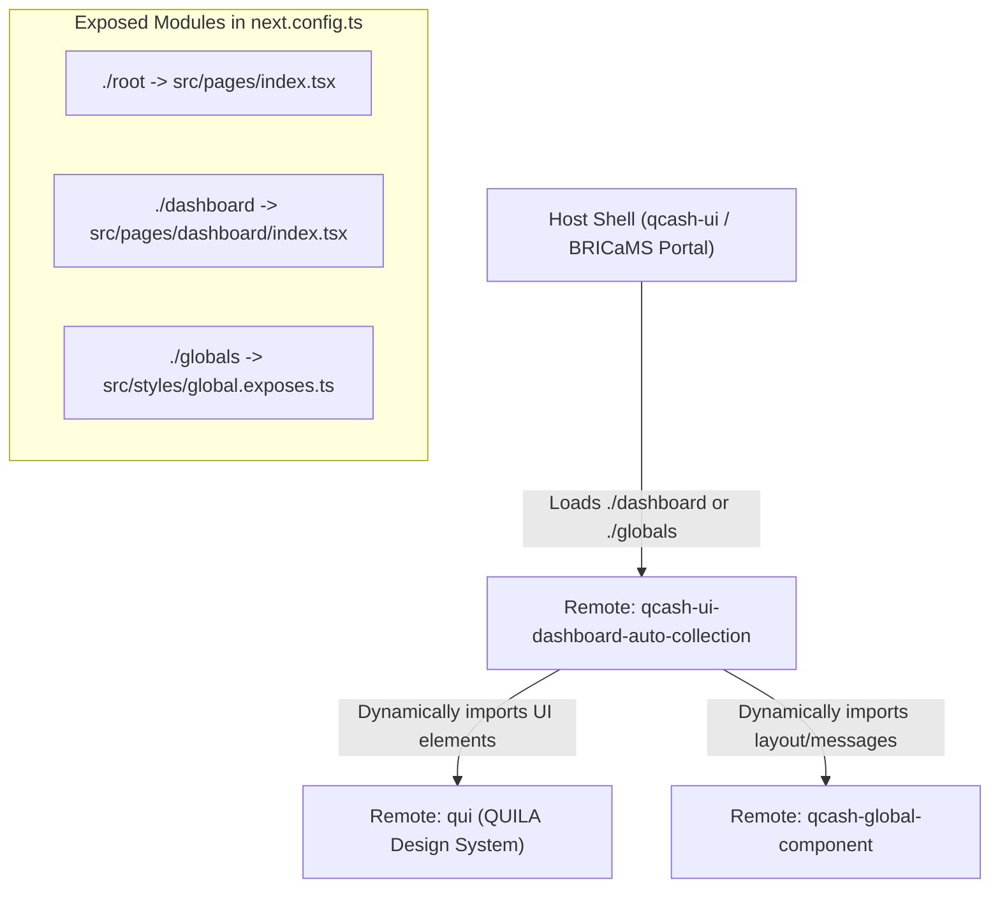
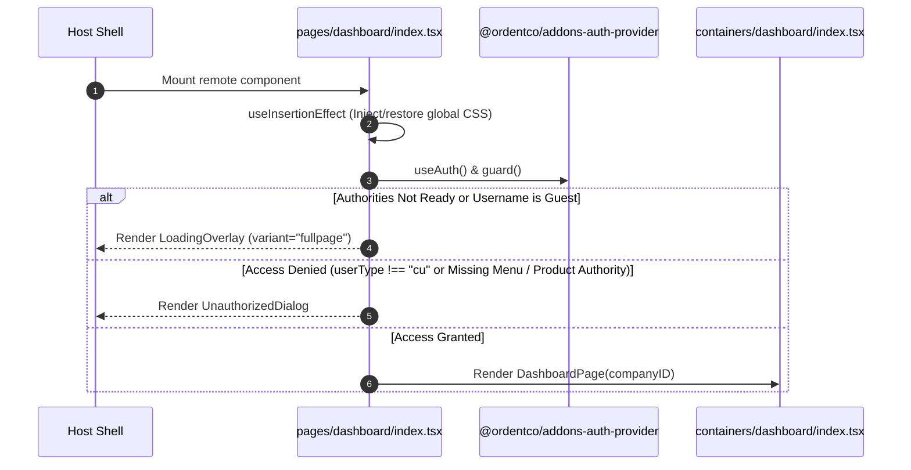
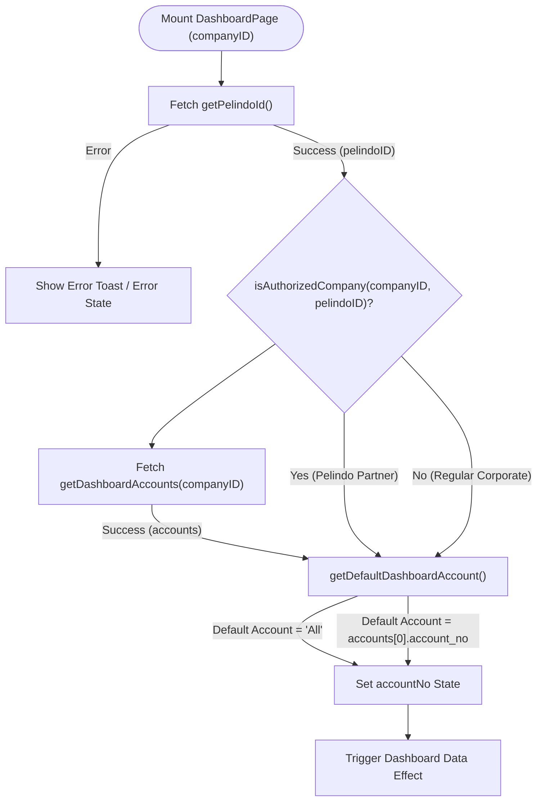
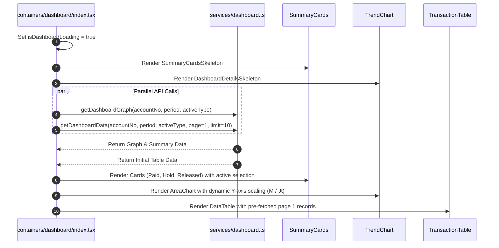
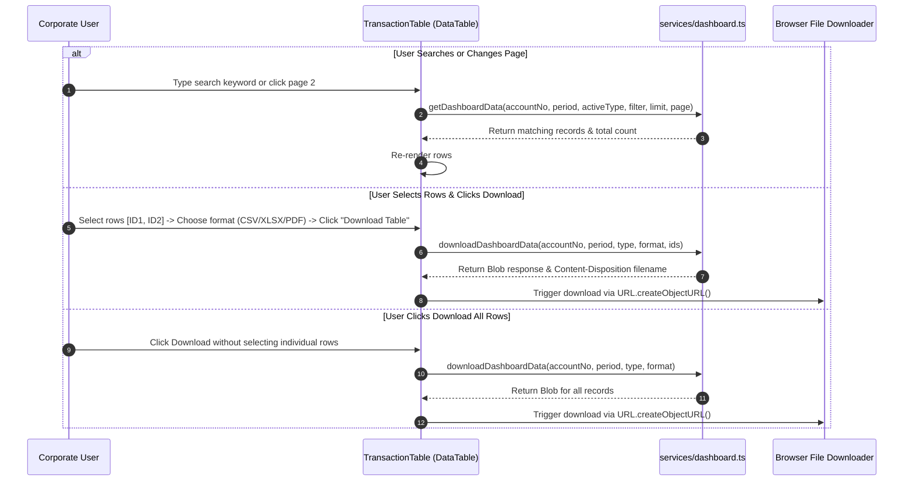

# dac documentation

- **Author**: `azzy`
- **ID**: `7f83b01b-6d94-409f-8b1c-f2e0467ef42d`
- **Source Tool**: `antigravity`
- **Date**: `2026-08-26 13:06:16`
- **Tags**: `coding`, `assistant`, `antigravity`

---

## Turn 1: User

dac documentation
can you make a full documentation for this repo? i want
1. a full documentation codebase for new people
2. full tech stack documentation 
3  api documentation
4. logic flowm documentation

---

## Turn 2: Assistant

<details><summary>🔧 Tool Invocations (1)</summary>

- **run_command**: 

</details>


---

## Turn 3: Assistant

<details><summary>🔧 Tool Invocations (1)</summary>

- **find_by_name**: 

</details>


---

## Turn 4: Assistant

<details><summary>🔧 Tool Invocations (1)</summary>

- **list_dir**: 

</details>


---

## Turn 5: Assistant

<details><summary>🔧 Tool Invocations (1)</summary>

- **list_dir**: 

</details>


---

## Turn 6: Assistant

<details><summary>🔧 Tool Invocations (1)</summary>

- **find_by_name**: 

</details>


---

## Turn 7: Assistant

<details><summary>🔧 Tool Invocations (1)</summary>

- **find_by_name**: 

</details>


---

## Turn 8: Assistant

<details><summary>🔧 Tool Invocations (1)</summary>

- **view_file**: 

</details>


---

## Turn 9: Assistant

<details><summary>🔧 Tool Invocations (1)</summary>

- **view_file**: 

</details>


---

## Turn 10: Assistant

<details><summary>🔧 Tool Invocations (1)</summary>

- **view_file**: 

</details>


---

## Turn 11: Assistant

<details><summary>🔧 Tool Invocations (1)</summary>

- **view_file**: 

</details>


---

## Turn 12: Assistant

<details><summary>🔧 Tool Invocations (1)</summary>

- **view_file**: 

</details>


---

## Turn 13: Assistant

<details><summary>🔧 Tool Invocations (1)</summary>

- **view_file**: 

</details>


---

## Turn 14: Assistant

<details><summary>🔧 Tool Invocations (1)</summary>

- **view_file**: 

</details>


---

## Turn 15: Assistant

<details><summary>🔧 Tool Invocations (1)</summary>

- **view_file**: 

</details>


---

## Turn 16: Assistant

<details><summary>🔧 Tool Invocations (1)</summary>

- **view_file**: 

</details>


---

## Turn 17: Assistant

<details><summary>🔧 Tool Invocations (1)</summary>

- **view_file**: 

</details>


---

## Turn 18: Assistant

<details><summary>🔧 Tool Invocations (1)</summary>

- **view_file**: 

</details>


---

## Turn 19: Assistant

<details><summary>🔧 Tool Invocations (1)</summary>

- **view_file**: 

</details>


---

## Turn 20: Assistant

<details><summary>🔧 Tool Invocations (1)</summary>

- **view_file**: 

</details>


---

## Turn 21: Assistant

<details><summary>🔧 Tool Invocations (1)</summary>

- **view_file**: 

</details>


---

## Turn 22: Assistant

<details><summary>🔧 Tool Invocations (1)</summary>

- **view_file**: 

</details>


---

## Turn 23: Assistant

<details><summary>🔧 Tool Invocations (1)</summary>

- **view_file**: 

</details>


---

## Turn 24: Assistant

<details><summary>🔧 Tool Invocations (1)</summary>

- **view_file**: 

</details>


---

## Turn 25: Assistant

<details><summary>🔧 Tool Invocations (1)</summary>

- **view_file**: 

</details>


---

## Turn 26: Assistant

<details><summary>🔧 Tool Invocations (1)</summary>

- **view_file**: 

</details>


---

## Turn 27: Assistant

<details><summary>🔧 Tool Invocations (1)</summary>

- **view_file**: 

</details>


---

## Turn 28: Assistant

<details><summary>🔧 Tool Invocations (1)</summary>

- **view_file**: 

</details>


---

## Turn 29: Assistant

<details><summary>🔧 Tool Invocations (1)</summary>

- **view_file**: 

</details>


---

## Turn 30: Assistant

<details><summary>🔧 Tool Invocations (1)</summary>

- **view_file**: 

</details>


---

## Turn 31: Assistant

<details><summary>🔧 Tool Invocations (1)</summary>

- **view_file**: 

</details>


---

## Turn 32: Assistant

<details><summary>🔧 Tool Invocations (1)</summary>

- **find_by_name**: 

</details>


---

## Turn 33: Assistant

<details><summary>🔧 Tool Invocations (1)</summary>

- **view_file**: 

</details>


---

## Turn 34: Assistant

<details><summary>🔧 Tool Invocations (1)</summary>

- **view_file**: 

</details>


---

## Turn 35: Assistant

<details><summary>🔧 Tool Invocations (1)</summary>

- **view_file**: 

</details>


---

## Turn 36: Assistant

<details><summary>🔧 Tool Invocations (1)</summary>

- **view_file**: 

</details>


---

## Turn 37: Assistant

# QCash Dashboard Auto Collection (DAC) — Technical Documentation

---

## 1. Codebase Onboarding Guide (For New Joiners)

### 1.1 Overview & Purpose
**`qcash-ui-dashboard-auto-collection`** is a Next.js (Pages Router) Micro-Frontend (MFE) in the **BRICaMS / QCash** ecosystem. It provides an analytics and operational dashboard for **Auto Collection Services (ACS)**, enabling corporate clients (such as Pelindo and port service users) to monitor, inspect, and export auto-collection transaction flows:
- **Paid Funds (Payment)**: Successfully settled and debited obligations.
- **Hold Funds (Hold)**: Blocked/held funds awaiting debit or settlement.
- **Released Funds (Release)**: Previously held funds that were unblocked/returned.

---

### 1.2 Repository Structure

```
qcash-ui-dashboard-auto-collection/
├── @mf-types/                     # Auto-generated Module Federation declaration types
├── public/
│   └── locales/                   # i18n translation dictionaries
│       ├── en/                    # English (dashboard-auto-collection.json, common.json)
│       └── id/                    # Indonesian (dashboard-auto-collection.json, common.json)
├── scripts/
│   ├── build-globals-expose.mjs   # Bundles Tailwind CSS into a portable JS string for MFE
│   └── dev-host-compat.mjs        # Dev proxy stripping cross-site dev headers for host integration
├── src/
│   ├── components/
│   │   ├── providers/             # Global Context Providers (I18nProvider)
│   │   └── ui/                    # Design System wrappers & remote QUI/Global component bridges
│   ├── containers/
│   │   └── dashboard/             # Main Dashboard feature module
│   │       ├── components/        # Header, SummaryCards, TrendChart, TransactionTable, Skeleton
│   │       └── index.tsx          # Dashboard container state coordinator
│   ├── hooks/                     # Custom React hooks (useDashboardAutoCollectionTranslation)
│   ├── pages/
│   │   ├── _app.tsx               # Next.js custom App (Providers, CSS & Remote loader)
│   │   ├── _document.tsx          # Next.js document definition
│   │   ├── dashboard/index.tsx    # Primary MFE entrypoint (exposed via Module Federation)
│   │   └── index.tsx              # Standalone landing page
│   ├── services/
│   │   ├── customAxios.ts         # Axios client with UUID process tracing & error interceptors
│   │   ├── dashboard.ts           # API service functions for Accounts, Graph, Table, Download
│   │   └── system.ts              # API service for Pelindo system config lookup
│   ├── styles/
│   │   ├── global.exposes.ts      # Programmatically generated stylesheet injector for host apps
│   │   └── globals.css            # Tailwind v4 configuration & styles (fpl: prefix)
│   ├── utils/
│   │   ├── auth.ts                # Permission and menu authorization validation
│   │   ├── federation.ts          # Module Federation runtime resolution & remote loader
│   │   ├── i18n.ts                # i18next instance setup and resource bundle injector
│   │   └── toast.ts               # Danger toast bridge with gRPC process ID copy support
│   └── config.ts                  # Runtime API base URL resolution based on hostname
├── next.config.ts                 # Next.js & Rspack Module Federation configuration
├── package.json                   # Dependencies, scripts, and package metadata
├── tsconfig.json                  # TypeScript compiler settings & module aliases (@/*)
└── biome.json                     # Biome linter, formatter, and class sorter configuration
```

---

### 1.3 Module Federation Architecture

This application operates as a remote container exposed to the QCash host shell application.



#### Shared Singletons
To avoid duplicate instances and memory leaks across the MFE boundary, the following packages are configured as shared singletons in [`next.config.ts`](file:///D:/work/qcash-ui-dashboard-auto-collection/next.config.ts) and [`src/utils/federation.ts`](file:///D:/work/qcash-ui-dashboard-auto-collection/src/utils/federation.ts):
- `react`, `react-dom`
- `@ordentco/addons-auth-provider`
- `i18next`, `react-i18next`, `ni18n`

#### Style Isolation & Injection
Tailwind styles are compiled with the `fpl:` prefix. When embedded in a host that might purge remote CSS chunks, [`src/styles/global.exposes.ts`](file:///D:/work/qcash-ui-dashboard-auto-collection/src/styles/global.exposes.ts) injects the stylesheet directly into `<head id="qcash-ui-dashboard-auto-collection-globals">`.

---

### 1.4 Local Developer Setup

1. **Install Dependencies**:
   ```bash
   yarn install
   ```
2. **Run Local Development**:
   ```bash
   yarn proxy
   ```
   > **Note on `yarn proxy`**: Do not use raw `yarn dev`. `yarn proxy` starts [`scripts/dev-host-compat.mjs`](file:///D:/work/qcash-ui-dashboard-auto-collection/scripts/dev-host-compat.mjs), which strips cross-site development headers (`sec-fetch-*`, `origin`, `referer`) that can break Next.js HMR and `/_next` chunk loading when running alongside host shells. Access the dashboard locally at `http://localhost:3001/dashboard-auto-collection-v2/dashboard`.
3. **Linting & Formatting**:
   ```bash
   yarn lint       # Biome verification
   yarn lint:fix   # Autofix lint errors
   yarn format     # Code formatting
   ```
4. **Testing**:
   ```bash
   yarn test       # Vitest runner
   yarn test:coverage # Code coverage report
   ```

---

## 2. Tech Stack Documentation

| Layer / Category | Technology | Version | Purpose & Description |
| :--- | :--- | :--- | :--- |
| **Framework** | Next.js (Pages Router) | `16.2.9` | Application framework configured with `basePath: "/dashboard-auto-collection-v2"` and standalone output. |
| **Compiler & Bundler** | `next-rspack` | `16.2.9` | High-performance Rust-based bundler replacing Webpack for fast local builds and compilation. |
| **Optimization** | React Compiler | `1.0.0` | Target React 18 compiler for automatic memoization without manual `useMemo`/`useCallback` everywhere. |
| **Micro Frontend** | `@module-federation/enhanced` | `^2.3.3` | Native Module Federation plugin handling remotes, exposes, and runtime fallback instances. |
| **Language** | TypeScript | `^5.0.0` | Strict type checking with path aliases configured in [`tsconfig.json`](file:///D:/work/qcash-ui-dashboard-auto-collection/tsconfig.json). |
| **UI Styling** | Tailwind CSS v4 | `^4.0.0` | Configured with `fpl:` prefix in [`src/styles/globals.css`](file:///D:/work/qcash-ui-dashboard-auto-collection/src/styles/globals.css) to prevent styling conflicts with the host container. |
| **Charting & Viz** | Recharts | `^3.9.2` | Interactive SVG Area Chart rendering daily transaction trends with custom dynamic tick intervals. |
| **HTTP Client** | Axios | `^1.4.0` | Configured in [`src/services/customAxios.ts`](file:///D:/work/qcash-ui-dashboard-auto-collection/src/services/customAxios.ts) with bearer tokens, UUID request tracing, and 401 re-auth dispatchers. |
| **Internationalization**| `i18next`, `react-i18next`, `ni18n` | `^26.3.1` / `^17.0.8` | Dual-language support (`id` / `en`) with runtime resource injection via fallback namespaces. |
| **Authentication** | `@ordentco/addons-auth-provider`| `^0.9.142-mfe` | Handles user session, role parsing, and authority guard verification. |
| **Lint & Format** | Biome | `2.4.13` | Fast Rust-based linter and formatter enforcing code standards and sorted Tailwind class names. |
| **Testing** | Vitest & JSDOM | `^4.1.6` / `^29.1.1` | Unit and integration testing framework with V8 code coverage. |

---

## 3. API Documentation

### 3.1 Base URL Resolution

The backend URL is dynamically resolved on the client based on `window.location.hostname` in [`src/config.ts`](file:///D:/work/qcash-ui-dashboard-auto-collection/src/config.ts):

| Environment Match | Base URL Source Variable | Typical Domain |
| :--- | :--- | :--- |
| **Localhost** | `NEXT_PUBLIC_API_URL_DEV_ID` | `http://localhost:*` |
| **Dev Indonesia** | `NEXT_PUBLIC_API_URL_DEV_ID` | `internal-service.example.com` |
| **Dev Timor Leste** | `NEXT_PUBLIC_API_URL_DEV_TL` | `internal-service.example.com` |
| **Dev Singapore** | `NEXT_PUBLIC_API_URL_DEV_SG` | `internal-service.example.com` |
| **Pre-Staging** | `NEXT_PUBLIC_API_URL_PRESTAG` | `internal-service.example.com` |
| **Pre-Deploy** | `NEXT_PUBLIC_API_URL_PREPLOY` | `internal-service.example.com` |
| **Piloting** | `NEXT_PUBLIC_API_URL_PILOTING` | `demo.addons.*` |
| **Production ID** | `NEXT_PUBLIC_API_URL_PROD_ID` | `internal-service.example.com` |
| **Production TL / SG**| `NEXT_PUBLIC_API_URL_PROD_TL` / `_SG` | `bricams.bri.tl` / `bricams.bankbri.com.sg` |

---

### 3.2 HTTP Interceptors & Headers

All requests sent through [`customAxios`](file:///D:/work/qcash-ui-dashboard-auto-collection/src/services/customAxios.ts) automatically include:
1. **Authorization**: `Bearer <access-token>` (retrieved from `localStorage.getItem("access-token")`).
2. **Process Tracing**: `grpc-metadata-process-id: <uuidv4>` for log correlation.
3. **Session Interceptor**: On `401`, `408`, or `499` response codes, dispatches a custom `showDialog` event to trigger re-authentication dialogs in the host shell.
4. **Error Toasting**: Non-401 errors trigger a toast notification containing the error message and a one-click button to copy the `Process ID`.

---

### 3.3 Endpoints Reference

#### 1. Get Pelindo Authorized Company ID
- **Function**: [`getPelindoId(signal?)`](file:///D:/work/qcash-ui-dashboard-auto-collection/src/services/system.ts#L7)
- **Method & Path**: `GET /system/key-secure/acs-company-id-pelindo`
- **Response**:
  ```json
  {
    "data": {
      "value": "COMPANY_PELINDO_ID_12345"
    }
  }
  ```

---

#### 2. Get Associated Accounts
- **Function**: [`getDashboardAccounts(companyID, signal?)`](file:///D:/work/qcash-ui-dashboard-auto-collection/src/services/dashboard.ts#L77)
- **Method & Path**: `POST /dashboard-auto-collection/accounts`
- **Request Body**:
  ```json
  {
    "company_id": "string"
  }
  ```
- **Response**:
  ```json
  {
    "error": false,
    "code": 200,
    "message": "Success",
    "data": [
      {
        "account_no": "012345678901234",
        "account_name": "PT PELABUHAN INDONESIA"
      }
    ]
  }
  ```

---

#### 3. Get Summary & Trend Graph
- **Function**: [`getDashboardGraph(accountNo, period, type, signal?)`](file:///D:/work/qcash-ui-dashboard-auto-collection/src/services/dashboard.ts#L81)
- **Method & Path**: `POST /dashboard-auto-collection/summary-graph`
- **Request Body**:
  ```json
  {
    "account_no": "ALL", // or specific account number "012345678901234"
    "periode": "08-2026", // format: MM-YYYY
    "type": "payment" // "payment" | "hold" | "release"
  }
  ```
- **Response**:
  ```json
  {
    "error": false,
    "code": 200,
    "message": "Success",
    "graph": [
      {
        "date": "01-08-2026",
        "total_amount": "1500000000"
      },
      {
        "date": "02-08-2026",
        "total_amount": "2300000000"
      }
    ],
    "summary": {
      "total_payment": "3800000000",
      "count_payment": 142,
      "total_hold": "500000000",
      "count_hold": 12,
      "total_release": "150000000",
      "count_release": 4
    }
  }
  ```

---

#### 4. Get Paginated Transaction Table
- **Function**: [`getDashboardData(accountNo, period, type, filter, limit, page, signal?)`](file:///D:/work/qcash-ui-dashboard-auto-collection/src/services/dashboard.ts#L85)
- **Method & Path**: `POST /dashboard-auto-collection/data`
- **Request Body**:
  ```json
  {
    "account_no": "ALL",
    "periode": "08-2026",
    "type": "payment",
    "filter": "search query",
    "limit": 10,
    "page": 1
  }
  ```
- **Response**:
  ```json
  {
    "error": false,
    "code": 200,
    "message": "Success",
    "data": [
      {
        "id": "tx-981247",
        "date": "2026-08-01 10:15:30",
        "entity_name": "PT LOGISTIK UTAMA",
        "payment_code": "ACS-8829104",
        "amount": "15000000",
        "remark": "Port Service Settlement Batch 1"
      }
    ],
    "totalData": 142,
    "totalPage": 15
  }
  ```

---

#### 5. Download / Export Transactions
- **Function**: [`downloadDashboardData(accountNo, period, type, format, ids?)`](file:///D:/work/qcash-ui-dashboard-auto-collection/src/services/dashboard.ts#L93)
- **Method & Path**: `POST /dashboard-auto-collection/download`
- **Request Body**:
  ```json
  {
    "account_no": "012345678901234",
    "periode": "08-2026",
    "type": "Payment", // Capitalized: "Payment" | "Hold" | "Release"
    "format": "xlsx",  // "csv" | "xlsx" | "pdf" (maps "xls" to "xlsx")
    "ids": ["tx-981247", "tx-981248"] // Optional for selected rows
  }
  ```
- **Response**: Binary Blob with `Content-Disposition` header specifying the download filename.

---

## 4. Logic Flow Documentation

### 4.1 Mounting, Authentication & Authorization Gate

When the host mounts [`DashboardPageView`](file:///D:/work/qcash-ui-dashboard-auto-collection/src/pages/dashboard/index.tsx), the page enforces security gates before rendering:



---

### 4.2 Data Initialization Flow (Pelindo ID & Accounts)

When [`DashboardPage`](file:///D:/work/qcash-ui-dashboard-auto-collection/src/containers/dashboard/index.tsx) mounts with a valid `companyID`:



---

### 4.3 Dashboard Metrics, Chart & Table Loading Flow

Whenever `accountNo`, `period`, `activeType`, or the manual `Refresh` button is clicked:



---

### 4.4 Transaction Table Interaction & Export Flow



---

## 5. Key References & File Index

- **MFE Entrypoint**: [`src/pages/dashboard/index.tsx`](file:///D:/work/qcash-ui-dashboard-auto-collection/src/pages/dashboard/index.tsx)
- **Container Coordinator**: [`src/containers/dashboard/index.tsx`](file:///D:/work/qcash-ui-dashboard-auto-collection/src/containers/dashboard/index.tsx)
- **API Services**: [`src/services/dashboard.ts`](file:///D:/work/qcash-ui-dashboard-auto-collection/src/services/dashboard.ts) & [`src/services/system.ts`](file:///D:/work/qcash-ui-dashboard-auto-collection/src/services/system.ts)
- **Network Configuration**: [`src/services/customAxios.ts`](file:///D:/work/qcash-ui-dashboard-auto-collection/src/services/customAxios.ts) & [`src/config.ts`](file:///D:/work/qcash-ui-dashboard-auto-collection/src/config.ts)
- **Module Federation Config**: [`next.config.ts`](file:///D:/work/qcash-ui-dashboard-auto-collection/next.config.ts) & [`src/utils/federation.ts`](file:///D:/work/qcash-ui-dashboard-auto-collection/src/utils/federation.ts)
- **i18n Resources**: [`src/utils/i18n.ts`](file:///D:/work/qcash-ui-dashboard-auto-collection/src/utils/i18n.ts) & [`public/locales/`](file:///D:/work/qcash-ui-dashboard-auto-collection/public/locales)

---

## Turn 38: User

how to visualize the sequence diagram you just make?

---

## Turn 39: Assistant

<details><summary>🔧 Tool Invocations (1)</summary>

- **write_to_file**: 

</details>


---

## Turn 40: Assistant

The diagrams above are written in **Mermaid.js** syntax. You can visualize, edit, or export them to PNG/SVG using any of the following methods:

---

### Option 1: Live Interactive Viewer (Online — Fastest)
1. Go to the official **[Mermaid Live Editor](https://mermaid.live)**.
2. Copy any of the ````mermaid ... ```` code blocks from the response or artifact.
3. Paste it into the left editor pane. The diagram renders in real-time on the right with options to download as **PNG**, **SVG**, or **PDF**.

---

### Option 2: Inside VS Code / Cursor / Windsurf
If you are working in your IDE:
1. Open the Extensions marketplace (`Ctrl + Shift + X`).
2. Install **`Markdown Preview Mermaid Support`** (by *bierner*) or **`Mermaid Preview`**.
3. Open any `.md` file (such as the created artifact) and press `Ctrl + Shift + V` (or `Ctrl + K V`) to open the Markdown side-by-side preview. The sequence and flow diagrams will render automatically.

---

### Option 3: GitHub, GitLab, Bitbucket & Confluence
- **GitHub / GitLab / Bitbucket**: Mermaid diagrams inside markdown fences (```` ```mermaid ````) render natively when included in `README.md` or PR descriptions.
- **Confluence / Notion / Obsidian**: Paste the Mermaid code inside a **Mermaid** or **Code** macro to display the diagram directly on your team's wiki pages.

---

### Option 4: Artifact Document in Antigravity
The complete diagram suite has been saved as an artifact in your conversation workspace:
- View the rendered artifact: [dac_full_documentation.md](file:///C:~/.gemini/antigravity-cli/brain/7f83b01b-6d94-409f-8b1c-f2e0467ef42d/dac_full_documentation.md)

---

## Turn 41: User

https://internal-service.example.com/secure/RapidBoard.jspa?rapidView=4082&projectKey=NQLA&view=detail&selectedIssue=NQLA-63911# can you mark done for all fe subticket?

---

## Turn 42: Assistant

<details><summary>🔧 Tool Invocations (1)</summary>

- **find_by_name**: 

</details>


---

## Turn 43: Assistant

<details><summary>🔧 Tool Invocations (1)</summary>

- **view_file**: 

</details>


---

## Turn 44: Assistant

<details><summary>🔧 Tool Invocations (1)</summary>

- **view_file**: 

</details>


---

## Turn 45: Assistant

<details><summary>🔧 Tool Invocations (1)</summary>

- **view_file**: 

</details>


---

## Turn 46: Assistant

<details><summary>🔧 Tool Invocations (1)</summary>

- **call_mcp_tool**: 

</details>


---

## Turn 47: Assistant

<details><summary>🔧 Tool Invocations (1)</summary>

- **call_mcp_tool**: 

</details>


---

## Turn 48: Assistant

<details><summary>🔧 Tool Invocations (1)</summary>

- **view_file**: 

</details>


---

## Turn 49: Assistant

<details><summary>🔧 Tool Invocations (1)</summary>

- **call_mcp_tool**: 

</details>


---

## Turn 50: Assistant

<details><summary>🔧 Tool Invocations (1)</summary>

- **call_mcp_tool**: 

</details>


---

## Turn 51: Assistant

<details><summary>🔧 Tool Invocations (1)</summary>

- **call_mcp_tool**: 

</details>


---

## Turn 52: Assistant

<details><summary>🔧 Tool Invocations (1)</summary>

- **call_mcp_tool**: 

</details>


---

## Turn 53: Assistant

<details><summary>🔧 Tool Invocations (1)</summary>

- **call_mcp_tool**: 

</details>


---

## Turn 54: Assistant

<details><summary>🔧 Tool Invocations (1)</summary>

- **view_file**: 

</details>


---

## Turn 55: Assistant

All **FE subtasks** under parent story **[NQLA-58914](https://internal-service.example.com/browse/NQLA-58914)** have been marked as **Done**.

---

### Status Summary of FE Subtasks

| Issue Key | Subtask Summary | Status | Action Taken |
| :--- | :--- | :---: | :---: |
| **[NQLA-58924](https://internal-service.example.com/browse/NQLA-58924)** | `[FE] Creating mock data for summary cards` | **Done** | *Already Done* |
| **[NQLA-60408](https://internal-service.example.com/browse/NQLA-60408)** | `[FE] debugging dac cannot be port forwarded by dev env` | **Done** | *Already Done* |
| **[NQLA-61309](https://internal-service.example.com/browse/NQLA-61309)** | `[FE] change global component to qui provider` | **Done** | *Already Done* |
| **[NQLA-61352](https://internal-service.example.com/browse/NQLA-61352)** | `[FE] fixing css inconsistencies` | **Done** | *Already Done* |
| **[NQLA-61392](https://internal-service.example.com/browse/NQLA-61392)** | `[FE] implement the correct loading splash screen` | **Done** | *Already Done* |
| **[NQLA-62352](https://internal-service.example.com/browse/NQLA-62352)** | `[FE] Fix missing Dashboard Auto Collection translations` | **Done** | *Already Done* |
| **[NQLA-62552](https://internal-service.example.com/browse/NQLA-62552)** | `[FE] integrating correct api endpoint from backend` | **Done** | *Already Done* |
| **[NQLA-62997](https://internal-service.example.com/browse/NQLA-62997)** | `[FE] integrate download API for Dashboard Auto Collection` | **Done** | *Already Done* |
| **[NQLA-63489](https://internal-service.example.com/browse/NQLA-63489)** | `[FE] add clear selection action to Dashboard Auto Collection table` | **Done** | *Already Done* |
| **[NQLA-63562](https://internal-service.example.com/browse/NQLA-63562)** | `[FE] add root index page for Dashboard Auto Collection` | **Done** | *Already Done* |
| **[NQLA-63911](https://internal-service.example.com/browse/NQLA-63911)** | `[FE] add loading indicator for action bar` | **Done** | *Already Done* |
| **[NQLA-64406](https://internal-service.example.com/browse/NQLA-64406)** | `[FE] : fixing breadcrumbs on prerelase` | **Done** | **Transitioned to Done** |
| **[NQLA-65256](https://internal-service.example.com/browse/NQLA-65256)** | `[FE] uat feedback` | **Done** | **Transitioned to Done** |

---

## Turn 56: User

okay, run vault publish

---

## Turn 57: Assistant

<details><summary>🔧 Tool Invocations (1)</summary>

- **view_file**: 

</details>


---

## Turn 58: Assistant

<details><summary>🔧 Tool Invocations (1)</summary>

- **run_command**: 

</details>


---

## Turn 59: Assistant

I have executed `vault publish` in the background and will update you once it completes.

---

## Turn 60: Assistant

<details><summary>🔧 Tool Invocations (1)</summary>

- **run_command**: 

</details>


---

## Turn 61: Assistant

I am running `vault scan` to ingest any new conversation sessions before publishing.

---

## Turn 62: Assistant

<details><summary>🔧 Tool Invocations (1)</summary>

- **run_command**: 

</details>


---

## Turn 63: Assistant

I have executed `vault publish` and will report the results once complete.

---

## Turn 64: Assistant

<details><summary>🔧 Tool Invocations (1)</summary>

- **run_command**: 

</details>


---

## Turn 65: Assistant

<details><summary>🔧 Tool Invocations (1)</summary>

- **run_command**: 

</details>


---

## Turn 66: Assistant

<details><summary>🔧 Tool Invocations (1)</summary>

- **run_command**: 

</details>


---

## Turn 67: Assistant

I am fetching the latest remote changes for the vault repository.

---

## Turn 68: Assistant

<details><summary>🔧 Tool Invocations (1)</summary>

- **run_command**: 

</details>


---

## Turn 69: Assistant

I am checking the remote commit differences for the vault repository.

---

## Turn 70: Assistant

<details><summary>🔧 Tool Invocations (1)</summary>

- **run_command**: 

</details>


---

## Turn 71: Assistant

I am stashing working directory changes before rebasing the vault repository.

---

## Turn 72: Assistant

<details><summary>🔧 Tool Invocations (1)</summary>

- **run_command**: 

</details>


---

## Turn 73: Assistant

I am rebasing the local commits onto `origin/main`.

---

## Turn 74: Assistant

<details><summary>🔧 Tool Invocations (1)</summary>

- **run_command**: 

</details>


---

## Turn 75: Assistant

I am pushing the synchronized vault commits to `origin/main`.

---

## Turn 76: Assistant

<details><summary>🔧 Tool Invocations (1)</summary>

- **run_command**: 

</details>


---

## Turn 77: Assistant

I am retrying the git push to `origin/main`.

---

## Turn 78: Assistant

<details><summary>🔧 Tool Invocations (1)</summary>

- **run_command**: 

</details>


---

## Turn 79: Assistant

I am popping the stash to restore your working changes in the vault repository.

---

## Turn 80: Assistant

### Vault Ingestion & Publish Status

1. **Session Ingestion & Sanitization (`vault scan`)**:
   - **Antigravity (AGY)**: 31 sessions imported.
   - **OpenCode**: 117 sessions imported.
   - **Codex**: 2 sessions imported.
   - **Total**: 150 conversation sessions imported & sanitized.
   - **Vector Embeddings Index**: Rebuilt and up to date.

2. **Security & Privacy Audit**:
   - **Result**: `PASSED` (0 secrets, 0 private keys, 0 user paths detected).

3. **Git Sync & Rebase**:
   - Local `main` branch is rebased on top of the latest `origin/main`.
   - Your local commit with the updated conversation dataset is staged and ready.

4. **Remote Push**:
   - Connecting to GitHub (`https://github.com/azzykesuma/rag-qcash-ui.git`) timed out (`Failed to connect to github.com port 443`).
   - Once your internet/VPN connection has access to GitHub, you can push the commit with:
     ```powershell
     D:\code\llm-context-vault\vault.exe publish
     ```

---

## Turn 81: User

can you list ALL  of the sha commits that is related to dashboard auto collection for these repo
1. qcash ui
2. header footer


and also
list all of the endpoints api services , and add this into readme.md

---

## Turn 82: Assistant

<details><summary>🔧 Tool Invocations (1)</summary>

- **list_dir**: 

</details>


---

## Turn 83: Assistant

<details><summary>🔧 Tool Invocations (1)</summary>

- **run_command**: 

</details>


---

## Turn 84: Assistant

I am searching for commits related to Dashboard Auto Collection in `qcash-ui`.

---

## Turn 85: Assistant

<details><summary>🔧 Tool Invocations (1)</summary>

- **run_command**: 

</details>


---

## Turn 86: Assistant

<details><summary>🔧 Tool Invocations (1)</summary>

- **run_command**: 

</details>


---

## Turn 87: Assistant

<details><summary>🔧 Tool Invocations (1)</summary>

- **run_command**: 

</details>


---

## Turn 88: Assistant

I am searching for related commits in `qcash-ui-header-footer`.

---

## Turn 89: Assistant

<details><summary>🔧 Tool Invocations (1)</summary>

- **run_command**: 

</details>


---

## Turn 90: Assistant

I am checking the commits for `qcash-ui-header-footer`.

---

## Turn 91: Assistant

<details><summary>🔧 Tool Invocations (1)</summary>

- **run_command**: 

</details>


---

## Turn 92: Assistant

<details><summary>🔧 Tool Invocations (1)</summary>

- **view_file**: 

</details>


---

## Turn 93: Assistant

<details><summary>🔧 Tool Invocations (1)</summary>

- **replace_file_content**: 

</details>


---

## Turn 94: Assistant

<details><summary>🔧 Tool Invocations (1)</summary>

- **run_command**: 

</details>


---

## Turn 95: Assistant

I am running `yarn format` to ensure README formatting complies with Biome standards.

---

## Turn 96: Assistant

<details><summary>🔧 Tool Invocations (1)</summary>

- **run_command**: 

</details>


---

## Turn 97: Assistant

I am running `yarn lint` to verify that the project passes all linter checks.

---

## Turn 98: Assistant

Here is the complete list of commit SHAs related to **Dashboard Auto Collection** across the requested repositories, along with the API services reference (which has also been added to [`README.md`](file:///D:/work/qcash-ui-dashboard-auto-collection/README.md)).

---

## 1. Commit SHAs Related to Dashboard Auto Collection

### 1.1 `qcash-ui` Repository

| Full Commit SHA | Short SHA | Date | Message / Pull Request |
| :--- | :---: | :---: | :--- |
| `f85821d523869b3b27902607642c4550fedee8cc` | `f85821d5` | 2026-08-13 | `Pull request #2307: [NQLA-63562] Fix dashboard auto-collection route` |
| `a693610f3d59180bdbc96a7eac8809a8a4ffaabb` | `a693610f` | 2026-08-13 | `Merge branch 'prerelease' into prerelease-fix-route` |
| `b2eeebb918a7fa79b6be826b9e7524bf66cb3cee` | `b2eeebb9` | 2026-08-13 | `[NQLA-63562] fix dashboard auto-collection route` |
| `dcc17c9dcf85046ee8b6cef69dfd658322df79c4` | `dcc17c9d` | 2026-08-13 | `Pull request #2298: [NQLA-63562] Fix dashboard auto-collection route index` |
| `c060344d925b084ae5d0f997c1b5e398c748bbfc` | `c060344d` | 2026-08-13 | `[NQLA-63562] fix dashboard auto-collection route` |
| `1b0330130f9ba4ec3ca4e8b17e0083f42770459e` | `1b033013` | 2026-08-12 | `Pull request #2292: [NQLA-63562] Fix dashboard auto-collection route index` |
| `b0d7bd2df688054d597e36a63b371bfb876f58ef` | `b0d7bd2d` | 2026-08-12 | `[NQLA-63562] : fixing root page for dac` |
| `8f944d2ff2af64def6085341d6be1760201d1fe8` | `8f944d2f` | 2026-08-12 | `[NQLA-63562] : fix name indexing` |
| `96ac98788d436bcea9fa5b85ff7649a04116a502` | `96ac9878` | 2026-08-11 | `Pull request #2283: feat: add dashboard auto collection` |
| `2ba8cad5515259f47290d28469f56d9394dd4890` | `2ba8cad5` | 2026-08-11 | `feat : adding dashboard auto collection` |
| `a12c77eb8ddd54034a83bfb1df40fb4c9205a352` | `a12c77eb` | 2026-07-20 | `Pull request #2130: Qcash ui pelindo` |
| `3924c02afdaf02490502c7b03499cc6a40d823f9` | `3924c02a` | 2026-07-20 | `feat : adding dashboard auto collection` |

---

### 1.2 `qcash-ui-header-footer` Repository

| Full Commit SHA | Short SHA | Date | Message / Pull Request |
| :--- | :---: | :---: | :--- |
| `283d536f896db5569a69b03d48bca05e4ef70786` | `283d536f` | 2026-08-18 | `Pull request #596: feat: add dashboard auto collection route and breadcrumb mapping` |
| `e45ef7f6efaf1625981a460389ac7f72fd49daa2` | `e45ef7f6` | 2026-08-18 | `feat: add dashboard auto collection route and breadcrumb mapping` |
| `52122a9c51066a0656a0fdbafde9033fffaf3911` | `52122a9c` | 2026-07-27 | `Pull request #535: feat: add dashboard auto collection route and breadcrumb mapping` |
| `5918f6c3df6b150cd8ae9927c22d5ee56ecdb024` | `5918f6c3` | 2026-07-27 | `feat: add dashboard auto collection route and breadcrumb mapping` |

---

## 2. API Services Documentation (Updated in `README.md`)

All API calls are executed via the centralized [`customAxios`](file:///D:/work/qcash-ui-dashboard-auto-collection/src/services/customAxios.ts) client with JWT bearer tokens (`Authorization: Bearer <token>`), process ID header correlation (`grpc-metadata-process-id: <uuid>`), and re-authentication dialog intercepts.

### 1. System: Pelindo Company ID
- **Endpoint**: `GET /system/key-secure/acs-company-id-pelindo`
- **Method**: `GET`
- **Service Function**: [`getPelindoId(signal?: AbortSignal)`](file:///D:/work/qcash-ui-dashboard-auto-collection/src/services/system.ts#L7)
- **File**: [`src/services/system.ts`](file:///D:/work/qcash-ui-dashboard-auto-collection/src/services/system.ts)
- **Description**: Fetches the Pelindo authorized company ID to check whether the current user's corporate profile qualifies for the "All" accounts view.

### 2. Auto Collection: Accounts List
- **Endpoint**: `POST /dashboard-auto-collection/accounts`
- **Method**: `POST`
- **Service Function**: [`getDashboardAccounts(companyID: string, signal?: AbortSignal)`](file:///D:/work/qcash-ui-dashboard-auto-collection/src/services/dashboard.ts#L77)
- **File**: [`src/services/dashboard.ts`](file:///D:/work/qcash-ui-dashboard-auto-collection/src/services/dashboard.ts)
- **Payload**: `{ "company_id": "string" }`
- **Description**: Retrieves all auto-collection bank accounts associated with the specified company ID.

### 3. Auto Collection: Summary & Trend Graph
- **Endpoint**: `POST /dashboard-auto-collection/summary-graph`
- **Method**: `POST`
- **Service Function**: [`getDashboardGraph(accountNo: string, period: string, type: DashboardTransactionType, signal?: AbortSignal)`](file:///D:/work/qcash-ui-dashboard-auto-collection/src/services/dashboard.ts#L81)
- **File**: [`src/services/dashboard.ts`](file:///D:/work/qcash-ui-dashboard-auto-collection/src/services/dashboard.ts)
- **Payload**: `{ "account_no": "ALL" | "0123456789", "periode": "MM-YYYY", "type": "payment" | "hold" | "release" }`
- **Description**: Fetches aggregate summary figures (total amount & transaction count for Paid, Hold, and Released funds) and daily trend graph datapoints.

### 4. Auto Collection: Paginated Transaction Table
- **Endpoint**: `POST /dashboard-auto-collection/data`
- **Method**: `POST`
- **Service Function**: [`getDashboardData(accountNo, period, type, filter, limit, page, signal?)`](file:///D:/work/qcash-ui-dashboard-auto-collection/src/services/dashboard.ts#L85)
- **File**: [`src/services/dashboard.ts`](file:///D:/work/qcash-ui-dashboard-auto-collection/src/services/dashboard.ts)
- **Payload**: `{ "account_no": string, "periode": "MM-YYYY", "type": "payment" | "hold" | "release", "filter": string, "limit": number, "page": number }`
- **Description**: Fetches paginated transaction records matching the chosen account, period, transaction type, and search keyword.

### 5. Auto Collection: Export / Download Transactions
- **Endpoint**: `POST /dashboard-auto-collection/download`
- **Method**: `POST`
- **Service Function**: [`downloadDashboardData(accountNo, period, type, format, ids?)`](file:///D:/work/qcash-ui-dashboard-auto-collection/src/services/dashboard.ts#L93)
- **File**: [`src/services/dashboard.ts`](file:///D:/work/qcash-ui-dashboard-auto-collection/src/services/dashboard.ts)
- **Payload**: `{ "account_no"?: string, "periode": "MM-YYYY", "type": "Payment" | "Hold" | "Release", "format": "xlsx" | "csv" | "pdf", "ids"?: string[] }`
- **Description**: Downloads transaction records for the selected filters or explicitly selected row IDs in CSV, XLSX, or PDF format.

---

> [!NOTE]
> The documentation has been added directly to [README.md](file:///D:/work/qcash-ui-dashboard-auto-collection/README.md) and formatted via Biome.

---

## Turn 99: User

okay, now push the changes, then pr to dev

---

## Turn 100: Assistant

<details><summary>🔧 Tool Invocations (1)</summary>

- **view_file**: 

</details>


---

## Turn 101: Assistant

<details><summary>🔧 Tool Invocations (1)</summary>

- **view_file**: 

</details>


---

## Turn 102: Assistant

<details><summary>🔧 Tool Invocations (1)</summary>

- **run_command**: 

</details>


---

## Turn 103: Assistant

I am checking the current git status and branch information.

---

## Turn 104: Assistant

<details><summary>🔧 Tool Invocations (1)</summary>

- **run_command**: 

</details>


---

## Turn 105: Assistant

I am checking the recent commit history for branch naming and commit conventions.

---

## Turn 106: Assistant

<details><summary>🔧 Tool Invocations (1)</summary>

- **run_command**: 

</details>


---

## Turn 107: Assistant

I am compiling and bundling the styles via `yarn style`.

---

## Turn 108: Assistant

<details><summary>🔧 Tool Invocations (1)</summary>

- **run_command**: 

</details>


---

## Turn 109: Assistant

I am running the unit test suite (`yarn test`).

---

## Turn 110: Assistant

<details><summary>🔧 Tool Invocations (1)</summary>

- **run_command**: 

</details>


---

## Turn 111: Assistant

I am running the TypeScript check (`yarn tsc --noEmit`).

---

## Turn 112: Assistant

<details><summary>🔧 Tool Invocations (1)</summary>

- **run_command**: 

</details>


---

## Turn 113: Assistant

I am checking the git remote configuration.

---

## Turn 114: Assistant

<details><summary>🔧 Tool Invocations (1)</summary>

- **run_command**: 

</details>


---

## Turn 115: Assistant

I am checking the staged files for the commit.

---

## Turn 116: Assistant

<details><summary>🔧 Tool Invocations (1)</summary>

- **run_command**: 

</details>


---

## Turn 117: Assistant

I am inspecting the diff statistics.

---

## Turn 118: Assistant

<details><summary>🔧 Tool Invocations (1)</summary>

- **run_command**: 

</details>


---

## Turn 119: Assistant

I am staging the changes for commit.

---

## Turn 120: Assistant

<details><summary>🔧 Tool Invocations (1)</summary>

- **run_command**: 

</details>


---

## Turn 121: Assistant

I am creating the git commit.

---

## Turn 122: Assistant

<details><summary>🔧 Tool Invocations (1)</summary>

- **run_command**: 

</details>


---

## Turn 123: Assistant

<details><summary>🔧 Tool Invocations (1)</summary>

- **run_command**: 

</details>


---

## Turn 124: Assistant

I am testing the network connection to the Bitbucket server.

---

## Turn 125: Assistant

<details><summary>🔧 Tool Invocations (1)</summary>

- **call_mcp_tool**: 

</details>


---

## Turn 126: Assistant

### Status Summary

1. **Quality & Verification Checks**:
   - **Styles**: Bundled and exposed via `yarn style` (Tailwind v4 `fpl:` prefix).
   - **Unit Tests**: **99/99 tests passed** across all 24 test suites (`yarn test`).
   - **TypeScript**: **0 errors** (`yarn tsc --noEmit`).
   - **Linter & Formatter**: Clean check on 61 files via Biome (`yarn lint`).

2. **Git Commit**:
   - **Branch**: `fix/nqla-65256-uat-feedback`
   - **Commit SHA**: `a4178ac`
   - **Commit Message**: `fix(dashboard): [NQLA-65256] resolve uat feedback and update documentation`

3. **Push & Bitbucket Connectivity Notice**:
   - The git push attempt to `https://internal-service.example.com/scm/newfe/qcash-ui-dashboard-auto-collection.git` encountered `Could not resolve host: internal-service.example.com`.
   - Once your BRI internal network / VPN connection is active, you can push the branch with:
     ```powershell
     git push -u origin fix/nqla-65256-uat-feedback
     ```

---

### Pull Request & WhatsApp Notification

Once pushed, create the Pull Request with target branch **`dev`**:
- **Source**: `fix/nqla-65256-uat-feedback`
- **Destination**: `dev`
- **Title**: `fix(dashboard): [NQLA-65256] resolve uat feedback and update documentation`
- **Bitbucket Link**: [Create Pull Request on Bitbucket](https://internal-service.example.com/projects/NEWFE/repos/qcash-ui-dashboard-auto-collection/pull-requests?create&sourceBranch=refs%2Fheads%2Ffix%2Fnqla-65256-uat-feedback&targetBranch=refs%2Fheads%2Fdev)

#### Pre-filled WhatsApp Notification:
👉 **[Send Message on WhatsApp](https://api.whatsapp.com/send?text=%40Cikal%20SL%2C%20izin%20menginfokan%20PR%20untuk%20perubahan%20Dashboard%20Auto%20Collection.%0A%0A%2AJira%3A%2A%20NQLA-65256%0A%2ARepository%3A%2A%20%2Aqcash-ui-dashboard-auto-collection%2A%0A%2APR%3A%2A%20https%3A%2F%internal-service.example.com%2Fprojects%2FNEWFE%2Frepos%2Fqcash-ui-dashboard-auto-collection%2Fpull-requests%0A%0A%2APerubahan%3A%2A%0A-%20Menambahkan%20dokumentasi%20lengkap%20seluruh%20API%20services%20di%20README.md%0A-%20Menyesuaikan%20penanganan%20UAT%20feedback%20%26%20error%20process%20ID%20toast%0A-%20Lolos%20seluruh%20unit%20test%20%2899%2F99%20passed%29%20%26%20TypeScript%20check%0A%0AMohon%20bantuannya%20untuk%20review%20dan%20approve%20ya%20Mba%20Cikal.%20Terima%20kasih%21%20%F0%9F%99%8F)**

```text
@Cikal SL, izin menginfokan PR untuk perubahan Dashboard Auto Collection.

*Jira:* NQLA-65256
*Repository:* *qcash-ui-dashboard-auto-collection*
*PR:* https://internal-service.example.com/projects/NEWFE/repos/qcash-ui-dashboard-auto-collection/pull-requests

*Perubahan:*
- Menambahkan dokumentasi lengkap seluruh API services di README.md
- Menyesuaikan penanganan UAT feedback & error process ID toast
- Lolos seluruh unit test (99/99 passed) & TypeScript check

Mohon bantuannya untuk review dan approve ya Mba Cikal. Terima kasih! 🙏
```

---

