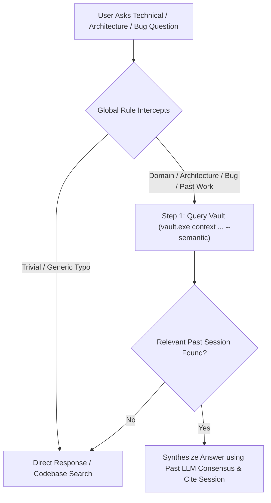

# vault chat integration

- **Author**: `azzy`
- **ID**: `27781f02-e1f5-4d10-b5ed-c56f4c6e6f9d`
- **Source Tool**: `antigravity`
- **Date**: `2026-08-28 20:32:25`
- **Tags**: `coding`, `assistant`, `antigravity`

---

## Turn 1: User

vault chat integration
we have vault in my local machine, where this is a conversation accumulator accross all of the local llm. what i want is , when i asked something, can you first refer to the vault conversation first before looking for your own answer? how do we integrate this pattern globally? should we add a skill md or something?

---

## Turn 2: Assistant

<details><summary>🔧 Tool Invocations (1)</summary>

- **view_file**: 

</details>


---

## Turn 3: Assistant

<details><summary>🔧 Tool Invocations (1)</summary>

- **view_file**: 

</details>


---

## Turn 4: Assistant

<details><summary>🔧 Tool Invocations (1)</summary>

- **view_file**: 

</details>


---

## Turn 5: Assistant

<details><summary>🔧 Tool Invocations (1)</summary>

- **find_by_name**: 

</details>


---

## Turn 6: Assistant

<details><summary>🔧 Tool Invocations (1)</summary>

- **grep_search**: 

</details>


---

## Turn 7: Assistant

<details><summary>🔧 Tool Invocations (1)</summary>

- **grep_search**: 

</details>


---

## Turn 8: Assistant

<details><summary>🔧 Tool Invocations (1)</summary>

- **view_file**: 

</details>


---

## Turn 9: Assistant

<details><summary>🔧 Tool Invocations (1)</summary>

- **find_by_name**: 

</details>


---

## Turn 10: Assistant

<details><summary>🔧 Tool Invocations (1)</summary>

- **view_file**: 

</details>


---

## Turn 11: Assistant

To integrate the **Vault-first pattern globally** across all your conversations and projects, the best practice is a **Hybrid Pattern: Global Rule + Vault Skill**.

---

### Why a Skill alone is not enough

* **Skills (`SKILL.md`)**: Use *progressive disclosure*. The agent only loads the full skill instructions when it explicitly decides to trigger it (or when you invoke `/vault`). On general coding or debugging questions, the agent will not automatically search the Vault first unless mandated to do so.
* **Global Rules (`RULE[user_global]` / Global Instructions)**: Are **always active** in the agent's context across all projects and sessions. They enforce the mandatory behavioral policy: *"Check Vault before answering from scratch."*

---

### The Recommended Global Architecture



---

### Step 1: Add the Vault Rule to Global Rules (`user_global`)

Add this block into your **Global Instructions / Global Rules** (in your Antigravity Settings or global prompt, right alongside your `<!-- context7 -->` block):

```markdown
<!-- local-vault -->
## LLM Context Vault First-Lookup Policy

Whenever the user asks a technical question, reports an error/bug, requests an architectural decision, or asks how something was previously solved:
1. **Query Vault First**: Before formulating your own answer from scratch or doing standard web searches, run the Vault CLI tool to retrieve relevant prior discussions across local LLMs (Antigravity, OpenCode, Codex, Aider):
   ```powershell
   D:\code\llm-context-vault\vault.exe context "<concise query or error message>" --semantic
   ```
2. **Evaluate & Cite Context**:
   - If relevant past context is found, use that prior solution/decision as the primary reference, aligning with existing team conventions and past fixes.
   - Mention the source session or past consensus briefly (e.g., *"Based on a past session in the Vault regarding..."*).
3. **Fallback**:
   - If Vault returns no relevant hits or the question is a trivial general-syntax query, proceed with standard codebase exploration and reasoning.
<!-- local-vault -->
```

---

### Step 2: Keep & Refine the Vault Skill (`SKILL.md`)

You already have the skill located at [`C:~/.gemini/config/skills/vault/SKILL.md`](file:///C:~/.gemini/config/skills/vault/SKILL.md). We can optimize it so it outlines both the primary CLI flow and markdown fallbacks:

```markdown
---
name: vault
description: Search, retrieve, and refer to past problem-solving sessions, architecture decisions, and bugfixes from the LLM Context Vault across local AI assistants (Antigravity, OpenCode, Codex, Aider).
---

# LLM Context Vault Skill

Use this skill to retrieve past debugging sessions, architecture decisions, and code solutions recorded across local AI tools.

## 📍 Vault Repository Location
- Central repo: `D:\code\llm-context-vault`
- Markdown sessions: `D:\code\llm-context-vault\conversations\markdown\`

## 🔎 Retrieval Commands

### 1. Semantic Context Extraction (Fastest for answering questions)
Extracts the most relevant context snippets directly for the current prompt:
```powershell
D:\code\llm-context-vault\vault.exe context "<topic or error message>" --semantic
```

### 2. Search Session List
Lists matching session titles and IDs:
```powershell
D:\code\llm-context-vault\vault.exe search "<topic or error message>" --semantic
```

### 3. Direct Markdown Inspection (Fallback)
If you need the full uncompressed session log, view the corresponding file in `D:\code\llm-context-vault\conversations\markdown\`:
- OpenCode: `opencode_*.md`
- OpenAI Codex: `codex_*.md`
- Antigravity: `agy_*.md`

## 📥 Sync & Maintenance Commands
- Scan & rebuild embeddings: `D:\code\llm-context-vault\vault.exe scan`
- Audit for secrets: `D:\code\llm-context-vault\vault.exe audit`
- Publish to remote: `D:\code\llm-context-vault\vault.exe publish`
- Web UI: `D:\code\llm-context-vault\vault.exe ui`
```

---

### Summary of Benefits

1. **Deterministic Execution**: The **Global Rule** guarantees the agent never skips checking the vault before generating answers.
2. **Context Efficient**: `vault.exe context --semantic` delivers just the top relevant snippets rather than loading massive conversation files into memory.
3. **Cross-Agent Memory**: Any solution found in OpenCode, Codex, or past Antigravity chats immediately informs future Antigravity sessions.

---

## Turn 12: User

okay go ahead and implement the global rules

---

## Turn 13: Assistant

<details><summary>🔧 Tool Invocations (1)</summary>

- **run_command**: 

</details>


---

## Turn 14: Assistant

<details><summary>🔧 Tool Invocations (1)</summary>

- **manage_task**: 

</details>

I am checking your Antigravity configuration directory to locate the global rules file.

---

## Turn 15: Assistant

<details><summary>🔧 Tool Invocations (1)</summary>

- **run_command**: 

</details>


---

## Turn 16: Assistant

<details><summary>🔧 Tool Invocations (1)</summary>

- **view_file**: 

</details>


---

## Turn 17: Assistant

<details><summary>🔧 Tool Invocations (1)</summary>

- **run_command**: 

</details>


---

## Turn 18: Assistant

<details><summary>🔧 Tool Invocations (1)</summary>

- **run_command**: 

</details>


---

## Turn 19: Assistant

<details><summary>🔧 Tool Invocations (1)</summary>

- **manage_task**: 

</details>


---

## Turn 20: Assistant

<details><summary>🔧 Tool Invocations (1)</summary>

- **replace_file_content**: 

</details>


---

## Turn 21: Assistant

<details><summary>🔧 Tool Invocations (1)</summary>

- **view_file**: 

</details>


---

## Turn 22: Assistant

<details><summary>🔧 Tool Invocations (1)</summary>

- **replace_file_content**: 

</details>


---

## Turn 23: Assistant

The global rule has been implemented in [`~\.gemini\GEMINI.md`](file:///C:~/.gemini/GEMINI.md) and synchronized with the [`vault` skill](file:///C:~/.gemini/config/skills/vault/SKILL.md).

---

### What Was Configured

1. **Global Rule in [`~\.gemini\GEMINI.md`](file:///C:~/.gemini/GEMINI.md)**:
   Added the `<!-- local-vault -->` directive so that on every incoming technical, debugging, or architectural inquiry across all workspaces, the agent will:
   - First execute:
     ```powershell
     D:\code\llm-context-vault\vault.exe context "<concise query or error message>" --semantic
     ```
   - Prioritize established patterns and solutions found in the Vault (across Antigravity, OpenCode, Codex, and Aider) over generating solutions from scratch.
   - Reference the past session when answering.
   - Gracefully fallback to codebase search/reasoning if no past context matches.

2. **Refined Skill in [`~\.gemini\config\skills\vault\SKILL.md`](file:///C:~/.gemini/config/skills/vault/SKILL.md)**:
   Maintained full support for manual triggers, session listing via `vault.exe search`, direct markdown log inspections, and vault scans (`vault.exe scan`).

---

### How It Works in Practice

Whenever you ask a question like *"how did we resolve the auto collection route issue?"* or provide a bug stack trace, the agent will automatically query your local Vault first, incorporate the relevant past discussion snippet into its context, and formulate the response aligned with your past local sessions.

---

